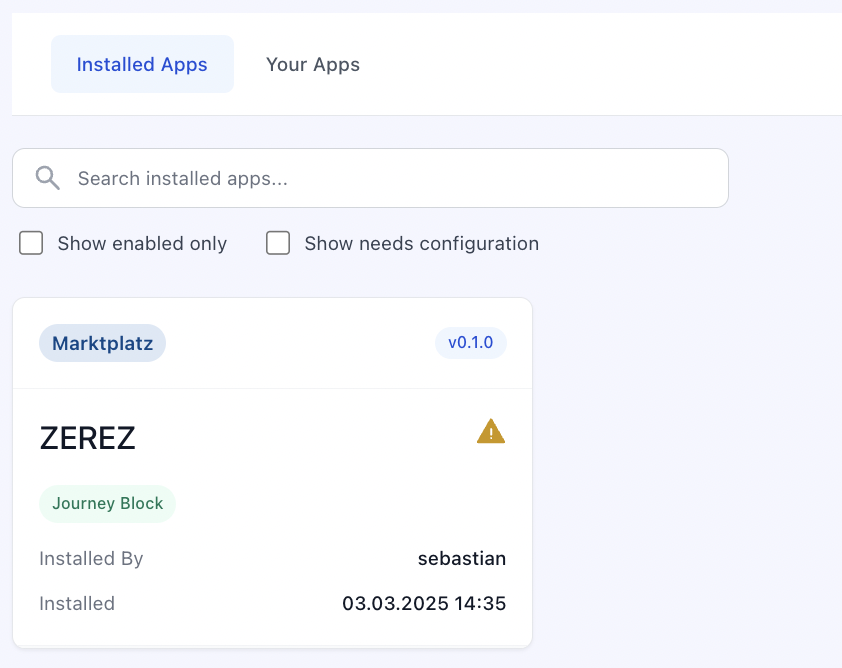

# Component Options

Learn how to configure options for your components and access them in your app.

## What Are Component Options?

Component Options are the settings that users can configure when installing your component in an epilot app. These options allow users to customize the behavior, appearance, and functionality of your component to suit their specific needs.

When you create a component for the epilot platform, you can define a set of options that users can adjust during the installation process. These options can include things like colors, text labels, data sources, and more, depending on the requirements of your component.

This configuration is rendered as the following UI for the user installing your app:

## Required Options

If you want to ensure that users provide specific information when installing your component, you can mark certain options as required. This will prompt users to enter a value for these options before they can complete the installation process.

They can still install the App, but it will be marked as `partially successful` in the App installation. The user is not able to use the App until the required options are filled.

## Accessing Options in Your Component

When your component runs, the options that users configured during installation are passed to your component as properties. You can use them to customize the behavior and appearance of your component.

How options are delivered depends on the component type. For a Custom Journey Block, options are passed as properties to your web component. For a Portal Extension, options are available in the context of your extension. Refer to each component type's documentation for specifics.