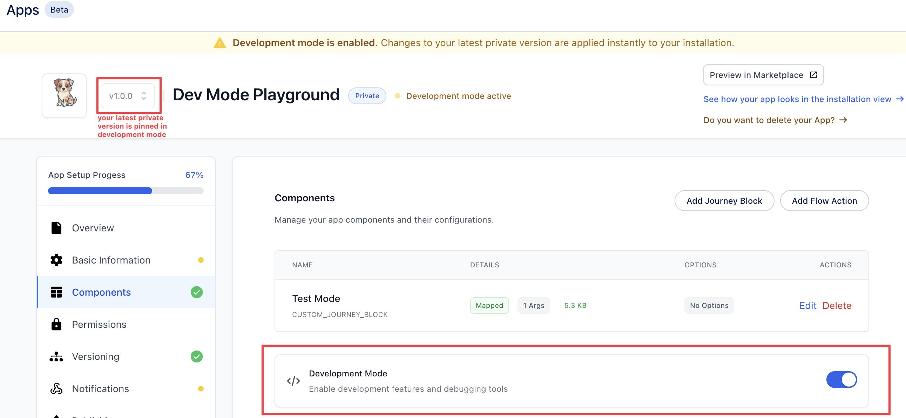
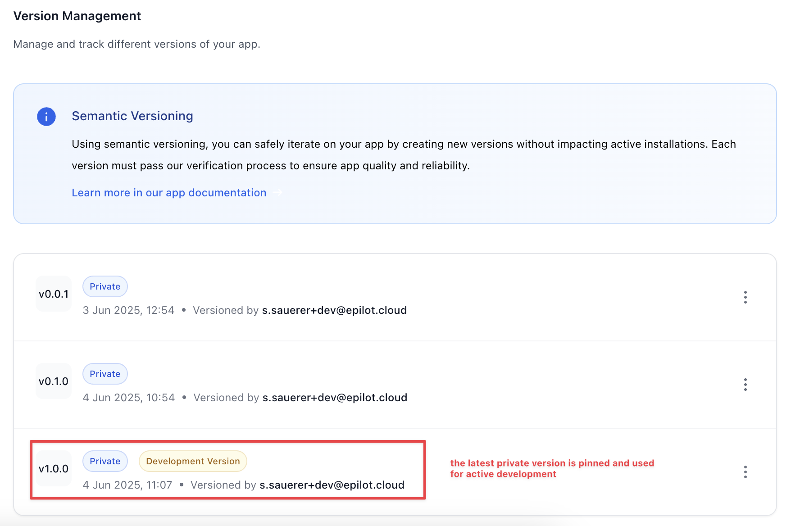
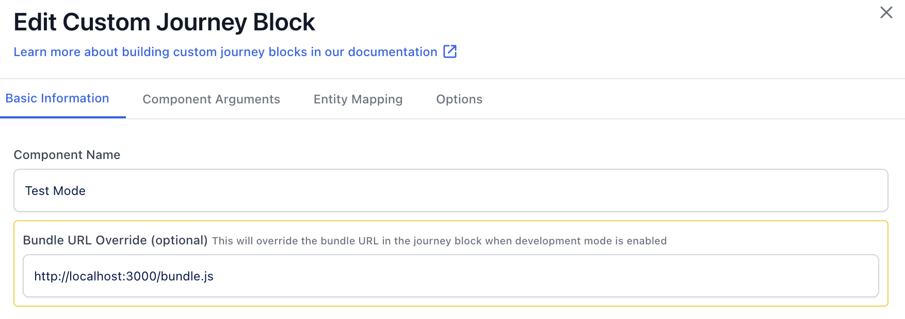

# What is Development Mode?

Development mode is a feature that allows you to run your app in a local development environment. This mode enables you to see changes in real-time without having to update the app every time you make a change. It is particularly useful for testing and debugging your app during the development process.

# How to Run in Development Mode

Head over to the components section and you will find a button to run the app in development mode.

What it does is it enables the development mode for the ***latest private version*** in your App. Once you enable development mode, this particualar version is pinned and not changeable. You can do your changes and immediately see the results without reinstalling your App everytime. Once the development mode is enabled, you have the ability to override some component configuration.

 

# Custom Journey Block Overrides

With development mode enabled, you can overide the component url of your Custom Journey Block. This allows you to point the component to a local development server or any other URL where your component is hosted. This way, you can test changes in real-time without having to publish a new version of your app.

Now once you go into a journey to connect this custom block, you will see the component url is overridden with the one you provided in the development mode. This allows you to test your changes in the context of a journey without having to publish a new version of your app.