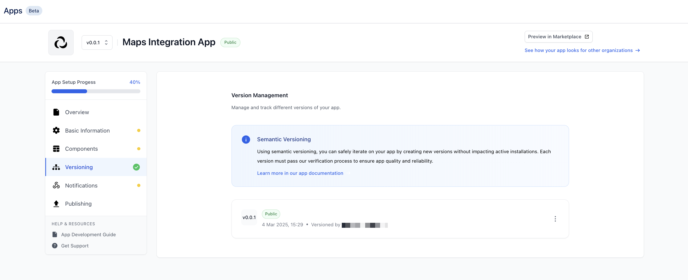
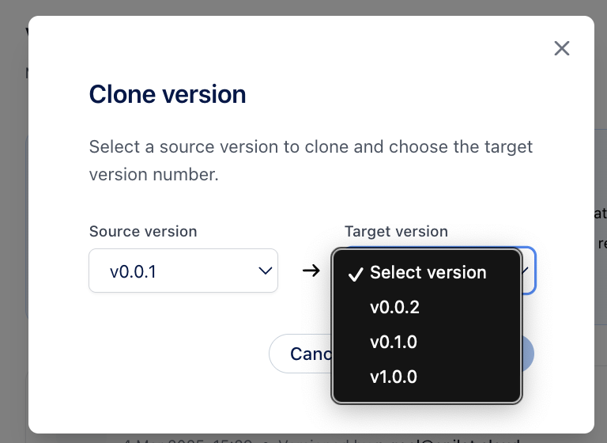

# Cloning Versions
How To Safely Implement New Changes Without Affecting the Installed Version

## Overview

Cloning versions is a critical step in the app development lifecycle. It allows you to create a new version of your app without affecting the existing version that is installed on the epilot platform. This guide outlines the steps you'll take to clone a version and implement new changes safely.

We use [semantic versioning](https://semver.org/) to manage app versions. This system allows you to indicate the type of changes in each version and ensure that users understand the impact of updating to a new version. By following these guidelines, you can maintain a clear version history and provide a smooth transition for users when updating your app.

The version overview lists all available versions and their visibility status.

## Cloning a Version

When you clone a version, you create a new version of your app that is based on an existing version. This new version is a copy of the original version and allows you to make changes without affecting the installed version. 

A new version is basically a snapshot of the existing version. You can make changes to the new version without affecting the original version. This allows you to experiment with new features, fix bugs, or make other improvements without impacting users who have already installed your app.

The newly created version is marked as a private version and is only visible to you and your organization. This allows you to test the changes thoroughly before making the version public.

To make this version public, you need to request a review and follow the verification process. Once the new version is approved, it becomes available to all epilot customers in the marketplace.

:::info
Once a version is public and installed by users, it becomes immutable. This means that you cannot make changes to the public version directly. Instead, you need to create a new version, clone the existing version, and make the necessary changes in the new version.
:::