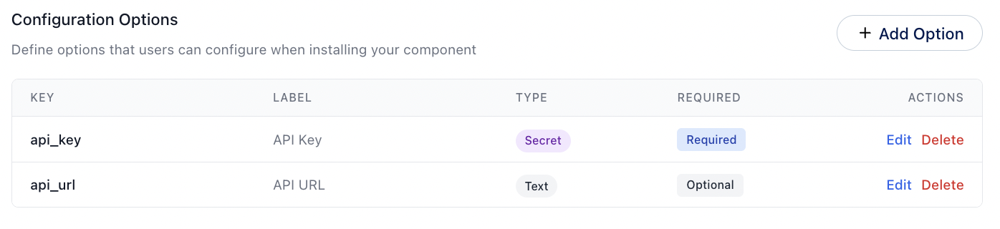
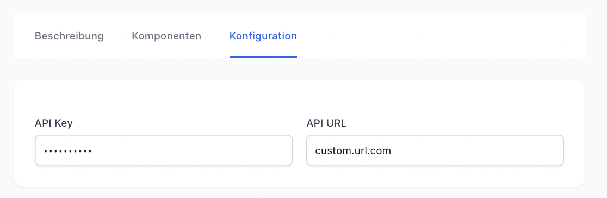
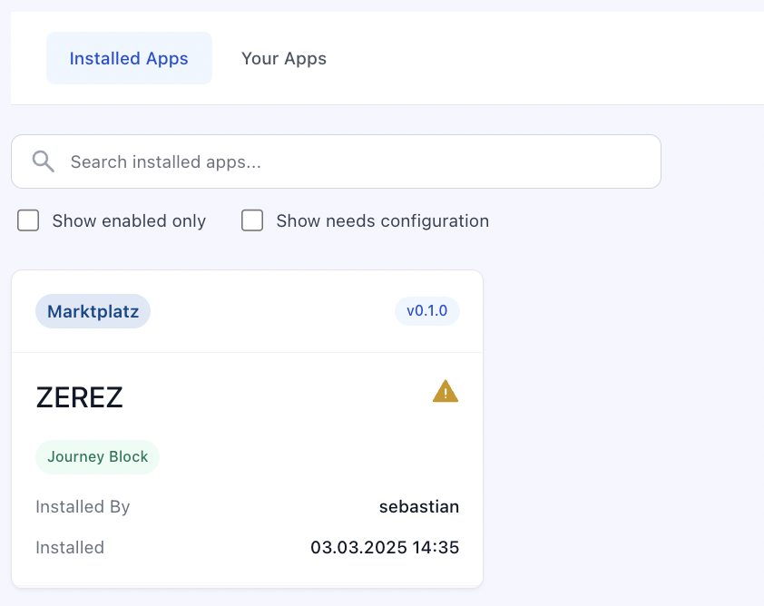

&nbsp;

<h1 align="center">Component Options</h1>

Define options that users can configure when installing your component

## What Are Component Options?

Component Options are the settings that users can configure when installing your component in an epilot app. These options allow users to customize the behavior, appearance, and functionality of your component to suit their specific needs.

When you create a component for the epilot platform, you can define a set of options that users can adjust during the installation process. These options can include things like colors, text labels, data sources, and more, depending on the requirements of your component.

this configuration will be translated into the following UI for the installing user:

## Required Options

If you want to ensure that users provide specific information when installing your component, you can mark certain options as required. This will prompt users to enter a value for these options before they can complete the installation process.

They can still install the App, but it will be marked as `partially successful` in the App installation. The user is not able to use the App until the required options are filled.

## How can you access the options in your component?

When you create a component for the epilot platform, you can access the options that users have configured during the installation process. These options are passed to your component as properties, allowing you to use them to customize the behavior and appearance of your component.

How these options are passed, depends on the type of component you are building. For example, if you are creating a Custom Journey Block, the options will be passed as properties to your web component. If you are creating a Portal Extension, the options will be available in the context of your extension.