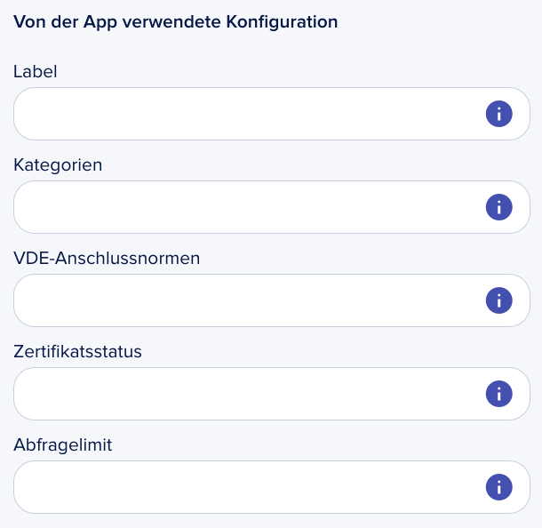

<p>&nbsp;</p>

<h1 align="center">Journey Blocks</h1>

<p align="center">Create custom interactive components for epilot's Journey Builder</p>

## What Are Journey Blocks?

Journey Blocks are the interactive components that make up customer journeys within the epilot platform. They're the building blocks that allow businesses to create seamless, engaging customer experiences from initial contact through completion of a process.

Custom Journey Blocks extend this capability, allowing developers to create specialized components that integrate seamlessly with epilot's Journey Builder. These custom blocks appear alongside native blocks in the Journey Builder palette and can be placed anywhere in a customer journey flow.

## Why Create Custom Journey Blocks?

Custom Journey Blocks enable you to:

- **Fill Functional Gaps**: Create specialized functionality not available in standard blocks
- **Integrate External Systems**: Connect epilot journeys with third-party services and APIs
- **Implement Business Logic**: Add industry-specific calculations and validations
- **Customize UI/UX**: Design tailored experiences for specific customer segments
- **Visualize Data**: Present complex information in intuitive, interactive ways

## Building Your First Journey Block

Custom Journey Blocks are web components that follow standard web technologies, making them accessible to any web developer.

### Prerequisites

- Basic knowledge of HTML, CSS, and JavaScript
- Familiarity with Web Components standards
- A development environment with Node.js

### Starter Template

We recommend starting with our React starter template to quickly set up your development environment:

```bash
# Clone the starter template
git clone https://github.com/epilot-dev/custom-journey-block-react.git my-custom-block

# Navigate to the project directory
cd my-custom-block

# Install dependencies
npm install

# Start the development server
npm run dev
```

You can also use our template for [Lit](https://github.com/epilot-dev/custom-journey-block-lit) to create a new project.

### Technology Recommendations

While Journey Blocks can be built with any framework that compiles to web components, we recommend using **React** for several key advantages:

- **Concorde UI Library Access**: Leverage epilot's Concorde component library for consistent styling
- **Alignment with epilot's Theme**: Ensure your blocks visually match the Journey Builder interface
- **Component Reusability**: Build with the same components used throughout the epilot platform
- **Developer Experience**: Benefit from React's robust ecosystem and developer tools

Using React with a web component wrapper gives you the best of both worlds: modern development experience and seamless integration with the Journey Builder.

For detailed examples and implementation guidelines, check our [Custom Block Examples](https://github.com/epilot-dev/epilot-journey-sdk/blob/main/custom-block.md).

### Component Mapping

A powerful feature of Journey Blocks is entity mapping, which lets you:

- **Connect UI Elements to Data**: Link form fields and components to specific entity properties
- **Enable Data Persistence**: Store and retrieve information across journey steps
- **Facilitate Data Processing**: Allow journey automation to use the collected data

Component mapping is defined in your app configuration and establishes the relationship between your UI elements and epilot's entity model. This mapping ensures that data flows properly between your custom block and the rest of the journey.

Example mapping types:
- `string`: For text fields and standard inputs
- `boolean`: For checkboxes and toggle switches
- `date`: For date picker components
- `datetime`: For date and time selection components

### Component Arguments




Journey Blocks can be made configurable through component arguments, which allow:

- **Per-Instance Configuration**: Journey creators can customize each instance of your block
- **Reusable Components**: The same block can be configured differently in various parts of a journey
- **User-Friendly Setup**: Non-technical users can adjust block behavior without coding

Arguments are defined in your app configuration and appear in the block settings panel when a user adds your block to a journey. They can include:

- Text inputs for customizable labels and messages
- Boolean toggles for feature enabling/disabling
- Dropdown selectors for pre-defined options
- And more

This configurability makes your custom blocks more versatile and valuable across different use cases.

## Best Practices

### Performance Considerations

- **Bundle Size**: Keep your bundle under 500KB to ensure quick loading times
- **Lazy Loading**: Load external resources only when needed
- **Asset Optimization**: Compress images and minimize CSS/JS
- **Efficient DOM Operations**: Minimize DOM manipulations and reflows

### Bundling Your Component

Your component should be bundled into a single JavaScript file that can be loaded by the Journey Builder. We recommend:

- **Webpack** or **Rollup** for bundling
- **Babel** for transpiling modern JavaScript
- Setting the correct output format (ES modules preferred)

Example webpack configuration:

```javascript
module.exports = {
  entry: './src/index.js',
  output: {
    filename: 'bundle.js',
    path: path.resolve(__dirname, 'dist'),
  },
  module: {
    rules: [
      {
        test: /\.js$/,
        exclude: /node_modules/,
        use: {
          loader: 'babel-loader',
          options: {
            presets: ['@babel/preset-env']
          }
        }
      }
    ]
  }
};
```

### UI Design Guidelines

For consistent user experience, your custom blocks should:

- Follow epilot's design language
- Be responsive and accessible
- Provide clear feedback on actions
- Include proper validation and error states

## Testing Your Journey Block

Before submitting your block:

1. Test in different browsers (Chrome, Firefox, Safari)
2. Verify responsiveness on different screen sizes
3. Ensure accessibility standards are met
4. Check for memory leaks during repeated use

## Useful Resources

### Journey UI Library Concorde (React)

While custom blocks are framework-agnostic, you can reference epilot's UI components for design consistency:

- [Source Code](https://github.com/epilot-dev/concorde-elements)
- [Storybook](https://portal.epilot.cloud/concorde-elements)

### Documentation and Examples

- [Web Components MDN Guide](https://developer.mozilla.org/en-US/docs/Web/Web_Components)
