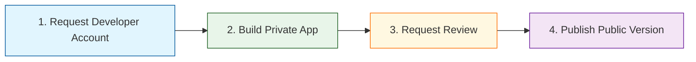

# Getting Started with App Development

Building and publishing an app on the epilot platform follows a straightforward process designed to help you move efficiently from initial setup to marketplace presence. This guide outlines the core steps you'll take on your journey to becoming an epilot app developer.

## The App Development Journey

The path from idea to published app consists of four essential phases:

## 1. Request Developer Account

Your first step is to obtain a dedicated developer sandbox account:

- Visit the [developer sandbox section](/apps/getting-started/developer-sandbox) to learn about sandbox accounts
- Provide details about your organization and development plans
- Once approved, you'll receive credentials for your sandbox environment
- This isolated account provides a safe space to experiment with epilot's features

## 2. Build Your First Private App

With your developer account activated, you can begin building:

- Navigate to the app creation page at [https://portal.epilot.cloud/app/apps/configuration/new](https://portal.epilot.cloud/app/apps/configuration/new)
- Configure your app's metadata (name, description, category)
- Add components based on your integration needs
- Develop and upload your component code
- Test your app thoroughly within your sandbox environment
- Make iterative improvements based on your testing

During this phase, your app remains private and is only visible within your organization. Take advantage of this isolation to perfect your app's functionality.

## 3. Request Review

When your app is ready for the spotlight:

- Ensure your app documentation is complete
- Verify all components function as expected
- Navigate to the version management section of your app
- Select the version you want to publish
- Click "Request Review" to submit for evaluation
- Our team will assess your app against quality and security standards
- You'll receive feedback if any improvements are needed

The review process helps maintain high standards in the epilot marketplace and ensures all apps provide value to users.

## 4. First Public Version

Upon approval of your review request:

- Your app becomes visible in the epilot marketplace
- Other organizations can discover and install your solution
- You'll receive notifications when your app is installed
- This version becomes immutable to ensure stability for users

Once public, you can continue developing new versions with enhanced features while users benefit from your current release.

## Next Steps

Ready to start your app development journey? Explore these resources:

- [Developer Sandbox Guide](/apps/getting-started/developer-sandbox) - Learn more about setting up your development environment
- [Component Types](/apps/components/overview) - Understand the different ways to extend epilot
- [Publishing Best Practices](/apps/publishing/how-to) - Tips for successful app submissions

By following this streamlined process, you'll be able to contribute valuable solutions to the epilot ecosystem and reach organizations throughout the energy industry.