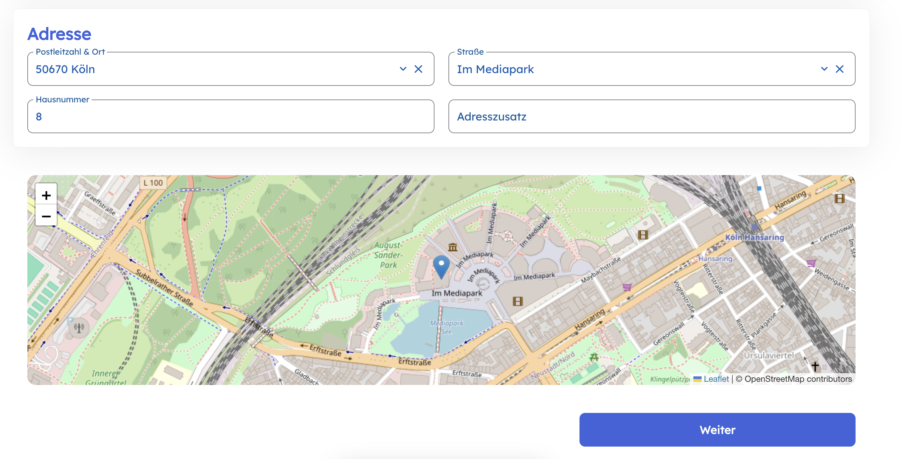
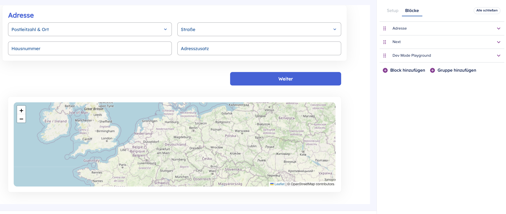
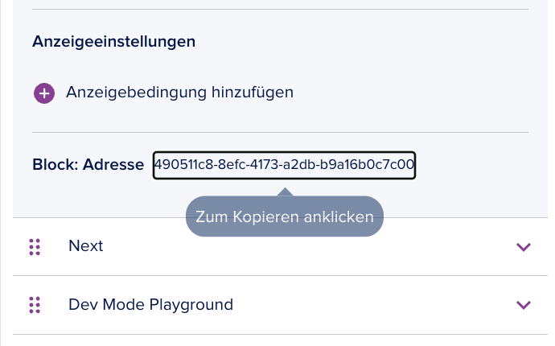
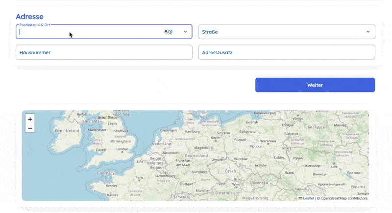
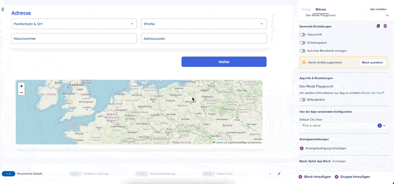

## How to build a custom Journey block

### Prerequisites
- Understanding of the epilot platform, particularly what Journeys are and how they work. See the [Journeys documentation](/docs/journeys/journey-builder) for more information.

- Basic understanding about the concept of an App inside the epilot platform. See the [App documentation](/apps) for more information.

- Understand what a custom journey block is and how it works. See the [Custom Journey Block documentation](/apps/about-apps/components/custom-journey-block) for more information.

### What we are building

We are going to build a journey block that renders the inputted address from the address block as a map marker in OpenStreetMap.

You can find the finished project [here](https://github.com/epilot-dev/app-component-examples/tree/main/examples/journey-block-openstreetmap).



You will learn and understand how to:

- create a new blank project in React that compiles to a web component in a single `bundle.js` file
- use the `development mode` in Apps in order to have a more convenient way to test your changes in the context of a journey
- subscribe to changes in other blocks (i.e. the address block) and access this information in your custom block
- use `component arguments` to pass data from the block configuration to your custom block
- use `component mapping` to map the output of your custom block (e.g. the lat/lng coordinates of the address) to the submission of the journey

### Step 1: Create a new project

A custom journey block is rendered as a web component in the journey builder. This is particularly useful as we do not care how the web component is implemented, as long as it is a web component. Hence you can use technologies like Lit, Svelte, React, Vue, etc. For this tutorial we use React and the [@r2wc/react-to-web-component](https://www.npmjs.com/package/@r2wc/react-to-web-component) library to compile our React code to a web component.


Clone the [app-examples](https://github.com/epilot-dev/app-component-examples) repo and navigate to the `examples/journey-block-openstreetmap` folder. This contains the fully working example we are building in this guide.

:::info
If you want to start with a fresh `minimalistic` custom block, then head over to the `templates/custom-journey-block-react` folder.
:::

1. The actual React component you implement is compiled into a web component with

```typescript title="src/main.tsx - Web component registration"
const componentTag = 'address-map'

const CustomBlock = r2wc(App, {
  props: {
    value: 'string',
    errors: 'string',
    required: 'boolean',
    // the r2wc lib will parse the string value for us
    theme: 'json',
    args: 'json',
    setValue: 'function',
    subscribe: 'function'
  }
})

customElements.define(componentTag, CustomBlock)
```

It is important to expose these props so the platform can pass data to your component. In the future we will probably create a small wrapper around this, but for now you can use them as-is.

2. The Vite config needs to output a single `bundle.js` file. We host this bundle in our CDN and then point the custom block to it.
This is a minimal working config.

```typescript title="vite.config.ts"
import { resolve } from 'path'
import { defineConfig } from 'Vite'
import react from '@Vitejs/plugin-react'
import typescript from '@rollup/plugin-typescript'
import cssInjectedByJsPlugin from 'vite-plugin-css-injected-by-js'

export default defineConfig({
  plugins: [react(), typescript(), cssInjectedByJsPlugin()],
  server: {
    port: 3000,
    strictPort: true
  },
  preview: {
    allowedHosts: true
  },
  define: {
    'process.env.NODE_ENV': '"production"'
  },
  build: {
    lib: {
      formats: ['umd'],
      entry: resolve(__dirname, 'src/main.tsx'),
      name: 'index',
      fileName: "bundle.js",
    },
    cssCodeSplit: false, // Ensures a single CSS file output
    minify: true,
    sourcemap: false,
    rollupOptions: {
      output: {
        entryFileNames: "bundle.js",
        inlineDynamicImports: true,
      },
    },
  },
})
```

Install and build the project with
```bash title="Install and build"
npm install
npm run build
```

During development you can run a local dev server and point development mode to it:
```bash title="Start local dev server"
npm run dev
```

### Step 2: Create the custom block in the App configuration
The business logic/internals of the App do not matter for now. We start to focus on the actual development mode. In order to create your first App go to the App configuration and click on the `Add Component` button. Add the `bundle.js` file from the `dist` folder.

After you created the component, install the App initially (by selecting the `See how your app looks in the installation view` link in the top right corner of the App configuration builder), then enable the [development mode](https://docs.epilot.io/apps/about-apps/development-mode). 

**Why development mode?** If you don't enable this during development, you always need to create a new version and update the current installation to the newest version with your changes. This is tedious and takes a lot of time. The development mode always pushes the latest changes to the current installation.

### Step 3: Create a dummy journey to test your component

Create a dummy journey to test your component. Add the custom block to the journey and test it. Head over to the [Journey Builder](https://portal.dev.epilot.cloud/app/journey-builder/wizard) and create a new journey. The journey should contain an Address block, as our custom journey block translates the address of the user into a map marker in OpenStreetMap. 

After adding the address block, head again over to the block configuration and either use the block search field or go to the bottom of the blocks to see installed Apps which provide journey blocks.



:::info
With the `development mode` enabled, you can override the component URL of your Custom Journey Block. This allows you to point the component to a local development server or any other URL where your component is hosted. This way, you can test your changes in the context of a journey without having to publish a new version of your app. It is only important to provide a `bundle.js` file (e.g. `http://localhost:3000/bundle.js`).
:::

Now you have a custom journey block showing Germany on the map. This is the simplest version of a custom journey block one can implement. 
But what if you want more interactivity?

### Step 4: Subscribe to changes in other blocks

We want to subscribe to changes in the address block and update the map accordingly.

1. Subscribe to changes in the address block
2. Get the lat/lng coordinates of the address
3. Update the map accordingly

To subscribe to changes in other blocks, you can use the `subscribe` function available on the container. This function lets your block react to updates in other blocks.

```typescript title="Subscribe to address block changes"
 const [address, setAddress] = useState<Address | null>(null)

  const callback = useCallback((partialState: Address)  => {
    const safe = (partialState as any) ?? {}
    const { city, houseNumber, streetName, zipCode, countryCode } = safe as Partial<Address>

    if (city && houseNumber && streetName && zipCode) {
      setAddress({
        city,
        houseNumber,
        streetName,
        zipCode,
        countryCode: countryCode ?? ""
      })
    } else {
      setAddress(null)
    }
  }, [])

  useEffect(() => {
    const unsubscribe = props.container.subscribe(BLOCK_ID, callback)

    return () => void unsubscribe()
  }, [props.container.subscribe, callback, props.container])
```


`BLOCK_ID` is the id of the address block. You can find this id in the block configuration (at the bottom) of the address block.



The updates from this subscription are reactive, i.e. whenever the address block is updated, the map will be updated accordingly.



:::info
By subscribing to changes in other blocks, you can build very powerful custom blocks that are not limited to the data that is available in the block configuration.
:::

### Step 5: Use component arguments to change the default view of the map

We want to make the map view configurable. This is a very common use case and can be achieved by using component arguments.

1. add a component argument to the custom block
2. use the component argument to change the default view of the map

To add a component argument, you can use the `args` provided via the container. This is a JSON stringified object containing all the args you provide when adding the block.

```typescript title="Parse and use component arguments"
 const args = useMemo(() => {
    return props.container.args ? JSON.parse(props.container.args) : undefined
  }, [props.container.args])

  const center = useMemo(() => {
    const candidate = (args as any)?.default_city

    // String form: "lat,lng"
    if (typeof candidate === "string") {
      const parts = candidate.split(",").map(p => Number(p.trim()))
      if (parts.length === 2 && Number.isFinite(parts[0]) && Number.isFinite(parts[1])) {
        return [parts[0], parts[1]] as [number, number]
      }
    }

    return undefined
  }, [args])
```

The component arguments are available via `props.container.args` in the custom block.

### Step 6: Map the generated lat/lng output back to the journey submission

To submit data from your custom block, call `setValue` with your output. For example, after geocoding the address, you can expose the coordinates:

```typescript title="Set value for journey submission"
useEffect(() => {
  if (!address) return
  geocode(address).then(({ lat, lng }) => {
    props.setValue(JSON.stringify({ lat, lng }))
  })
}, [address])

// or 

const addCoordsToMapping = useCallback((coords: [number, number] | null) => {
    props.container.setValue(JSON.stringify({ lat: coords?.[0], lng: coords?.[1] }))
  }, [args, props.container.setValue])
```

This value can then be mapped using component mapping so it becomes part of the journey submission payload.



## Conclusion

You have now learned how to build a custom journey block that is fully functional and can be used in a journey. You have also learned how to subscribe to changes in other blocks, use component arguments and use component mapping to map the output of your custom block to the submission of the journey.

A quick summary:

- a custom journey block is a web component that is rendered in the journey builder
- you can subscribe to changes in other blocks by using `container.subscribe` and the `BLOCK_ID`
- you can use component arguments to pass data from the block configuration to your custom block via `container.args`
- you can use `setValue` and component mapping to map the output of your custom block to the submission of the journey

You can find the finished project [here](https://github.com/epilot-dev/app-component-examples/tree/main/examples/journey-block-openstreetmap).