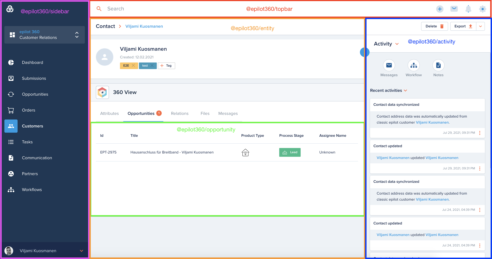

# Microfrontends

The 360 portal application consists of multiple frontend microservices, governed by [single-spa](https://single-spa.js.org/).

## @epilot360/root-config

This is the root project defining the microfrontend layout and import maps containing references to the correct bundle for each microfrontend application.

The project also contains the centralised localisation files.

## Layout

The basic layout consists of the following parts:

- @epilot360/login
  - Login overlay
  - Manages the user login state of the entire application
- @epilot360/topbar
  - Top bar menus
  - Global search
  - Notifications
- @epilot360/sidebar
  - Main left sidebar navigation

## Links

- Full list of 360 microfrontends: https://gitlab.com/e-pilot/product/360-portal/epilot360-root-config#microfrontends