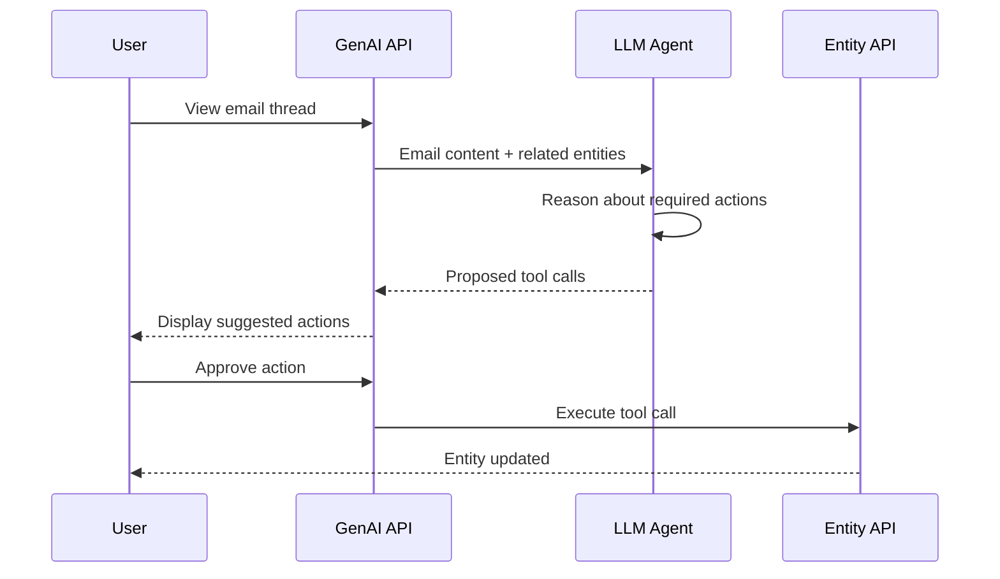
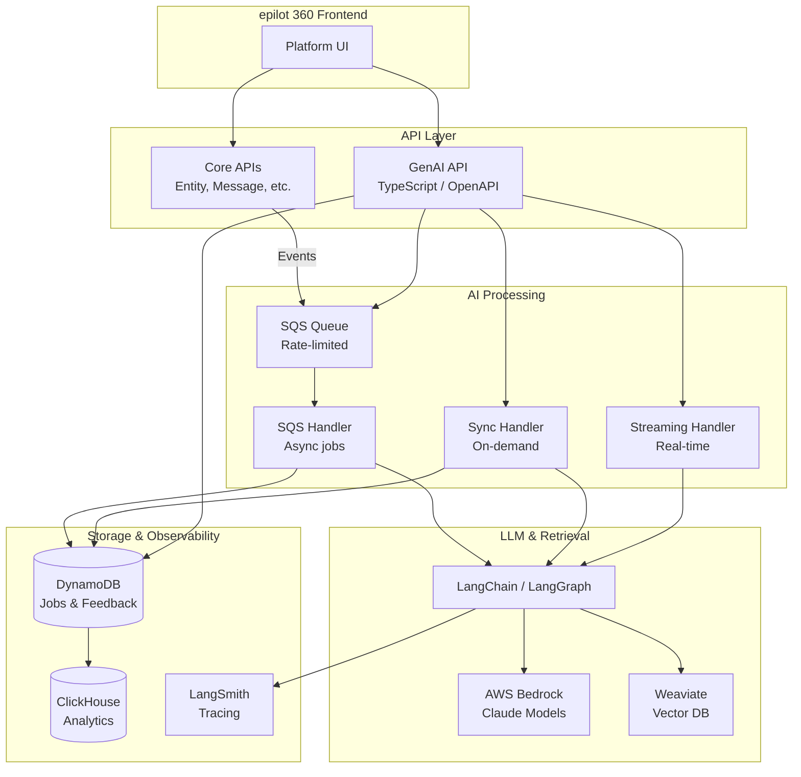
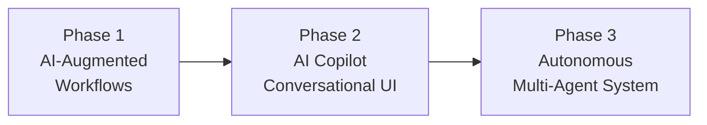

# AI in epilot

epilot embeds AI directly into the workflows energy companies use every day -- messaging, entity management, search, and process automation. No standalone chatbot. Every AI feature operates within existing platform screens, augmenting the work users already do.

The system is built on a centralized **GenAI API** backed by AWS Bedrock, a Python-based **GenAI Foundation** for LLM orchestration, and a serverless RAG pipeline for contextual generation. All data stays in the EU region with a zero-retention policy on the LLM provider side.

## AI Features

### Email Assistance

The messaging hub is epilot's highest-traffic surface. AI augments it in three ways:

| Capability | Description |
|---|---|
| **Thread Summaries** | Bullet-point summary, topics, and suggested next steps generated for every inbound email thread. Reduces comprehension time from 16+ minutes to under 1 minute. |
| **Reply Suggestions** | Context-aware draft replies powered by RAG. The system retrieves similar past conversations from a vector store, then generates a reply grounded in prior organizational knowledge. |
| **Auto-Labeling** | Inbound emails are classified against a master label list using zero-shot classification. Labels with confidence scores above a per-label threshold are applied automatically; users can accept or reject suggestions. |

Thread summaries trigger asynchronously on message creation via EventBridge. Reply suggestions are generated on-demand with streaming support.

See [Messaging](/docs/messaging/message-api) for the broader messaging architecture.

### Suggested Actions (AI Agents)

When a user views an email, the AI agent reads the message content alongside related entities and proposes concrete actions -- updating a contact's address, changing bank details, creating a meter reading, or registering a new customer. Each suggestion is a tool call with pre-filled arguments that the user reviews and executes with a single click.

Under the hood, this uses a **ReAct (Reason and Act) agent** built with LangGraph. The LLM reasons about what needs to happen, selects the right tool (`update_entity`, `create_entity`, `create_meter_reading`), and populates the arguments. Human-in-the-loop approval is enforced -- the agent never writes data without user confirmation.

### Entity Summaries

AI generates a concise summary for any entity (opportunity, contact, contract, ticket) by synthesizing entity attributes, activity history, related entities, files, and workflow state. Summaries include priority assessment, current status, and recommended next actions.

Summaries support multiple variants:

- **Short** -- headline-level overview
- **Detailed** -- full context with activity timeline
- **Action Points** -- prioritized list of next steps

Available in both German and English, streamed to the UI in real time.

### Ask Your Entity

A conversational interface in the entity side panel. Users ask questions about any entity in natural language:

- "What needs to be done next?"
- "Did the customer upload the roof picture?"
- "When was the bank account last updated?"

The LLM answers based on entity payload, related entities, files, emails, notes, activity history, and workflows. This is the foundation for a broader **AI Copilot** that will gain tool access to take actions across the platform.

### AI-Powered Table Filtering

Users type natural language queries like "orders with tag solar from last month" into entity tables. The system converts this to structured filter parameters using the LLM, hydrated with the table's full filter schema (including nested relation fields). Results are applied instantly to the table view.

### Blueprint Summaries

When exporting [blueprints](/docs/blueprints/intro), AI generates a natural language description of the blueprint contents -- schemas, automations, journeys, and workflows included. This replaces manual description writing by the Customer Success team and accelerates marketplace publishing.

### CSS Assistant for Journeys

A conversational AI assistant embedded in the [Journey](/docs/journeys/embedding) Design Builder. Users describe styling changes in plain language ("make all primary buttons use our brand green with rounded corners"), and the assistant generates valid CSS targeting epilot's Concorde design system components. Generated styles are applied live to the journey preview.

### Portal Design Generation

AI generates portal theme configurations from a reference URL or natural language description, enabling rapid portal branding without manual CSS work.

### ERP Mapping Generation

For [integration](/docs/integrations/overview) scenarios, AI assists in generating and updating ERP-to-epilot field mappings from natural language instructions, reducing the complexity of configuring data synchronization.

## Architecture

### System Overview

### GenAI API

The **GenAI API** is the centralized gateway for all AI features. Built in TypeScript with the standard epilot OpenAPI stack, it handles:

- **Job management** -- every AI operation creates a job tracked in DynamoDB with status (`INITIATED`, `IN_PROGRESS`, `COMPLETED`, `FAILED`), token usage, and model metadata.
- **Caching** -- repeated requests for the same input return cached results (e.g., thread summaries keyed by `THREAD_INFO#THREAD_ID#MESSAGE_ID`).
- **Rate limiting** -- per-organization limits (RPM/TPM) tied to pricing tiers, using a fixed-window algorithm.
- **Feedback collection** -- unified endpoints for user ratings (`LOVE`, `LIKE`, `DISLIKE`) and free-text feedback across all features.

The API ships independently from core platform APIs, enabling rapid iteration on AI features without affecting other services.

### GenAI Foundation

The **GenAI Foundation** is a Python monorepo that handles all LLM interaction. It runs as Lambda functions behind three entrypoints:

| Handler | Use Case |
|---|---|
| **SQS Handler** | Async jobs (summaries, auto-labeling). Processes messages from the central SQS queue with controlled `batchSize`, `batchWindow`, and `maxConcurrency` to respect Bedrock rate limits. |
| **Sync Handler** | On-demand synchronous calls (table filters, suggested actions). Returns LLM output directly to the caller. |
| **Streaming Handler** | Real-time streaming responses (reply generation, entity summaries). Uses FastAPI with AWS Lambda Web Adapter. |

Both handlers share the same module interface, making it straightforward to expose any feature as either sync or async.

### LLM Provider

epilot uses **AWS Bedrock** as the primary LLM provider:

- **Models**: Anthropic Claude (Sonnet class) for most features
- **EU-only processing**: All inference runs in EU regions
- **Zero-retention policy**: Prompts and outputs are not stored by AWS or model providers
- **Cross-region inference**: Endpoints span multiple regions to increase available throughput
- **Provider flexibility**: Bedrock's multi-model architecture avoids vendor lock-in; migration to alternative providers (e.g., Google Vertex AI) can happen per-feature based on performance data

### RAG Pipeline

For features that need organizational context (reply suggestions, entity Q&A), epilot runs a Retrieval-Augmented Generation pipeline:

1. **Ingestion** -- Incoming emails are cleaned, PII is redacted using Microsoft Presidio, and hypothetical questions are generated to improve retrieval. Text and questions are embedded and stored in Weaviate.
2. **Retrieval** -- For each user request, the system extracts key questions, runs parallel hybrid searches (keyword + semantic, `alpha=0.90`) across text and question vector fields, and merges unique results above a similarity threshold (0.70).
3. **Augmentation** -- Retrieved documents populate XML-tagged sections in the system prompt alongside entity references, security guidelines, and temporal context.
4. **Generation** -- The augmented prompt is sent to the LLM, which generates a grounded response with inline citations referencing source messages.

Prompt engineering techniques

epilot's prompts use several techniques optimized for Claude models:

- **XML tags** for structured input sections (`<email_thread>`, `<instructions>`, `<context>`)
- **Few-shot examples** showing the expected JSON output format
- **Response prefilling** to constrain output format (e.g., prefilling `{` to force JSON)
- **Role assignment** in system prompts ("You are an intelligent assistant specialized in assisting customer service agents in the energy industry")
- **Structured output** via Pydantic models for validation

### Observability

AI features are monitored through:

- **LangSmith** -- Native LangChain observability for tracing chains, tracking I/O prompts, comparing model performance, and managing prompt versions
- **CloudWatch** -- Invocation counts, error rates, and token usage at the infrastructure level
- **ClickHouse** -- Job analytics, feedback aggregation, and per-organization usage reports piped from DynamoDB

### Rate Limiting

Requests are rate-limited per organization based on pricing tier:

| Tier | Requests/min | Tokens/min |
|---|---|---|
| Starter | 1 | 2,500 |
| Business | 3 | 3,000 |
| Professional | 7 | 5,000 |
| Enterprise | 10 | 7,500 |

Rate limit headers (`X-RateLimit-Limit-Requests`, `X-RateLimit-Remaining-Requests`, `X-RateLimit-Limit-Tokens`, `X-RateLimit-Remaining-Tokens`, `X-RateLimit-Limit-Reset`) are returned on every GenAI API response.

### Human-in-the-Loop

Every AI feature that modifies data enforces human approval. The platform collects structured feedback (ratings, rejection reasons, free-text comments) which feeds back into prompt refinement and retrieval quality improvements. An internal admin portal surfaces feedback for the HITL review team.

## GenAI API Reference

The GenAI API exposes the following operation groups:

### Message Operations

| Endpoint | Method | Description |
|---|---|---|
| `/v1/genai/thread/{threadId}/info` | GET | Get thread summary, topics, and next steps |
| `/v1/genai/thread/{threadId}/reply` | POST | Get AI-generated reply suggestion |
| `/v1/genai/thread/{threadId}/reply:streaming-token` | POST | Get streaming token for reply generation |
| `/v1/genai/thread/{threadId}/suggested-actions` | POST | Get AI-suggested entity actions from email content |
| `/v1/genai/message/{messageId}/auto-label` | POST | Auto-label a message |
| `/v1/genai/message/{messageId}/auto-label/accept` | POST | Accept suggested labels |
| `/v1/genai/message/{messageId}/auto-label/reject` | POST | Reject suggested labels |

### Entity Operations

| Endpoint | Method | Description |
|---|---|---|
| `/v1/genai/entity/{slug}/{entityId}/summary` | GET | Get latest entity summary |
| `/v1/genai/entity/{slug}/{entityId}/summary:streaming-token` | POST | Generate streaming entity summary |
| `/v1/genai/entity/{slug}/{entityId}/ask` | POST | Conversational Q&A about an entity |
| `/v1/genai/entity/{entityId}/copilot:streaming-token` | POST | AI Copilot streaming interface |
| `/v1/genai/entity/getTableFilters` | POST | AI-powered table filter generation |

### Feedback Operations

| Endpoint | Method | Description |
|---|---|---|
| `/v1/genai/feedback/{jobId}` | GET | Get feedback for a job |
| `/v1/genai/feedback/{jobId}` | PUT | Submit feedback (rating + comments) |

### Other Operations

| Endpoint | Method | Description |
|---|---|---|
| `/v1/genai/blueprints/getBlueprintsSummary` | POST | Generate blueprint description |
| `/v1/genai/portal/getDesign` | POST | AI-generated portal design |
| `/v1/genai/erp/mapping:generate` | POST | AI-assisted ERP mapping |

:::info Authentication
All GenAI API endpoints require standard epilot authentication (`Authorization: Bearer <token>`) and an organization header (`x-epilot-org-id`).
:::

## Roadmap

The AI roadmap progresses through three phases:

1. **AI-Augmented Workflows** (current) -- Summaries, suggestions, and classifications embedded in existing screens.
2. **AI Copilot** -- A platform-wide conversational interface with tool access to Entity, Messaging, File, and Workflow APIs. Context-aware based on the user's current view.
3. **Autonomous Agents** -- Multi-agent orchestration integrated with Flows (epilot's workflow engine). AI agents can execute workflow steps, draft communications, and escalate to humans when uncertain. A supervisor agent routes tasks to specialized agents (Entity Management, Communication, etc.).

