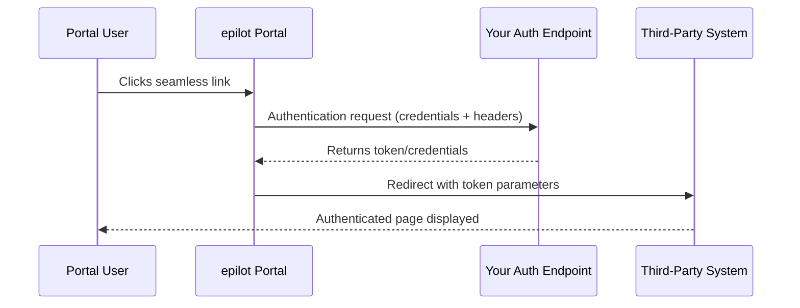

<h1 align="center">Portal Extensions</h1>

<p align="center">Enhance epilot portals with custom functionality and integrations</p>

## Configuration

All development is performed using the built-in configuration editor accessible from the component editor.

The editor provides you with autocomplete and validation of the configuration. That way you can start with the example provided in this documentation and fine-tune your portal extension without ever leaving the editor.


## Links

The easiest way to extend the functionality of portals is to link to a third party system.
This is possible using the "seamless link" concept.

### What are Seamless Links?

Seamless links enable portal users to access third-party systems directly without manual authentication. When a user clicks a seamless link in the portal, epilot handles the authentication process in the background according to your configured rules, then redirects the user to the specified page in the third-party system with the necessary credentials or tokens.

This provides a smooth user experience where portal users can navigate to external systems without interruption, while you maintain control over the authentication mechanism and security policies.

#### How Seamless Links Work



The seamless link flow consists of two main steps:

1. **Authentication**: epilot makes a request to your authentication endpoint using the configured credentials and headers
2. **Redirect**: epilot uses the authentication response to construct a redirect URL with the necessary parameters (such as tokens) and sends the user to the target page

All of this happens automatically in the background, so the portal user experiences a seamless transition to the third-party system.

### Configuration and Example

Seamless links are configured in your app configuration. Each seamless link defines the authentication mechanism and the redirect behavior. The built-in component configuration editor will guide you through the available properties and their format. Here is an example hook configuration:

```json title="Seamless link configuration"
{
  "id": "third_party_seamless_link",
  "type": "seamless",
  "name": {
    "en": "Dashboard",
    "de": "Dashboard"
  },
  "description": {
    "en": "Adds Third Party System as a Type for \"Seamless link\". Once configured, the system can be opened from Portal without a need to authenticate.",
    "de": "Fügt Third Party System als Typ für \"Seamless Link\" hinzu. Sobald konfiguriert, kann das System von Portal aus geöffnet werden, ohne sich authentifizieren zu müssen."
  },
  "auth": {
    "url": "{{Options.api_url}}/token",
    "method": "GET",
    "headers": {
      "API-Key": "{{Options.api_key}}",
      "UID": "{{Contact.customer_number}}"
    }
  },
  "redirect": {
    "url": "{{Options.ui_url}}/dashboard",
    "params": {
      "token": "{{AuthResponse.data.data.token}}",
      "contractId": "{{Contract.contract_number}}"
    }
  }
}
```

The configuration above adds a new option for quick actions like this:


### Template Variables

You can use template variables throughout your seamless link configuration to dynamically inject values from various sources. Template variables use the `{{Variable.path}}` syntax.

#### Available Variables

- **`Options.*`**: Access values from the app options configured during installation
  - Example: `{{Options.api_url}}`, `{{Options.api_key}}`

- **`Contact.*`**: Access properties from the current portal user's contact entity
  - Example: `{{Contact.customer_number}}`, `{{Contact.email}}`

- **`AuthResponse.*`**: Access data from the authentication response
  - Example: `{{AuthResponse.data.data.token}}`, `{{AuthResponse.status}}`
  - Use this to extract tokens or other authentication data returned by your auth endpoint

- **`Entity.*`**: Access properties from the current context entities
  - Example: `{{Contract.contract_number}}`, `{{Contract.id}}`


### Example Use Cases

1. **Billing Dashboard**: Redirect portal users to a third-party billing system to check details of their last bill
2. **Document Management**: Provide direct access to a document repository
3. **Service Portal**: Integrate with external service management systems

### Security Considerations

:::caution
Never hardcode sensitive credentials in your configuration. Always store API keys and secrets as app options, which are encrypted at rest.
:::

- **Credentials Storage**: Store sensitive credentials (like API keys) as app options rather than hardcoding them
- **Token Expiration**: Ensure your authentication tokens have appropriate expiration times
- **HTTPS**: Always use HTTPS URLs for authentication endpoints and redirects
- **Access Control**: Implement proper authorization checks on your authentication endpoint to ensure only authorized portal users can obtain tokens

## Hooks

Hooks allow changing or adding functionality to portals.
They typically rely on your API for the execution of any necessary logic and expect a certain response.

For certain functionalities, users can choose which hook is used in the portal settings drawer under Extensions.


There are currently three groups of hooks supported based on their use:

- Time Series Data Retrieval
- Data Existence Check/Retrieval
- Data Validation

### Time Series Data Retrieval Hooks

Data retrieval hooks enable portals to fetch and display time-series data from third-party systems. These hooks are used to power data visualizations and charts in the portal interface, allowing portal users to view real-time or historical data from integrated systems.

#### Types of Data Retrieval Hooks

Portals support three types of data retrieval hooks:

1. **Price Data Retrieval** (`priceDataRetrieval`): Fetches price information over time
2. **Consumption Data Retrieval** (`consumptionDataRetrieval`): Retrieves consumption or usage data
3. **Cost Data Retrieval** (`costDataRetrieval`): Fetches cost or billing data

#### How Data Retrieval Hooks Work

Data retrieval hooks follow a three-step process:

1. **Authentication**: epilot authenticates with your third-party system to obtain a token or credentials
2. **Data Retrieval**: Using the authentication token, epilot makes a request to your data API with the requested time range and interval
3. **Data Resolution**: The response is processed and extracted using the configured data path, then displayed in the portal

The authentication step supports caching to reduce API calls and improve performance. The data retrieval supports configurable time intervals (e.g., hourly, daily) and automatically handles time range queries based on the portal user's selected view.

#### Configuration and Example

Data retrieval hooks are configured in your app configuration. Each hook defines the authentication mechanism, the data retrieval endpoint, and how to process the response.

Below are examples for all three data retrieval hook types.
All of these enable configuring users to add a Dynamic Tariff or Consumption block where your integration is pickable using the "Integration" dropdown.


##### Price Data Retrieval

```json title="Price data retrieval hook"
{
  "id": "price",
  "type": "priceDataRetrieval",
  "name": {
    "en": "Price",
    "de": "Preis"
  },
  "intervals": ["PT1H"],
  "auth": {
    "url": "{{Options.api_url}}/token",
    "method": "GET",
    "headers": {
      "API-Key": "{{Options.api_key}}",
      "UID": "{{Contact.customer_number}}"
    },
    "cache": {
      "key": "{{Options.api_key}}-{{Contact.customer_number}}",
      "ttl": "3600"
    }
  },
  "call": {
    "url": "{{Options.api_url}}/price",
    "headers": {
      "Authorization": "Bearer {{AuthResponse.data.data.token}}"
    },
    "params": {
      "from": "{{Scope.from}}",
      "to": "{{Scope.to}}",
      "interval": "{{Scope.interval}}"
    }
  },
  "resolved": {
    "dataPath": "prices"
  }
}
```

##### Consumption Data Retrieval

```json title="Consumption data retrieval hook"
{
  "id": "consumption",
  "type": "consumptionDataRetrieval",
  "name": {
    "en": "Consumption",
    "de": "Verbrauch"
  },
  "intervals": ["PT1H"],
  "auth": {
    "url": "{{Options.api_url}}/token",
    "method": "GET",
    "headers": {
      "API-Key": "{{Options.api_key}}",
      "UID": "{{Contact.customer_number}}"
    },
    "cache": {
      "key": "{{Options.api_key}}-{{Contact.customer_number}}",
      "ttl": "3600"
    }
  },
  "call": {
    "url": "{{Options.api_url}}/consumption",
    "headers": {
      "Authorization": "Bearer {{AuthResponse.data.data.token}}"
    },
    "params": {
      "from": "{{Scope.from}}",
      "to": "{{Scope.to}}",
      "interval": "{{Scope.interval}}"
    }
  },
  "resolved": {
    "dataPath": "consumptions"
  }
}
```

##### Cost Data Retrieval

```json title="Cost data retrieval hook"
{
  "id": "cost",
  "type": "costDataRetrieval",
  "name": {
    "en": "Cost",
    "de": "Kosten"
  },
  "intervals": ["PT1H"],
  "auth": {
    "url": "{{Options.api_url}}/token",
    "method": "GET",
    "headers": {
      "API-Key": "{{Options.api_key}}",
      "UID": "{{Contact.customer_number}}"
    },
    "cache": {
      "key": "{{Options.api_key}}-{{Contact.customer_number}}",
      "ttl": "3600"
    }
  },
  "call": {
    "url": "{{Options.api_url}}/cost",
    "headers": {
      "Authorization": "Bearer {{AuthResponse.data.data.token}}"
    },
    "params": {
      "from": "{{Scope.from}}",
      "to": "{{Scope.to}}",
      "interval": "{{Scope.interval}}"
    }
  },
  "resolved": {
    "dataPath": "costs"
  }
}
```

#### Template Variables

Data retrieval hooks support the same template variables as any other hook, plus additional scope variables:

#### Standard Variables

- **`Options.*`**: Access values from the app options configured during installation
- **`Contact.*`**: Access properties from the current portal user's contact entity
- **`AuthResponse.*`**: Access data from the authentication response
- **`Entity.*`**: Access data from the context entities like `Contract`.

#### Scope Variables (for `call.params`)

These variables are automatically provided by epilot based on the portal user's selected time range and interval:

- **`Scope.from`**: Start timestamp of the requested time range (ISO 8601 format)
- **`Scope.to`**: End timestamp of the requested time range (ISO 8601 format)
- **`Scope.interval`**: Selected time interval (ISO 8601 duration format, e.g., `"PT1H"` for hourly)


#### Best Practices

- **Caching**: Use authentication token caching to reduce API load and improve response times
- **Interval Support**: Support multiple intervals if your API allows it to give portal users flexibility with different data views
- **Error Handling**: Ensure your API returns appropriate error responses that epilot can handle gracefully
- **Time Zone Handling**: Take care when handling Time Zones and DSTs

#### Returning Typed Data

The consumption hook may return more than one record per timestamp by adding a `type` field to each record. This lets a single chart break a value down into multiple series — for example a household that both draws from and feeds into the grid, or a meter billed on two tariffs.

```json title="Typed consumption response (prosumer)"
{
  "consumptions": [
    { "timestamp": "2026-01-20T11:00:00.000+00:00", "type": "feed-in", "value": 3.21 },
    { "timestamp": "2026-01-20T11:00:00.000+00:00", "type": "feed-out", "value": 0.0 },
    { "timestamp": "2026-01-20T12:00:00.000+00:00", "type": "feed-in", "value": 3.84 },
    { "timestamp": "2026-01-20T12:00:00.000+00:00", "type": "feed-out", "value": 0.0 },
    { "timestamp": "2026-01-20T20:00:00.000+00:00", "type": "feed-in", "value": 0.0 },
    { "timestamp": "2026-01-20T20:00:00.000+00:00", "type": "feed-out", "value": 0.42 }
  ]
}
```

The `type` values are free-form, but they only render meaningfully when the portal knows how to label, color and combine them. That information comes from the **Visualization Metadata** hook described below — each `type` returned by the data hook should match a `type_options[].id` returned by the metadata hook.

### Visualization Metadata Hook

The `visualizationMetadata` hook returns runtime metadata describing **how** a visualization should be rendered for the current portal context (which meter, contract, etc. the user is looking at). The portal invokes it _before_ the data hook, with the same context, so the shape of the chart can vary per meter or contract — different tariff models, available intervals, or history depth.

A `visualizationMetadata` hook is looked up implicitly per extension (one per extension); a data-retrieval hook does not need to reference it explicitly.

The metadata response has three optional fields:

- **`type_options`**: the series advertised for this context. Each option's `id` matches the `type` field on the data hook records. Options also carry a localized `label`, an `aggregation_group`, a `statistical_method`, a `unit`, a Spark `color`, and a display `precision`.
- **`intervals`**: the intervals supported for this context (`PT15M`, `PT1H`, `P1D`, `P1M`). Prefer this over the now-deprecated `intervals` field on the data-retrieval hooks, so the supported intervals can vary per meter/contract.
- **`data_range`**: the earliest (`from`) and latest (`to`) timestamps for which data is available, used to bound the date picker.

The `statistical_method` on each type both describes the aggregation already applied to that type's data and dictates the chart shape:

- `sum` → **bar chart**. Same-`aggregation_group` types are stacked into one bar; different groups render side-by-side.
- `min` / `average` / `max` → **line chart**. Same-`aggregation_group` types render as an area band; different groups render as separate lines.

Because the method is per-type, a single visualization can mix bar-shaped and line-shaped series.

```json title="Visualization metadata hook"
{
  "id": "visualization_metadata",
  "type": "visualizationMetadata",
  "auth": {
    "url": "{{Options.api_url}}/token",
    "method": "GET",
    "headers": {
      "API-Key": "{{Options.api_key}}",
      "UID": "{{Contact.customer_number}}"
    },
    "cache": {
      "key": "{{Options.api_key}}-{{Contact.customer_number}}",
      "ttl": "3600"
    }
  },
  "call": {
    "url": "{{Options.api_url}}/example/visualization/metadata",
    "headers": {
      "Authorization": "Bearer {{AuthResponse.data.data.token}}"
    },
    "params": {
      "setup": "{{Options.setup}}"
    }
  },
  "resolved": {
    "data_path": "",
    "error_message_path": "message"
  }
}
```

:::note
`use_static_ips` is deprecated on all hook types — prefer `secure_proxy` (route requests through the ERP Integration secure proxy by setting `integration_id` and `use_case_slug`). The `resolved.dataPath` field has also been renamed to `resolved.data_path`; the old name still works but is deprecated.
:::

### Worked Examples: epilot Example Integration

The epilot **example integration** service is a reference backend that powers Dynamic Tariff and Consumption blocks against synthetic-but-realistic German energy data. It exposes the data-retrieval endpoints (`/example/price`, `/example/consumption`, `/example/cost`) and a `/example/visualization/metadata` endpoint, and accepts a `setup` query parameter that selects a predefined deployment scenario. Using the same `setup` across the metadata and data hooks keeps the advertised `type_options` aligned with the records the data hooks return.

The endpoints also accept `from`, `to` and `interval` (and, for consumption/cost, an optional `multiplier` for B2B scenarios). The two scenarios below show the prosumer and load-cycle setups end-to-end.

#### Prosumer (feed-in / feed-out)

A household with a rooftop PV system both imports from and exports to the grid. The `prosumer` setup advertises two series — `feed-in` (surplus exported to the grid, peaks midday) and `feed-out` (drawn from the grid, mostly at night) — as separate groups so they render as distinct series.

```json title="Visualization metadata response (setup=prosumer)"
{
  "type_options": [
    { "id": "feed-in", "label": { "en": "Feed-in", "de": "Einspeisung" }, "aggregation_group": "feed-in", "statistical_method": "sum", "unit": "kWh", "color": "green", "precision": 2 },
    { "id": "feed-out", "label": { "en": "Feed-out", "de": "Ausspeisung" }, "aggregation_group": "feed-out", "statistical_method": "sum", "unit": "kWh", "color": "blue", "precision": 2 }
  ],
  "intervals": ["PT15M", "PT1H", "P1D", "P1M"],
  "data_range": { "from": "2024-06-08T00:00:00.000Z", "to": "2026-06-08T00:00:00.000Z" }
}
```

```json title="Consumption hook (setup=prosumer)"
{
  "id": "consumption",
  "type": "consumptionDataRetrieval",
  "name": {
    "en": "Consumption",
    "de": "Verbrauch"
  },
  "auth": {
    "url": "{{Options.api_url}}/token",
    "method": "GET",
    "headers": {
      "API-Key": "{{Options.api_key}}",
      "UID": "{{Contact.customer_number}}"
    },
    "cache": {
      "key": "{{Options.api_key}}-{{Contact.customer_number}}",
      "ttl": "3600"
    }
  },
  "call": {
    "url": "{{Options.api_url}}/example/consumption",
    "headers": {
      "Authorization": "Bearer {{AuthResponse.data.data.token}}"
    },
    "params": {
      "from": "{{Scope.from}}",
      "to": "{{Scope.to}}",
      "interval": "{{Scope.interval}}",
      "setup": "prosumer"
    }
  },
  "resolved": {
    "data_path": "consumptions"
  }
}
```

The matching consumption response (hourly) returns a `feed-in` and a `feed-out` record per timestamp — surplus during the day, grid draw at night:

```json title="Consumption response (setup=prosumer, interval=PT1H)"
{
  "consumptions": [
    { "timestamp": "2026-01-20T07:00:00.000+00:00", "type": "feed-in", "value": 0.0 },
    { "timestamp": "2026-01-20T07:00:00.000+00:00", "type": "feed-out", "value": 0.31 },
    { "timestamp": "2026-01-20T13:00:00.000+00:00", "type": "feed-in", "value": 4.12 },
    { "timestamp": "2026-01-20T13:00:00.000+00:00", "type": "feed-out", "value": 0.0 },
    { "timestamp": "2026-01-20T21:00:00.000+00:00", "type": "feed-in", "value": 0.0 },
    { "timestamp": "2026-01-20T21:00:00.000+00:00", "type": "feed-out", "value": 0.58 }
  ]
}
```

For a line-chart variant of the same data, the example integration also ships a `prosumer-line` setup (feed-in/feed-out advertised with `statistical_method: average`).

#### Load Cycle (min / average / max)

An industrial / B2B site is billed on instantaneous power (kW) rather than energy. The `load-cycle` setup advertises three series — `min`, `average` and `max` — sharing a single `aggregation_group` but each carrying its own `statistical_method`. The portal renders this as a min–max area band with the average drawn as a line on top.

```json title="Visualization metadata response (setup=load-cycle)"
{
  "type_options": [
    { "id": "min", "label": { "en": "Minimum", "de": "Minimum" }, "aggregation_group": "load", "statistical_method": "min", "unit": "kW", "color": "slate", "precision": 0 },
    { "id": "average", "label": { "en": "Average", "de": "Durchschnitt" }, "aggregation_group": "load", "statistical_method": "average", "unit": "kW", "color": "primary", "precision": 0 },
    { "id": "max", "label": { "en": "Maximum", "de": "Maximum" }, "aggregation_group": "load", "statistical_method": "max", "unit": "kW", "color": "red", "precision": 0 }
  ],
  "intervals": ["PT15M", "PT1H", "P1D"],
  "data_range": { "from": "2025-06-08T00:00:00.000Z", "to": "2026-06-08T00:00:00.000Z" }
}
```

```json title="Consumption response (setup=load-cycle, interval=PT1H)"
{
  "consumptions": [
    { "timestamp": "2026-01-20T03:00:00.000+00:00", "type": "min", "value": 118 },
    { "timestamp": "2026-01-20T03:00:00.000+00:00", "type": "average", "value": 128 },
    { "timestamp": "2026-01-20T03:00:00.000+00:00", "type": "max", "value": 139 },
    { "timestamp": "2026-01-20T09:00:00.000+00:00", "type": "min", "value": 548 },
    { "timestamp": "2026-01-20T09:00:00.000+00:00", "type": "average", "value": 642 },
    { "timestamp": "2026-01-20T09:00:00.000+00:00", "type": "max", "value": 731 }
  ]
}
```

The hook configuration is identical to the prosumer consumption hook above, only with `"setup": "load-cycle"` in `call.params`.

#### Other Built-in Setups

The example integration ships further setups you can point the `setup` parameter at to exercise different chart shapes and discovery payloads:

| `setup` | Series (`type_options`) | Rendered as | Notes |
| --- | --- | --- | --- |
| `default` | `default` (Consumption, kWh) | Bar | Single-tariff household, all intervals, last 2 years. |
| `dual-tariff` | `ht` (High tariff), `nt` (Night tariff) | Stacked bar | HT 06:00–22:00, NT otherwise; both in the `consumption` group. |
| `prosumer` | `feed-in`, `feed-out` | Bars (separate groups) | Net grid flows for a 5 kWp PV household. |
| `prosumer-line` | `feed-in`, `feed-out` | Area / line | Prosumer data as `statistical_method: average`. |
| `load-cycle` | `min`, `average`, `max` | Min–max band + average line | Industrial load in kW. |
| `consumption-with-load` | `consumption` (kWh, bar), `average-load` (kW, line) | Mixed bar + line | Two `aggregation_group`s in one chart. |
| `daily-only` | `default` | Bar | Only `P1D` + `P1M` (e.g. monthly meter readings). |
| `partial-history` | `ht`, `nt` | Stacked bar | Last 6 months only (e.g. recently switched provider). |
| `current-month` | `default` | Bar | Current month only (`PT1H` + `P1D`), e.g. start-of-contract demos. |

### Data Existence Check/Retrieval

Sometimes it is desired to check against a third party system before allowing a user to register or self-assign business objects to their account.
At the same time, it might be necessary to load business entities to epilot before allowing user to proceed in cases epilot does not have all data on non-portal users.

#### Registration Hook

Use the registration hook to validate identifiers before creating a portal user. If the registration is valid, you can pass back an epilot Contact UUID that is associated with the portal user.

If no body is specified, all identifiers configured for the portal and provided by the user are passed grouped by the schema.

```json title="Registration hook"
{
  "id": "registration",
  "type": "registrationIdentifiersCheck",
  "call": {
    "url": "https://webhook.site/5e6eae4f-a0ea-4858-ab1a-3f7cb96f5abd",
    "headers": {
      "Authorization": "Bearer {{Options.api_key}}"
    },
    "result": "{{CallResponse.data.contact_id}}"
  }
}
```

#### Template Variables

Registration hooks support the standard template variables plus the identifiers context:

- **`Options.*`**: Access values from the app options configured during installation
- **`Identifiers.*`**: Access properties provided by the user to identify the entity groupped by schema

#### Self-Assignment Hook

Use the self-assignment hook when portal users attach additional contracts to their account. The hook can also include localized explanations shown to the user.

If no body is specified, all identifiers configured for the portal and provided by the user are passed grouped by the schema.

```json title="Self-assignment hook"
{
  "id": "CONTRACT_IDENTIFICATION",
  "type": "contractIdentification",
  "call": {
    "url": "https://webhook.site/5e6eae4f-a0ea-4858-ab1a-3f7cb96f5abd",
    "headers": {
      "Authorization": "Bearer {{Options.api_key}}"
    },
    "body": {
      "entity": {
        "customer_number": "{{Contact.customer_number}}",
        "portal_user_id": "{{PortalUser._id}}",
        "contract_number": "{{Identifiers.contract.contract_number}}"
      }
    }
  },
  "assignment_mode": "contact_to_portal_user",
  "explanation": {
    "en": "If you add additional contracts, all your documents, such as invoices, contract offers, etc., will be managed in the customer portal. You will no longer receive the documents by mail, but you will be notified by email about the upload of new documents that have been uploaded to the customer portal for you. Please note that there is currently a limit of 50 contracts.",
    "de": "Wenn Sie einen weiteren Verträge hinzufügen werden alle Ihre Dokumente, wie z.B. Rechnungen, Vertragsangebote etc. im Kundenportal verwaltet. Sie erhalten die Dokumente dann nicht mehr per Post, werden aber per E-Mail über den Upload von neuen Unterlagen, die im Kundenportal für Sie hochgeladen wurden, informiert. Bitte beachten Sie, dass derzeit eine Begrenzung von 50 Verträgen besteht."
  }
}
```

#### Template Variables

Self-assignment hooks support the standard template variables plus the identifiers context:

- **`Options.*`**: Access values from the app options configured during installation
- **`Contact.*`**: Access properties from the current portal user's contact entity
- **`PortalUser.*`**: Access properties from the current portal user
- **`Identifiers.*`**: Access properties provided by the user to identify the entity groupped by schema
- **`CallResponse.*`**: Access data from the call response (for example in `call.result`)

### Data Validation


#### Meter Reading Plausibility

Use the plausibility check hook to validate meter readings before they are submitted and return limits for validation feedback.

```json title="Meter reading plausibility check hook"
{
  "id": "PLAUSIBILITY_CHECK",
  "type": "meterReadingPlausibilityCheck",
  "call": {
    "url": "https://webhook.site/5e6eae4f-a0ea-4858-ab1a-3f7cb96f5abd",
    "headers": {
      "Authorization": "Bearer {{Options.api_key}}"
    },
    "body": {
      "meter_number": "{{Meter.meter_number}}",
      "register_number": "{{MeterCounter.register_number}}",
      "timestamp": "{{Reading.timestamp}}",
      "value": "{{Reading.value}}"
    }
  },
  "resolved": {
    "valid": "{{CallResponse.data.valid}}",
    "lower_limit": "{{CallResponse.data.lower_limit}}",
    "upper_limit": "{{CallResponse.data.upper_limit}}"
  }
}
```

#### Template Variables

Meter reading plausibility hooks support the standard template variables plus meter reading context:

- **`Options.*`**: Access values from the app options configured during installation
- **`Contact.*`**: Access properties from the current portal user's contact entity
- **`Meter.*`**: Access properties of the meter
- **`MeterCounter.*`**: Access properties of the meter register
- **`Reading.*`**: Access properties of the submitted reading
- **`CallResponse.*`**: Access data from the call response

For questions about portal extensions, [contact our developer support team](https://developers.epilot.cloud/contact).
