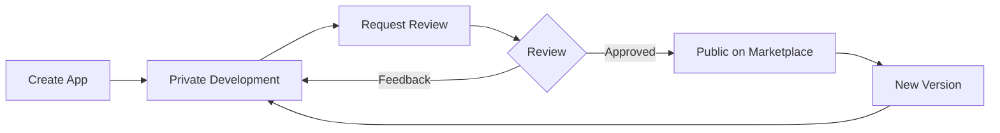

# Private vs. Public Apps

The epilot app platform distinguishes between private and public apps to support a secure development workflow while ensuring quality in the marketplace. This distinction is central to how apps are developed, tested, and distributed.

## Private Apps: Your Development Sandbox

When you first create an app on epilot, it begins as a private app with an initial version (0.0.1). This private status provides a protected development environment where you can:

- Build and test your app components without affecting other organizations
- Make frequent iterative changes during development
- Configure all aspects of your app until it meets your requirements
- Install and test the app within your own organization exclusively

During this stage, your app remains completely invisible to other epilot customers and cannot be installed outside your organization. This isolation allows for risk-free experimentation and thorough testing.

## The Review Process: Gateway to Public Release

Once you've developed and thoroughly tested your private app, you can request a formal review to make a specific version public. The review process ensures that all apps in the public marketplace meet epilot's standards for:

- Security and data handling
- Performance and reliability
- User experience and design consistency
- Documentation and support
- Compliance with platform guidelines

Our team will evaluate your app based on these criteria and provide feedback if improvements are needed before public release.

## Public Apps: Available to All

After successfully passing the review process, your app version becomes public and:

- Appears in the epilot app marketplace for all customers
- Can be discovered, evaluated, and installed by any organization
- Joins the ecosystem of trusted epilot integrations
- Becomes subject to version control to ensure stability

At this point, the specific version that was approved becomes locked—you cannot modify a public version directly. Instead, to make updates or improvements, you'll create new versions that go through the same private development and review cycle.

## Managing Multiple Versions

As your app evolves, you'll maintain both private and public versions:

- **Development Versions**: Newer private versions where you're actively making changes
- **Public Versions**: Stable, reviewed versions available to all customers

This versioning approach ensures that users can rely on the stability of public versions while you continue to innovate with new features in development.

## Best Practices

To make the most of the private-to-public workflow:

1. **Thoroughly test in private**: Use your private versions to extensively test all aspects of your app before requesting review
2. **Document carefully**: Prepare comprehensive documentation for your app before submission
3. **Plan your versions**: Use semantic versioning to clearly communicate the nature of your changes
4. **Provide migration paths**: When making significant changes, consider how existing users will transition

By understanding the distinction between private and public apps, you can effectively leverage epilot's platform to develop, distribute, and maintain high-quality integrations for the energy industry.