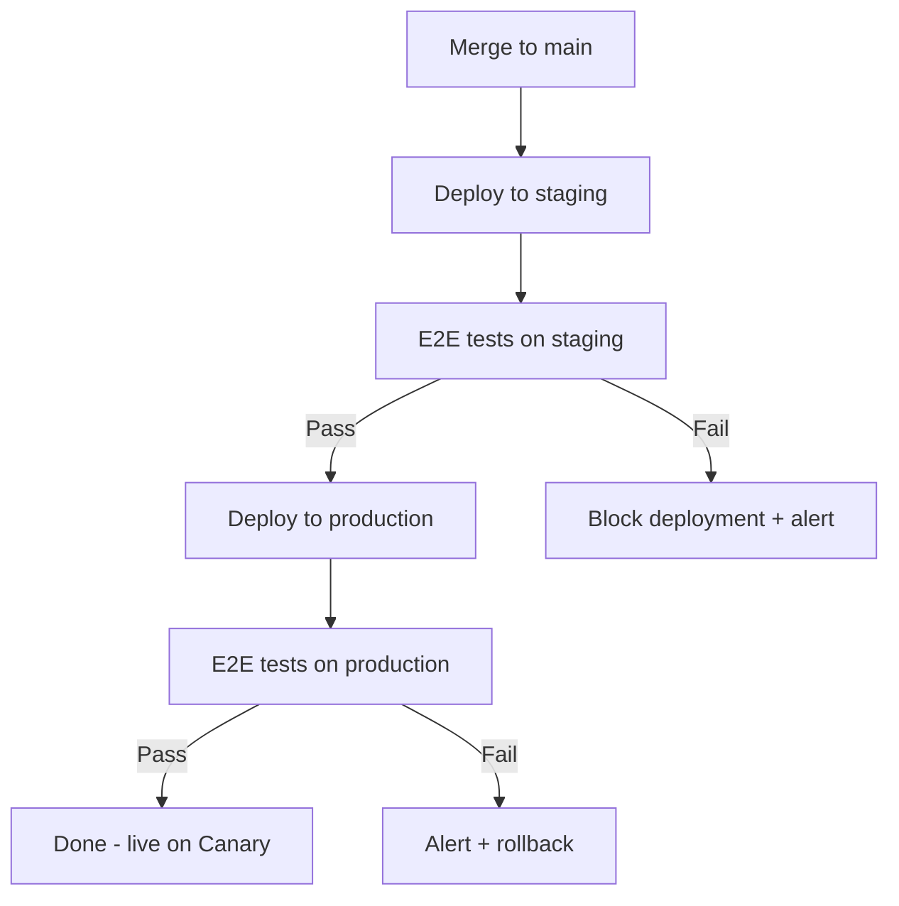

# Continuous Delivery

epilot ships over 200 production deployments per week using trunk-based development and automated pipelines. Every merge to `main` triggers a deployment through staging to production, gated by end-to-end tests.

To balance speed with stability, epilot operates two release channels: **Canary** for continuous updates and **Stable** for curated monthly releases.

## Release Channels

### Canary (Continuous Updates)

The Canary channel receives every deployment as it happens. Code merged to `main` flows through staging, passes automated E2E tests, and reaches production within minutes.

Canary is suited for:

- Internal testing and development organizations
- Partner organizations validating upcoming features
- Customers who want early access to new capabilities

### Stable (Monthly Releases)

The Stable channel receives curated, tested releases on a monthly cadence. Each release goes through a structured acceptance testing period before publication.

**Release timeline:**

| Phase | Timing | What happens |
|-------|--------|-------------|
| Feature development | Ongoing | Teams ship continuously to Canary |
| Acceptance testing | Week before release | QA team + engineers validate the release candidate |
| Release day | First Monday of the month | Stable import map updated, release notes published |

Stable releases are assembled by snapshotting tested versions of all frontend microfrontends into a `stable-importmap.json`, which is served to organizations on the Stable channel.

### How Customers Choose

Organizations select their update frequency in the epilot 360 portal settings. The default is Stable (monthly updates).

Individual users can also override the organization default from their account settings -- useful for administrators who want to preview upcoming changes without switching the entire organization to Canary.

### Hotfixes and Patches

Critical issues affecting Stable customers are addressed immediately through two mechanisms:

- **Hotfix tags** (`hotfix-*`) -- deploy directly to the Stable import map, skipping E2E tests for speed. Reserved for critical production issues.
- **Patch tags** (`patch-*`) -- deploy to the Stable import map after running the full pipeline with E2E tests and manual approval. Used for non-urgent fixes between monthly releases.

## Deployment Pipeline

All services follow trunk-based development. There are no long-lived feature branches or release branches.



### Frontend Deployments

The epilot 360 portal is a [single-spa micro-frontend architecture](/docs/portal/microfrontends). Each microfrontend deploys independently and updates an import map that the portal shell reads at load time.

| Trigger | Import map updated | Channel |
|---------|-------------------|---------|
| Merge to `main` | `systemjs-importmap.json` | Canary |
| `stable-*` tag | `stable-importmap.json` | Stable |
| `hotfix-*` tag | `stable-importmap.json` | Stable |
| `patch-*` tag | `stable-importmap.json` (with manual approval) | Stable |

Because APIs maintain backward compatibility, Stable frontend versions continue to work correctly even as backend services are updated continuously.

### Backend Deployments

Backend services (AWS Lambda, Step Functions, CDK stacks) deploy through the same pipeline: staging, E2E tests, then production. Backend deployments always go live for all customers -- the Canary/Stable split applies only to frontend microfrontends.

## Feature Flags

epilot uses [LaunchDarkly](https://launchdarkly.com/) for feature flag management, enabling progressive rollout of new capabilities independent of deployments.

Feature flags serve several purposes:

- **Ship incomplete work safely.** Code deploys continuously to production behind flags, decoupling deployment from release.
- **Gradual rollout.** Enable features for specific organizations, user segments, or percentages of traffic.
- **Instant rollback.** Disable a feature without redeploying code.
- **Per-environment control.** Enable features in staging for testing before production.

<details>
<summary>Frontend usage</summary>

```typescript
import { useFlags } from '@epilot360/feature-flags-service'

const MyComponent = () => {
  const flags = useFlags()

  if (flags.myNewFeature) {
    return <NewExperience />
  }

  return <CurrentExperience />
}
```

</details>

<details>
<summary>Backend usage</summary>

```typescript
import { init } from 'launchdarkly-node-server-sdk'

const client = init(process.env.LD_SDK_KEY)

const isEnabled = await client.variation(
  'my-feature-flag',
  { key: orgId },
  false
)
```

</details>

Flags are evaluated at runtime using the organization ID (and optionally user ID) as the targeting context, enabling fine-grained control over who sees what.

## Testing Strategy

### Unit Tests

All services use [Vitest](https://vitest.dev/) for unit testing. Test files are colocated next to the modules they test. Integration tests against AWS services use [LocalStack](https://localstack.cloud/) running as a Docker service in CI.

### End-to-End Tests (Playwright)

A centralized Playwright test suite runs against the full application in staging and production as part of every deployment pipeline. These tests act as the primary deployment gate -- if they fail on staging, the deployment to production is blocked.

The E2E test suite covers critical user workflows across the platform: entity management, journeys, workflows, messaging, portals, and more.

**Key practices:**

- **Page Object Models** encapsulate UI interactions, improving test readability and reducing locator duplication across test files.
- **User-visible locators** (`getByRole`, `getByLabel`) are preferred over implementation-coupled selectors (`locator('.css-class')`), making tests resilient to UI refactors.
- **Test isolation** -- each test manages its own data setup and teardown, enabling parallel execution and reliable retries.

### Performance Benchmarks

Playwright test durations are monitored via Datadog. Alerts fire when key user flows exceed duration thresholds, surfacing both performance regressions and flaky tests early.

## Release Quality Process

Each monthly Stable release follows a structured quality gate:

1. **Release candidate assembly.** Teams tag tested versions of their microfrontends for inclusion.
2. **Acceptance testing.** A minimum 3-day testing period where QA engineers and cross-functional colleagues validate the release candidate in a production-like environment.
3. **Release readiness criteria.** All automated tests passing, QA playbooks completed, no open blocker bugs, no open translation issues.
4. **Release.** The stable import map is updated and release notes are published.
5. **Post-release monitoring.** Bug reports in the first 7 days after release are tracked and analyzed to improve future releases.

:::info
epilot's API-first architecture means backend services maintain strict backward compatibility. Stable frontend versions are fully compatible with continuously updated backend APIs -- there are no version lock-in concerns.
:::

## Monitoring and Rollback

- **E2E tests on production** run immediately after every deployment. Failures trigger alerts and automatic rollback.
- **Real-time error monitoring** via Datadog catches issues that automated tests miss.
- **Feature flags** provide instant kill switches for new functionality without requiring a rollback deployment.
- **Hotfix pipeline** enables emergency patches to reach Stable customers within minutes when needed.

## Further Reading

- [Architecture Overview](/docs/architecture/overview) -- epilot's tech stack and system design
- [API First](/docs/architecture/api-first) -- API design philosophy and backward compatibility
- [Security Architecture](/docs/architecture/security) -- multi-tenant isolation and encryption
