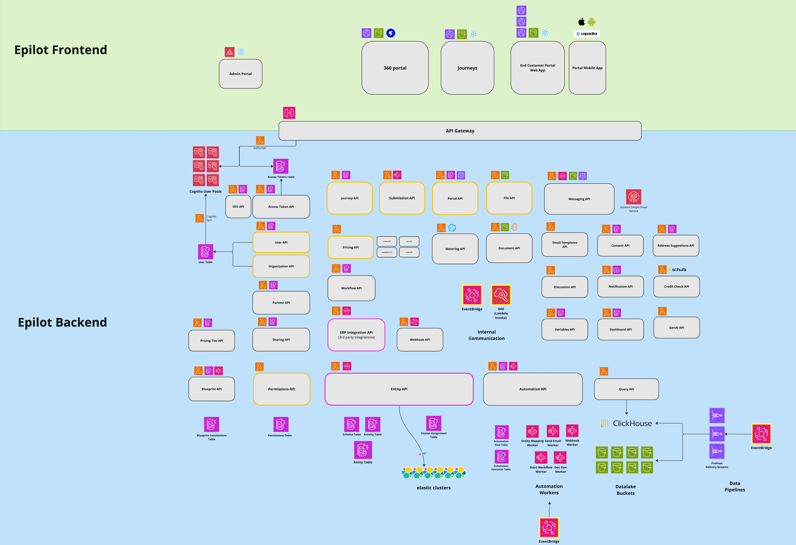

# Tech Stack & Architecture

:::info

_epilot_ is a multi-tenant SaaS platform for energy suppliers, municipal utilities, grid operators, and solution providers. It provides a 360° energy XRM (extended relationship management) to digitize sales, service, and grid processes end-to-end.

[What is an energy XRM?](https://www.epilot.cloud/en/blog/what-is-an-energy-xrm)

:::

## Overview

The epilot application consists of:

- [The epilot portal](/docs/architecture/microfrontends) — single-spa micro-frontend SPA
- [Embeddable Journey Frontends](/docs/journeys/journey-builder) — customer-facing forms and flows
- [epilot Portals](/docs/portals/customer-portal) — white-label self-service portals for end-users, with [mobile app](/docs/portals/mobile-app) support
- Serverless microservices with [public APIs](/api)

## Architecture

epilot runs entirely on **AWS** in the EU (Frankfurt) region as a cloud-native, serverless platform.

The backend is composed of independent **microservices** deployed as Lambda functions behind API Gateway. Services communicate asynchronously through EventBridge and SQS. All APIs follow an **API-first** design — OpenAPI contracts are defined before implementation, powering auto-generated SDKs and documentation.

The frontend consists of multiple **independently deployable applications** — the epilot 360 portal (a single-spa micro-frontend SPA), embeddable journey frontends, and white-label end-user portals — all built with React or Svelte and sharing the Volt UI design system.

## Tech Stack

See the [epilot Tech Radar](https://docs.epilot.io/techradar/) for a detailed technology landscape.

### Frontend

| Technology | Role |
|---|---|
| [React](https://react.dev/) | Main UI framework |
| [Svelte](https://svelte.dev/) | Used in select micro-frontends |
| [single-spa](https://single-spa.js.org/) | Micro-frontend orchestration for the epilot portal |
| [Tailwind CSS](https://tailwindcss.com/) | Utility-first CSS framework |
| [Volt UI](https://www.npmjs.com/package/@epilot/volt-ui) | epilot design system (React and Svelte) |
| [Capacitor](https://capacitorjs.com/) | Hybrid native runtime for [portal mobile apps](/docs/portals/mobile-app) |
| [Axios](https://axios-http.com/) / [openapi-client-axios](https://www.npmjs.com/package/openapi-client-axios) | HTTP client with OpenAPI type generation |

### Backend

| Technology | Role |
|---|---|
| [AWS Lambda](https://aws.amazon.com/lambda/) | Serverless compute for all microservices |
| [API Gateway](https://aws.amazon.com/api-gateway/) (HTTP API) | API routing and authorization |
| [Step Functions](https://aws.amazon.com/step-functions/) | Workflow orchestration |
| [EventBridge](https://aws.amazon.com/eventbridge/) | Event-driven communication between services |
| [S3](https://aws.amazon.com/s3/) | File and object storage |
| [SQS](https://aws.amazon.com/sqs/) | Message queuing |
| [openapi-backend](https://www.npmjs.com/package/openapi-backend) | OpenAPI-first request handling |
| [Zod](https://zod.dev/) | Runtime schema validation |

### Databases

| Technology | Role |
|---|---|
| [DynamoDB](https://aws.amazon.com/dynamodb/) | General-purpose data store for microservices |
| [Elastic Cloud](https://www.elastic.co/cloud) | Full-text search and indexing for business entities |
| [ClickHouse Cloud](https://clickhouse.com/) | Analytical queries, [Datalake](/docs/datalake/epilot-datalake), workflow data, audit logs |
| [Momento](https://www.gomomento.com/) | Caching |

## Further Reading

- [API First](/docs/architecture/api-first) — OpenAPI contract-first design and code generation
- [Microfrontends](/docs/architecture/microfrontends) — single-spa orchestration of the epilot 360 portal
- [SDK](/docs/architecture/sdk) — Auto-generated TypeScript SDK for epilot APIs
- [Security](/docs/architecture/security) — Multi-tenant isolation, authentication, authorization, and encryption
- [Serverless](/docs/architecture/serverless) — AWS Lambda-based microservice architecture
- [Continuous Delivery](/docs/architecture/continuous-delivery) — Trunk-based development, canary and stable release channels
- [Design System](/docs/architecture/design-system) — Volt UI component library for React and Svelte
- [Open Source](/docs/architecture/open-source) — Public repositories and community contributions
