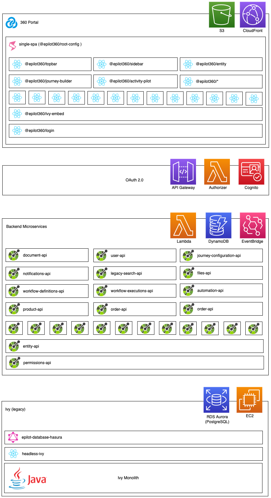

# Introduction to epilot

Epilot is a multi-tenant SaaS platform for complex ecommerce.

Our tenants use epilot to sell complex products online and collaborate with partners to deliver great ecommerce experiences to their end customers.

## Overview

The epilot application consists of:

- [The main 360 portal app](https://portal.epilot.cloud)
- Embeddable customer-facing journey frontends
- End customer portal app
- Serverless microservices exposed via [APIs](/api)
- [Internal admin area](https://admin.epilot.cloud)

## Tech Stack

The portal frontend is a single-page web application (SPA) consisting of multiple frontend microservices running on [single-spa](https://single-spa.js.org/).

The majority of frontend microservices are written in [React](https://reactjs.org/) + [Typescript](https://www.typescriptlang.org/).

The epilot application backend consists of serverless microservices behind [APIs](/api).

The majority of backend microservices are written in [Typescript](https://www.typescriptlang.org/) using serverless AWS services such as Lambda, Step Functions, API Gateway, S3, DynamoDB, EventBridge.

We still support some customers using the legacy version of epilot built on [Axon Ivy](https://www.axonivy.com/). Ivy is a monolith Java application running on AWS EC2.

