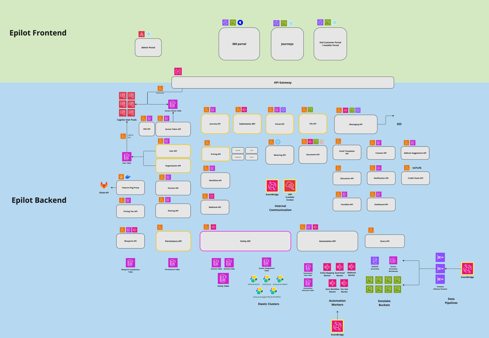

# Introduction to epilot

:::info

_epilot_ is a multi-tenant vertical SaaS built for energy suppliers, municipal utilities, grid operators & solution providers, all collaborating on one platform and ecosystem.

We offer a 360° energy XRM – an extended relationship management platform to digitize sales, service & grid processes from initial customer inquiries to ongoing support. For efficient processes, flexible market launches and happy customers.

[What is an energy XRM?](https://www.epilot.cloud/en/blog/what-is-an-energy-xrm)

:::

## Overview

The epilot application consists of:

- [The epilot portal](/docs/portal/microfrontends)
- [Embeddable Journey Frontends](/docs/journeys/journey-builder)
- [Customer & Installer Portals](https://docs.epilot.io/docs/portals/customer-portal)
- Serverless microservices with [APIs](/api)
- Internal Admin Portal

## Tech Stack

The portal frontend is a single-page web application (SPA) hosted on AWS CloudFront consisting of frontend microservices orchestrated by the [single-spa](https://single-spa.js.org/) framework.

Most of our frontend codebase is written in React and Typescript but other frameworks such as Svelte are also used in parts of the application.

The epilot application backend consists of serverless microservices written mostly in Typescript and Python leveraging serverless AWS services such as Lambda, Step Functions, API Gateway, S3, DynamoDB, EventBridge.

Check out our [Tech Radar](https://docs.epilot.io/techradar/) for a more detailed view of our tech stack!

## System Architecture Diagram

