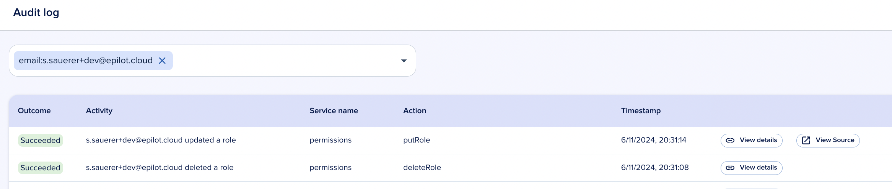

# Audit Logs

[[SDK](https://www.npmjs.com/package/@epilot/audit-logs-client)]

Audit logs provide a tamper-resistant record of activity across your epilot organization. They capture **who** did **what**, **when**, and on **which resource** — giving you the visibility you need for security reviews, compliance, and troubleshooting.

:::info
Audit logs are an enterprise-tier feature. Contact sales for details.
:::

## What is tracked

Audit logs focus on **mutations** — operations that change the state of your organization:

- **Create** — A new resource is created (e.g. a new entity, user, or webhook)
- **Update** — An existing resource is modified (e.g. editing an entity, changing permissions)
- **Delete** — A resource is removed (e.g. deleting an automation flow, removing a user)

Selected **read operations** are also logged when they are security-relevant, such as viewing sensitive configuration or exporting data.

:::tip
If you need audit coverage for an operation or service not yet tracked, contact support to request an addition.
:::

## Audited services

The following services currently emit audit log events:

| Service | Description |
|---|---|
| App | App installations and configuration changes |
| Automation | Automation flow create, update, and delete operations |
| Blueprint Manifest | Blueprint installations and manifest changes |
| Customer Portal | Portal configuration and settings changes |
| Email Settings | Email domain, sender, and routing configuration |
| Entity | Entity create, update, and delete across all schemas |
| ERP Integration API | ERP integration configuration and sync operations |
| Journey Config | Journey configuration and publishing changes |
| Permissions | Role and grant changes |
| User | User invitations, role assignments, and account changes |
| Webhooks | Webhook endpoint create, update, and delete operations |

:::note
Coverage expands over time. Not every API call within a service is logged — only the operations that modify resources or access sensitive data.
:::

## Log entry details

Each audit log entry contains:

| Field | Description |
|---|---|
| **Timestamp** | When the event occurred |
| **User** | The user or API token that triggered the action |
| **Operation** | The specific action performed (e.g. `createEntity`, `updateRole`) |
| **Service** | The service that emitted the event |
| **Resource** | The affected resource identifier |
| **Changes** | A diff of what changed, when available |

## Permissions

Viewing audit logs requires the `audit_log:view` permission. Admin users have this by default. Assign it to other roles through [access management](/docs/auth/permissions).

## Facade APIs

The Entity API is audited. Facade APIs (wrappers around the Entity API) are not separately audited to avoid duplicate entries. The underlying entity mutation is still captured.

## Retention

Audit log entries are retained according to your organization's plan. Contact your account manager for details on retention periods and data export options.
