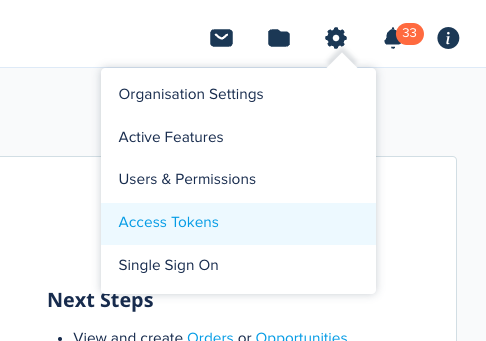
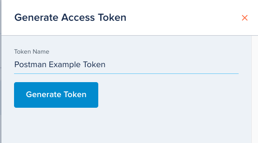
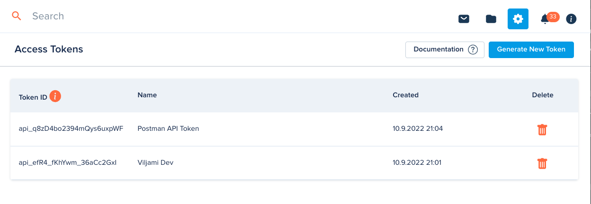

# Access Tokens

[[API Docs](/api/access-token)]
[[SDK](https://www.npmjs.com/package/@epilot/access-token-client)]

:::info

To call epilot APIs, requests must be authorized using a valid _Access Token_.

:::

## Using Access Token Authorization

The access token should be passed in the `Authorization` request header.

```
Authorization: Bearer <your-access-token>
```

## Creating Access Tokens

Users logged into the epilot portal can manage their Access Tokens from [Settings > Access Tokens](https://portal.epilot.cloud/app/tokens).

Creating access tokens requires the `token:create` permission.



When creating an Access Token, the token inherits the roles and permissions of the logged in user.



:::note
The generated token is shown only once and must be saved by the user.
:::

## Revoking Access Tokens

Access Tokens can be deleted from the management view to revoke them.

After revoking a token, it cannot be used anymore to call epilot APIs.



:::caution
epilot doesn't store and cannot recover lost or revoked access tokens.
:::

## Access Token API

Authenticated users can generate long-term access tokens for 3rd party applications using the epilot [Access Token API](/api/access-token) `createAccessToken` operation.

```
POST /v1/access-tokens
```

```json
{
  "name": "Token for my application"
}
```

Optionally, you can pass a list of Role IDs, to define the roles the access token will have access to. By default, the access token inherits the caller's roles.

```
POST /v1/access-tokens
```

```json
{
  "name": "Postman Access Token",
  "assume_roles": ["123:owner"]
}
```

Each Access Token generated via the API gets a generated a unique ID.

```json
// 201 - success
{
  "id": "api_5ZugdRXasLfWBypHi93Fk",
  "created_at": "2019-08-24T14:15:22Z",
  "name": "Postman Access Token",
  "assignments": ["123:owner"]
}
```

Access tokens may also be revoked using the `revokeAccessToken` operation

```
DELETE /v1/access-tokens/api_5ZugdRXasLfWBypHi93Fk
```

```json
// 200 - success
{
  "id": "api_5ZugdRXasLfWBypHi93Fk",
  "created_at": "2019-08-24T14:15:22Z",
  "name": "Postman Access Token",
  "assignments": ["123:owner"]
}
```
