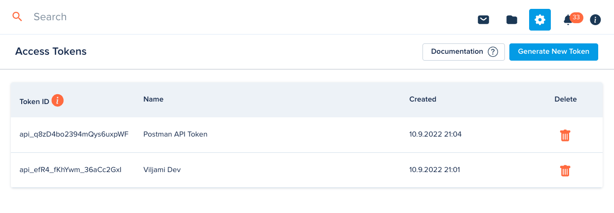

# Access Tokens

[[API Docs](/api/access-token)]
[[SDK](https://www.npmjs.com/package/@epilot/sdk)]

:::info

To call epilot APIs, requests must be authorized using a valid _Access Token_.

:::

## Using Access Tokens

Pass the access token in the `Authorization` request header:

```http title="Authorization header"
Authorization: Bearer <your-access-token>
```

## Creating Access Tokens

Manage Access Tokens from [Settings > Access Tokens](https://portal.epilot.cloud/app/tokens) in the epilot 360 app. Creating tokens requires the `token:create` permission.

By default, a new Access Token inherits the roles and permissions of the creating user.

When creating a token, you can optionally set an **expiry**. A token with an expiry is automatically invalidated once it passes; a token created without one remains valid until revoked. Setting an expiry is recommended to limit the impact of a leaked token.


:::note
The generated token is shown only once and must be saved by the user.
:::

## Revoking Access Tokens

Delete an Access Token from the management view to revoke it. After revocation, the token is immediately invalidated.



:::caution
epilot doesn't store and cannot recover lost or revoked access tokens.
:::

## Access Token API

Generate access tokens programmatically using the [Access Token API](/api/access-token) `createAccessToken` operation:

```http title="Create a basic token"
POST /v1/access-tokens
```

```json title="Request body"
{
  "name": "Token for my application"
}
```

Optionally, pass a list of Role IDs to scope the token to specific roles. By default, the token inherits the caller's roles.

```http title="Create a scoped token"
POST /v1/access-tokens
```

```json title="Request body with role assignment"
{
  "name": "Postman Access Token",
  "assume_roles": ["123:owner"]
}
```

Set an optional expiry with the `expires_in` parameter — a number of seconds (e.g. `3600`) or a duration string with time units (e.g. `'10h'`, `'7d'`, `'2 days'`), bounded between 30 seconds and 365 days. Without `expires_in`, the token does not expire.

```json title="Request body with expiry"
{
  "name": "Postman Access Token",
  "assume_roles": ["123:owner"],
  "expires_in": "30d"
}
```

Tokens created with `expires_in` are stored, listed, and revocable exactly like non-expiring tokens. The response includes an `expires_at` timestamp, and the token stops working — and drops out of the token list — once it expires:

```json title="201 response for a token with expiry"
{
  "id": "api_5ZugdRXasLfWBypHi93Fk",
  "created_at": "2019-08-24T14:15:22Z",
  "expires_at": "2019-09-23T14:15:22.000Z",
  "name": "Postman Access Token",
  "assignments": ["123:owner"]
}
```

Each Access Token generated via the API receives a unique ID.

```json title="201 response"
{
  "id": "api_5ZugdRXasLfWBypHi93Fk",
  "created_at": "2019-08-24T14:15:22Z",
  "name": "Postman Access Token",
  "assignments": ["123:owner"]
}
```

Revoke access tokens using the `revokeAccessToken` operation:

```http title="Revoke an access token"
DELETE /v1/access-tokens/api_5ZugdRXasLfWBypHi93Fk
```

```json title="200 response"
{
  "id": "api_5ZugdRXasLfWBypHi93Fk",
  "created_at": "2019-08-24T14:15:22Z",
  "name": "Postman Access Token",
  "assignments": ["123:owner"]
}
```

## See Also

- [Token Types](/docs/auth/token-types) — comparison of all epilot token types
- [Authentication](/docs/auth/authentication) — OAuth 2.0 login flow
- [Permissions](/docs/auth/permissions) — role-based access control and grants
