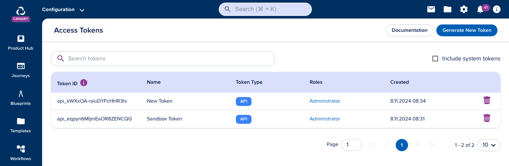

# Access Tokens

[[API Docs](/api/access-token)]
[[SDK](https://www.npmjs.com/package/@epilot/access-token-client)]

To call epilot APIs from 3rd party applications, requests must be authorized using a valid _Access Token_.

The Bearer's Token is passed in the `Authorization` request header.

```
Authorization: Bearer <your-access-token>
```

## Generating Access Tokens

Administrator users with the `token:create` permission can [create and manage Access Tokens](https://portal.epilot.cloud/app/tokens) from the 360 Portal.


Long term Access Tokens for API usage can be generated by clicking "Generate New Token" in the Access Token Management view.




When creating an access token, the generated token is shown only once after creation and must be stored by the user.

> Warning: epilot doesn't store and cannot recover lost or revoked access tokens.

## Access Token API

Authenticated users can generate long-term access tokens for 3rd party applications using the epilot [Access Token API](/api/access-token) `createAccessToken` operation.

```
POST /v1/access-tokens
```

```json
{
  "name": "Token for my application"
}
```

Optionally, you can pass a list of Role IDs, to define the roles the access token will have access to. By default, the access token inherits the caller's roles.

```
POST /v1/access-tokens
```

```json
{
  "name": "Postman Access Token",
  "assume_roles": ["123:owner"]
}
```

Each Access Token generated via the API gets a generated a unique ID.

```json
// 201 - success
{
  "id": "api_5ZugdRXasLfWBypHi93Fk",
  "created_at": "2019-08-24T14:15:22Z",
  "name": "Postman Access Token",
  "assignments": ["123:owner"]
}
```

## Revoking Access Tokens

Access tokens may also be revoked using the `revokeAccessToken` operation

```
DELETE /v1/access-tokens/api_5ZugdRXasLfWBypHi93Fk
```

```json
// 200 - success
{
  "id": "api_5ZugdRXasLfWBypHi93Fk",
  "created_at": "2019-08-24T14:15:22Z",
  "name": "Postman Access Token",
  "assignments": ["123:owner"]
}
```
