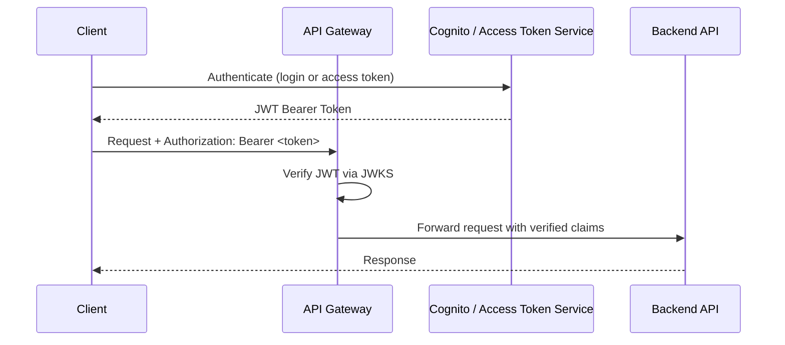

# Authentication

epilot APIs use bearer tokens for authentication. All requests must include a valid token in the `Authorization` header:

```http title="Authorization header"
Authorization: Bearer <your-token>
```

## Getting Started

The recommended way to authenticate with epilot APIs is using **Access Tokens** — long-lived, scoped tokens designed for integrations.

1. Go to [Settings > Access Tokens](https://portal.epilot.cloud/app/tokens) in the epilot portal
2. Create a new token, optionally scoping it to specific roles
3. Pass the token as a bearer token in your API requests

```typescript
import { epilot } from '@epilot/sdk'

epilot.authorize('<your-access-token>')

const { data } = await epilot.entity.createEntity(
  { slug: 'contact' },
  { first_name: 'Example', last_name: 'Contact' },
)
```

See [Access Tokens](/docs/auth/access-tokens) for full details on creating, scoping and revoking tokens.

## SDK Auth Patterns

The SDK's `authorize()` accepts a string or a function. The function form is preferred — it is called on every request, so tokens stay fresh.

### Global authorization

Applies to all clients resolved from the SDK:

```ts
import { epilot } from '@epilot/sdk'

epilot.authorize(() => '<my-token>')                          // function (recommended)
epilot.authorize(async () => await getTokenFromSession())     // async function
epilot.authorize('my-static-api-token')                       // static string
```

### Per-client authorization

```ts
import { authorize } from '@epilot/sdk'
import { getClient } from '@epilot/sdk/entity'

const entityClient = await getClient()
authorize(entityClient, () => '<my-token>')
```

### Frontend (epilot360)

```ts
import { epilot } from '@epilot/sdk'
import { getTokenSync } from '@epilot360/auth-service'

epilot.authorize(() => getTokenSync())
```

### Backend internal calls

Pass the caller's headers to downstream APIs for permission checks:

```ts
import { getClient } from '@epilot/sdk/entity'
import { getLambdaRunner } from 'openapi-lambda-adapter'

const getEntityClient = async (passedHeaders: Headers) => {
  const client = await getClient()
  client.api.registerRunner(getLambdaRunner(process.env.ENTITY_LAMBDA_NAME))
  client.defaults.headers.common = {
    authorization: passedHeaders['authorization'],
    ['x-ivy-org-id']: passedHeaders['x-ivy-org-id'],
    ['x-epilot-org-id']: passedHeaders['x-epilot-org-id'],
    ['x-epilot-user-id']: passedHeaders['x-epilot-user-id'],
  }
  return client
}
```

For admin-privileged internal calls, use `@epilot/internal-auth` tokens and set `x-epilot-org-id` (or `x-ivy-org-id`).

See the [SDK documentation](/docs/sdk/overview) for the full SDK reference.

## How It Works

epilot authentication is built on [OAuth 2.0](https://oauth.net/2/) with [Amazon Cognito User Pools](https://docs.aws.amazon.com/cognito/latest/developerguide/cognito-user-identity-pools.html) as the identity provider. Each epilot tenant has its own Cognito User Pool.

When a user logs in to the epilot portal, Cognito issues short-lived OAuth tokens (60 min). For API integrations, the [Access Token service](/api/access-token) issues long-lived JWTs with claims compatible with Cognito tokens, so all epilot APIs accept them seamlessly.

All tokens are verified by the API Gateway authorizer using JWKS endpoints before reaching backend services.


```mermaid
sequenceDiagram
    participant Client
    participant API Gateway
    participant Cognito / Access Token Service
    participant Backend API

    Client->>Cognito / Access Token Service: Authenticate (login or access token)
    Cognito / Access Token Service-->>Client: JWT Bearer Token
    Client->>API Gateway: Request + Authorization: Bearer <token>
    API Gateway->>API Gateway: Verify JWT via JWKS
    API Gateway->>Backend API: Forward request with verified claims
    Backend API-->>Client: Response
```

## Token Types

| Token | Lifetime | Use case |
|---|---|---|
| **Access Token** | Long-lived | Server-side API integrations, scripts, third-party apps |
| **OAuth 2.0 Token** | 60 minutes | Interactive user sessions in the epilot portal |
| **Publishable Token** | Long-lived | Client-side public apps (journeys, portals) |

For most integrations, **Access Tokens** are the right choice. See [Token Types](/docs/auth/token-types) for a full comparison.

## See Also

- [Access Tokens](/docs/auth/access-tokens) — creating and managing scoped tokens
- [Token Types](/docs/auth/token-types) — comparison of all epilot token types
- [Authorization](/docs/auth/authorization) — how API requests are authorized
- [Permissions](/docs/auth/permissions) — role-based access control and grants
- [Multi-Factor Authentication](/docs/auth/mfa) -- TOTP and SMS second factor
- [Passwordless Login](/docs/auth/passwordless) -- email-based sign-in links
- [Passkeys](/docs/auth/passkeys) -- phishing-resistant biometric and hardware key authentication
- [SSO](/docs/sso/single-sign-on) — single sign-on with OIDC and SAML
