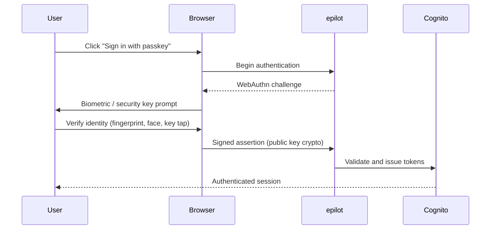

# Passkeys (WebAuthn / FIDO2)

Passkeys allow users to sign in to epilot 360 using biometrics (fingerprint, face recognition) or hardware security keys, with no password or OTP required. epilot's passkey support is built on the [FIDO2 / WebAuthn](https://fidoalliance.org/fido2/) standard.

:::tip Recommended for high-security environments
Passkeys provide the **strongest phishing resistance** of any authentication method available on epilot. No shared secret (password, OTP, or magic link) is ever transmitted, making passkey-based authentication immune to phishing, credential stuffing, and man-in-the-middle attacks. For organizations with strict compliance requirements (ISO 27001, KRITIS), we recommend enabling passkeys alongside [SSO](/docs/sso/single-sign-on) for a defence-in-depth authentication posture.
:::

## How Passkeys Work

Passkeys use public-key cryptography. A private key is stored securely on the user's device (protected by the device's secure enclave), while a public key is registered with epilot. Authentication requires the user to verify their identity on their device -- no shared secrets are transmitted over the network.

epilot supports two passkey login flows:

- **Email-based flow** -- the user enters their email, then authenticates with a passkey registered to their account.
- **Discoverable flow** -- the user clicks "Sign in with passkey" without entering an email. The browser presents all available passkeys and resolves the user identity automatically.

## Registering a Passkey

Users can register passkeys from **My Account > Passkeys** in epilot 360:

1. Enter a friendly name for the passkey (e.g., "Work Laptop", "YubiKey").
2. Click **Register passkey**.
3. Complete the browser's WebAuthn prompt (fingerprint, face scan, or security key tap).
4. The passkey appears in the list and can be used for future logins.

Users can register multiple passkeys and delete them at any time. We recommend registering at least two passkeys (e.g., a laptop and a hardware key) for account recovery.

## Enabling Passkeys for Your Organisation

Once passkeys are enabled for your organisation, the "Sign in with passkey" button appears on the login screen alongside the passwordless and SSO options.

Contact your account manager or epilot support to enable passkeys for your organisation.

## Supported Devices and Browsers

Passkeys are supported on all modern browsers and operating systems that implement the WebAuthn standard:

| Platform | Support |
|---|---|
| **macOS / iOS** | Touch ID, Face ID, iCloud Keychain passkeys |
| **Windows** | Windows Hello (fingerprint, face, PIN) |
| **Android** | Fingerprint, face unlock, Google Password Manager |
| **Hardware keys** | YubiKey, Titan Security Key, and other FIDO2 devices |

Cross-device authentication (using a phone to sign in on a laptop) is supported via the WebAuthn cross-platform authenticator flow.

## Security Comparison

| Method | Phishing Resistant | No Shared Secret | No Second Device Needed |
|---|---|---|---|
| Password + MFA | Partial | No | No |
| Passwordless (magic link) | Partial | Yes | No (email access required) |
| **Passkeys** | **Yes** | **Yes** | **Yes** |
| SSO (OIDC/SAML) | Depends on IdP | Yes | Depends on IdP |

## See Also

- [Passwordless Login](/docs/auth/passwordless) -- email-based sign-in links
- [Multi-Factor Authentication](/docs/auth/mfa) -- TOTP and SMS second factor
- [SSO](/docs/sso/single-sign-on) -- federated login with corporate identity providers
- [Security Architecture](/docs/architecture/security) -- platform security overview
