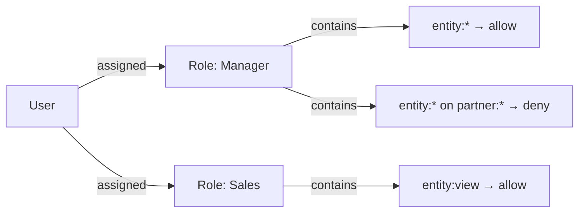

# Permissions

[[API Docs](/api/permissions)]

epilot implements flexible role-based access control (RBAC) with attribute-based conditions, inspired by the design of AWS IAM policies. The system supports fine-grained control at the role, resource, and attribute level.

## Core Concepts

The permissions model has three building blocks:

- **Users** are assigned one or more **Roles**
- **Roles** are collections of **Grants**
- **Grants** define whether a user is allowed (or explicitly denied) to perform an action on a resource



## Grant Structure

Each grant specifies an action, an optional resource pattern, an effect, and optional conditions:

```json title="Grant with conditions"
{
  "action": "entity:edit",
  "resource": "contract:*",
  "effect": "allow",
  "conditions": [
    {
      "attribute": "_tags",
      "operation": "equals",
      "values": ["active", "pending"]
    }
  ]
}
```

| Field | Description |
|---|---|
| `action` | The operation being performed (e.g., `entity:view`, `message:send`). Supports wildcards (`entity:*`). |
| `resource` | The target resource pattern (e.g., `contact:*`, `file:*`). Defaults to all resources if omitted. |
| `effect` | `allow` or `deny`. Defaults to `allow`. |
| `conditions` | Optional array of attribute-based conditions that must all be satisfied. |

## Actions

Actions follow a `{domain}:{operation}` pattern. Common actions include:

| Action | Description |
|---|---|
| `entity:view` | Read entities |
| `entity:edit` | Update entities |
| `entity:create` | Create entities |
| `entity:delete` | Delete entities |
| `entity:*` | All entity operations |
| `entity:attribute:view` | View specific entity attributes |
| `entity:attribute:edit` | Edit specific entity attributes |
| `message:view` | View messages |
| `message:send` | Send messages |
| `workflow:*` | All workflow operations |
| `webhook:*` | All webhook operations |
| `user:invite` | Invite users to the organization |
| `role:assign` | Assign roles to users |

## Resource Patterns

Resources support wildcards for flexible scoping:

| Pattern | Matches |
|---|---|
| `*` | All resources |
| `contact:*` | All contacts |
| `opportunity:123456` | A specific opportunity |
| `contact:Personal Details:*` | All attributes in the "Personal Details" group on contacts |
| `contact:Personal Details:phone` | The phone attribute specifically |

Attribute-level resources follow the format `{schema}:{group}:{attribute}`, enabling permissions down to individual fields on entity types.

## Conditions (Attribute-Based Access Control)

Conditions add dynamic, data-driven rules to grants. When conditions are present, the grant only applies if the entity being accessed satisfies all conditions.

```json title="Grant restricted to entities with specific tags"
{
  "action": "entity:view",
  "resource": "file:*",
  "conditions": [
    {
      "attribute": "_tags",
      "operation": "equals",
      "values": ["offer", "contract"]
    }
  ]
}
```

Conditions support:

- **Flat attributes** -- `"attribute": "_tags"` matches a top-level field
- **Nested paths** -- `"attribute": "_customer._payment._type"` matches deeply nested values
- **Wildcard paths** -- `"attribute": "workflows.*.currentTask"` matches across dynamic keys
- **Array matching** -- if the attribute is an array, the condition matches if any element equals one of the specified values

:::tip
Conditions are evaluated at runtime with actual entity data. This enables scenarios like restricting a role to only edit entities in a specific workflow step, or only view files tagged with certain categories.
:::

### Condition Examples

**Restrict to entities in a specific workflow step:**

```json title="Only entities at a specific task"
{
  "action": "entity:edit",
  "resource": "*",
  "conditions": [
    {
      "attribute": "workflows.*.currentTask",
      "operation": "equals",
      "values": ["review", "approval"]
    }
  ]
}
```

**Restrict to entities owned by specific organizations (cross-org sharing):**

```json title="ACL-based access control"
{
  "action": "entity:edit",
  "resource": "*",
  "conditions": [
    {
      "attribute": "_acl.edit",
      "operation": "equals",
      "values": ["org_911215"]
    }
  ]
}
```

## Evaluation Rules

Grant evaluation follows AWS IAM conventions:

1. **Tenant isolation** -- Roles only grant access within their own organization.
2. **Owner role** -- The built-in `owner` role (present in every organization) inherits all organization grants.
3. **Least privilege** -- Roles have no grants by default.
4. **Dual-role matching** -- Both the organization root role grant **and** a user role grant must match for access to be granted.
5. **Explicit deny** -- An explicit `deny` in any matched grant overrides all `allow` grants. Use deny grants to create exceptions within broad allow rules.
6. **Wildcard matching** -- Actions and resources support wildcard expressions (e.g., `entity:*`, `contact:*`).
7. **Condition evaluation** -- When conditions are present, all conditions on a grant must be satisfied (AND logic).

## Role Types

| Type | Description |
|---|---|
| **User Role** | Standard role assigned to specific users. Can inherit from a parent org or share role. |
| **Organization Role** | Automatically applied to all users in the organization. Defines the maximum permission ceiling. |
| **Share Role** | Grants cross-organization access for partner sharing scenarios. |
| **Partner Role** | Assigned to users in partner organizations with configurable user limits. |
| **Portal Role** | Implicit role for end-customer portal users with restricted permissions. |

## Organization Root Role

Every organization has a mandatory root role that defines the **maximum permission set** any user can receive. The organization's subscription tier determines this role. User roles can only grant permissions up to the ceiling set by the root role.

This two-level model ensures that subscription tiers control feature access at the organization level, while user roles provide fine-grained access within those boundaries.

:::info
The root role also enables feature flagging via explicit denies. For example, an organization on a lower tier might have `"action": "webhook:*", "effect": "deny"` on its root role, preventing any user from accessing webhook features regardless of their user roles.
:::

## Example Role Definition

```json title="Manager role with entity access and partner deny"
{
  "id": "66:manager",
  "name": "Manager",
  "slug": "manager",
  "organization_id": "66",
  "type": "user_role",
  "grants": [
    { "action": "entity:*", "effect": "allow" },
    { "action": "entity:*", "resource": "partner:*", "effect": "deny" },
    { "action": "message:*", "effect": "allow" },
    { "action": "workflow:*", "effect": "allow" }
  ]
}
```

This role allows all entity, messaging, and workflow operations, but explicitly denies access to partner-owned entities.

## See Also

- [Authorization](/docs/auth/authorization) -- how epilot authorizes API requests
- [Token Types](/docs/auth/token-types) -- comparison of all epilot token types
- [Security Architecture](/docs/architecture/security) -- platform security overview
