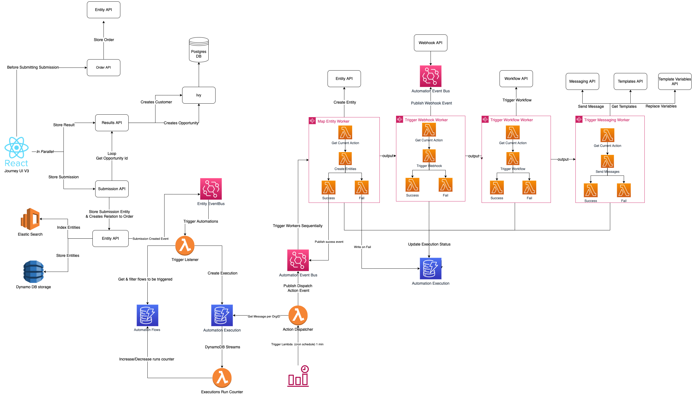

# Architecture

[[API Docs](/api/automation#tag/executions)]
[[SDK](https://www.npmjs.com/package/@epilot/automation-client)]

The diagram above illustrates the epilot Automation architecture:

1. **Flow Configurations** are stored in a DynamoDB table.
2. A **Trigger Listener** watches Entity Events and matches them against configured Automation Triggers.
3. Matched triggers create **Executions** in a DynamoDB table.
4. An **Action Dispatcher** listens for changes in the Execution table and dispatches jobs to the **Automation Event Bus**.
5. **Automation Workers** (typically Lambda Step Functions) pick up jobs and execute the corresponding action type.
