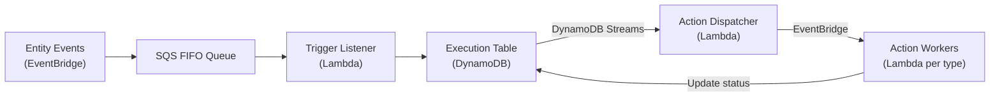

# Architecture

[[API Docs](/api/automation#tag/executions)]
[[SDK](https://www.npmjs.com/package/@epilot/automation-client)]

The automation engine is a serverless, event-driven pipeline built on AWS Lambda, DynamoDB, EventBridge, and SQS. It processes entity events in real time, matches them against configured flows, and executes action sequences with full observability.

## Pipeline



### 1. Event Ingestion

Platform events -- entity creates, updates, journey submissions, inbound emails, activity events -- are published to EventBridge and routed to an SQS FIFO queue. FIFO ordering is grouped by organization to preserve event sequence per tenant.

### 2. Trigger Matching

The **Trigger Listener** Lambda consumes events from SQS in batches. For each event, it evaluates all enabled automation flows to find matching triggers. Matching considers the trigger type, entity schema, source ID, and any configured trigger conditions.

### 3. Execution Creation

For each matched flow, an **Execution** record is written to DynamoDB. The execution captures the flow's action sequence, a snapshot of the triggering entity, and initializes all actions to `pending` status. This record becomes the single source of truth for the automation run.

### 4. Action Dispatching

A DynamoDB Streams consumer -- the **Action Dispatcher** -- reacts to execution state changes. When an execution is created or an action completes, the dispatcher identifies the next pending action and publishes a `dispatch-{action-type}` event to the Automation Event Bus (EventBridge). This creates a state-machine loop driven entirely by data changes.

### 5. Action Execution

Each action type has a dedicated **Worker Lambda** subscribed to its EventBridge pattern. Workers execute the business logic (send an email, map an entity, fire a webhook) and write the result back to the execution record. This status change triggers the dispatcher again, advancing to the next action or completing the execution.

## Concurrency Control

The engine includes safeguards against runaway execution:

| Mechanism | Purpose |
|---|---|
| **Entity-level locking** | Prevents concurrent automations from racing on the same entity |
| **Org-level execution limits** | Caps concurrent executions per organization to protect shared infrastructure |
| **Flow rate limiting** | `max_executions` on a flow caps how often it can fire within a time window |
| **Dead letter queue** | Unprocessable SQS messages are routed to a DLQ for investigation |

## Hot Flow Detection

A misconfigured automation can create feedback loops -- for example, a flow that triggers on entity updates and also updates the same entity. To protect the platform, the Trigger Listener includes **hot flow detection** that automatically disables flows exceeding execution rate thresholds.

### Detection Strategy

The system evaluates multiple thresholds in order of priority:

| Check | Default Threshold | Window | Applies to |
|---|---|---|---|
| **Custom flow limit** | Configured per flow via `max_executions` | ISO 8601 duration | Any trigger type |
| **General trigger limit** | 100 executions | 30 seconds | All flows |
| **Per-entity update limit** | 50 executions | 1 minute | `updateEntity` triggers only |
| **System activity limit** | 20 executions | 5 minutes | System-generated entity updates |

If a flow has a custom `max_executions` configured, that limit takes precedence and the other checks are skipped.

### What Happens When a Flow Goes Hot

1. **Flow is disabled** -- The system sets `enabled: false` with `disabled_by: 'system'` so administrators can identify automatic shutdowns
2. **Execution is recorded with `hot` status** -- The execution is persisted for observability but no actions are dispatched
3. **Action Dispatcher skips it** -- Hot executions are filtered out of the dispatch loop
4. **Not counted toward runs** -- Hot executions don't increment the flow's run counter

```json title="Custom rate limit configuration"
{
  "max_executions": {
    "count": 10,
    "window": "PT1M"
  }
}
```

:::caution
When a flow is auto-disabled, it must be manually re-enabled after fixing the underlying issue. Check the flow's `disable_details` to confirm it was a system-initiated shutdown.
:::

## Bulk Automation

For large-scale operations (e.g., repricing 100K contracts), a Step Functions orchestrator manages batch processing:

1. **Query** -- Entities are fetched lazily from Elasticsearch using cursor-based pagination
2. **Process** -- A time-bounded worker Lambda processes entities in batches, running up to 12 minutes per invocation
3. **Monitor** -- Progress is tracked per-entity in DynamoDB with individual execution items
4. **Report** -- A summary is generated once all entities are processed

This architecture avoids the memory and state-history limits of processing all entities upfront.

## Error Handling

Workers support configurable retry policies with exponential backoff. When an action fails:

- If `allow_failure` is **true**, the execution continues with the action marked as failed
- If `allow_failure` is **false** (default), the execution stops and is marked as failed

Failed executions are visible on the triggering entity and can be retried from the UI or API.

:::tip
Interested in building event-driven infrastructure at scale? See [open positions at epilot](https://www.epilot.cloud/en/company/careers).
:::
