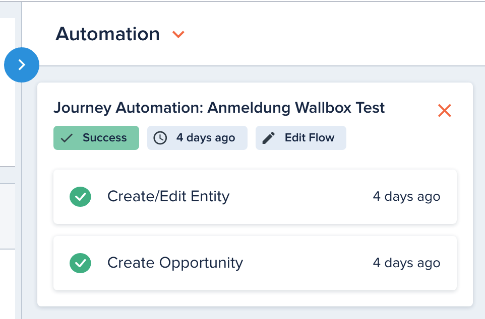
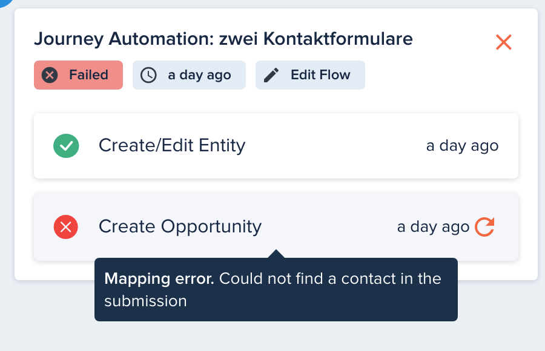

# Automation Executions

[[API Docs](/api/automation#tag/executions)]
[[SDK](https://www.npmjs.com/package/@epilot/automation-client)]

When an Automation Flow is triggered, a new **Automation Execution** is created.

The execution can seen viewed on the triggering Entity from the Automation section.

## Actions

An Automation Execution contains a list of actions that will be executed in the same order in which they were defined on the Automation Flow.

Each Action is executed in sequence, and will only be started if the previous action is succesfully completed.

An Action may fail to complete, in which case an error message is shown on the Automation Execution.

