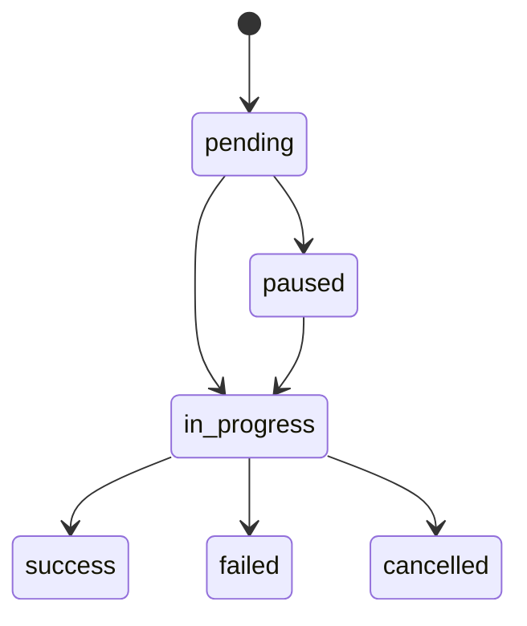

# Automation Executions

[[API Docs](/api/automation#tag/executions)]
[[SDK](https://www.npmjs.com/package/@epilot/automation-client)]

When an Automation Flow is triggered, a new **Automation Execution** is created.

The execution can be viewed on the triggering entity from the Automation section.

## Actions

An execution contains a list of actions that run in the same order they were defined on the Automation Flow.

Each action executes in sequence and only starts after the previous action completes successfully.

If an action fails, an error message appears on the execution and subsequent actions are skipped.

## Execution Statuses

An execution progresses through the following statuses:

| Status | Description |
|--------|-------------|
| `pending` | Execution created, waiting to start |
| `in_progress` | Actions are being executed |
| `success` | All actions completed successfully |
| `failed` | An action encountered an error |
| `cancelled` | Execution was cancelled |
| `paused` | Execution is paused (e.g. scheduled for later) |
