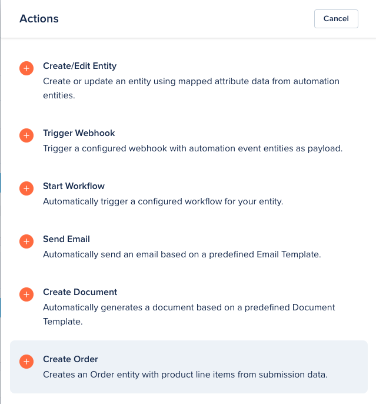

# Automation Flows

[[API Docs](/api/automation#tag/flows)]
[[SDK](https://www.npmjs.com/package/@epilot/automation-client)]

Automation configurations on epilot are called **Automation Flows**.

Each Automation Flow has:

- **Triggers** (when the automation should be executed)
- **Actions** (what happens when the automation is executed)

## Automaton Triggers

The following is a list of automation trigger types supported by epilot:

- **Journey Submission**
  - Triggers when a Journey created in epilot [Journey Builder](/docs/journeys/journey-builder) receives a new [Submission](/docs/submissions)
- **Frontend Submission**
  - Triggers when a legacy Frontend created in epilot classic receives a new [Submission](/docs/submissions)
- **API Submission**
  - Triggers when a submission is received via the [Submission API](/api/submission) with a matching `source_id` field
- **Manual Triggers**
  - Triggered manually from the Entity view
- **Entity Triggers**
  - Triggers on events for a specific Entity Schema (e.g. Contacts):
    - Entity Created
    - Entity Updated
    - Entity Deleted

## Automaton Actions

The following is a list of automation actions supported by epilot:

- **Create/Edit Entity**
  - Used to map data from the triggering entity to other business entities
  - Allows updating existing entities or creating new ones
- **Trigger Webhook**
  - Sends a Webhook to an external system with a payload containing the trigger event and all related entities
- **Start Workflow**
  - Starts a Worfklow on the triggering entity and all related entities as context
- **Send Email**
  - Sends an Email using an Email Template, which can contain variables from the triggering entity and all relations
- **Create Document**
  - Generates a document file attachment using a document template
- **Create Opportunity**
  - A special action to create Order and Opportunity entities from handled epilot Journeys
