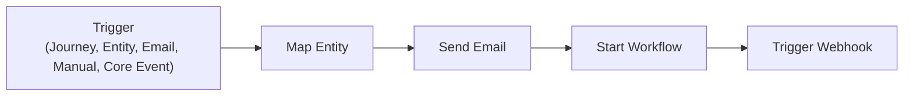

# Automation Flows

[[API Docs](/api/automation#tag/flows)]
[[SDK](https://www.npmjs.com/package/@epilot/automation-client)]

Automation configurations in epilot are called **Automation Flows**.

Each Automation Flow consists of:

- **Triggers** -- when the automation executes
- **Actions** -- what happens when it executes

## Automation Triggers

The following trigger types are supported:

- **Journey Submission** -- fires when a [Journey](/docs/journeys/journey-builder) receives a new [Submission](/docs/journeys/submissions)
- **Frontend Submission** -- fires when a Frontend receives a new [Submission](/docs/journeys/submissions)
- **API Submission** -- fires when a submission arrives via the [Submission API](/api/submission) with a matching `source_id`
- **Manual** -- triggered by a user from the Entity view
- **Entity Operation** -- fires on create, update, or delete events for a specific Entity Schema (e.g. Contacts)
- **Received Email** -- fires when an inbound email is received
- **Activity** -- fires on activity events
- **Event Catalog event** (`event_catalog`) -- fires when a [Core Event](/docs/integrations/core-events) such as `CustomerRequestSubmitted` is published, with the full event payload available to conditions and actions. See [Event Catalog Trigger](/docs/automation/event-catalog-trigger).

## Automation Actions

```mermaid
flowchart LR
    Trigger["Trigger\n(Journey, Entity, Email, Manual, Core Event)"] --> A1["Map Entity"]
    A1 --> A2["Send Email"]
    A2 --> A3["Start Workflow"]
    A3 --> A4["Trigger Webhook"]
```

Supported action types:

- **Create/Edit Entity** (`map-entity`) -- maps data from the triggering entity to create or update other business entities. See [Entity Mapping](/docs/automation/entity-mapping).
- **Trigger Webhook** (`trigger-webhook`) -- sends a webhook to an external system with the trigger event and all related entities as payload.
- **Start Workflow** (`trigger-workflow`) -- starts a Workflow on the triggering entity with all related entities as context.
- **Send Email** (`send-email`) -- sends an email using an Email Template with variables from the triggering entity and its relations.
- **Create Document** (`create-document`) -- generates a document attachment using a document template.
- **Create Order** (`cart-checkout`) -- creates an Order entity with product line items from submission data.
- **Trigger Event** (`trigger-event`) -- publishes a [Core Event](/docs/integrations/core-events) from the flow, which webhooks, integrations, and other automations can consume.
