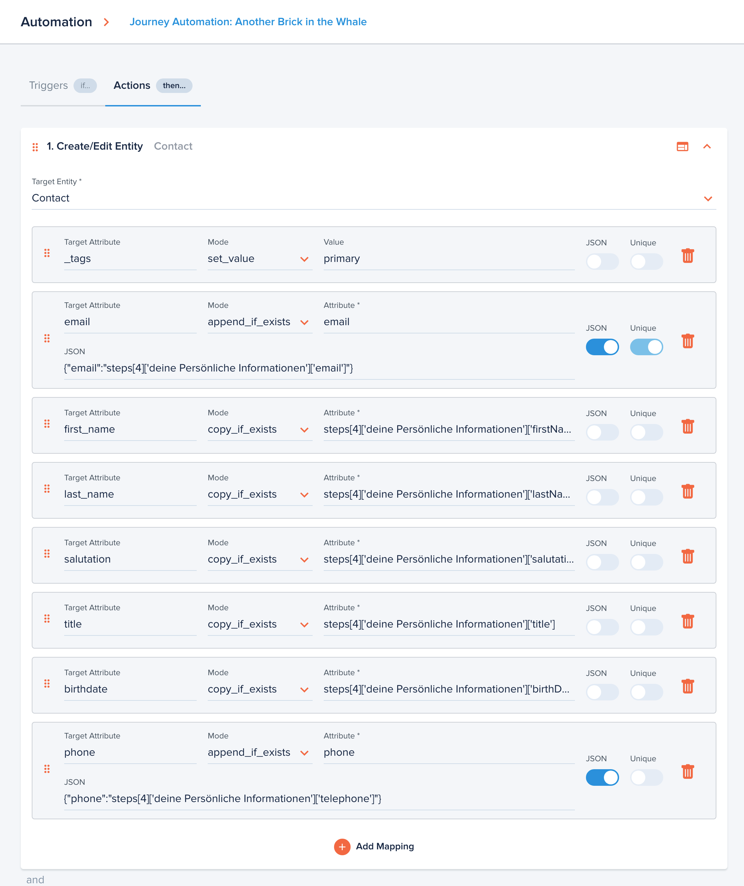

# Entity Mapping

[[API Docs](/api/automation#tag/executions)]
[[SDK](https://www.npmjs.com/package/@epilot/automation-client)]

The **Create/Edit Entity** (`MapEntityAction`) action allows mapping data from one entity to create or update other entities.

## MapEntityAction

The MapEntityAction consists of a Target Entity and a list of Mappings.

Mappings support three different modes:

- `copy_if_exists` - replaces the target attribute with the source value
- `append_if_exists` - replaces target attribute with array like values. Useful when you have multiple values to be added into one attribute.
- `set_value` - sets a value to a predefined value. Must be used together with value property.

