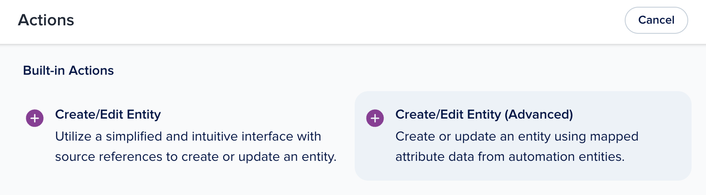
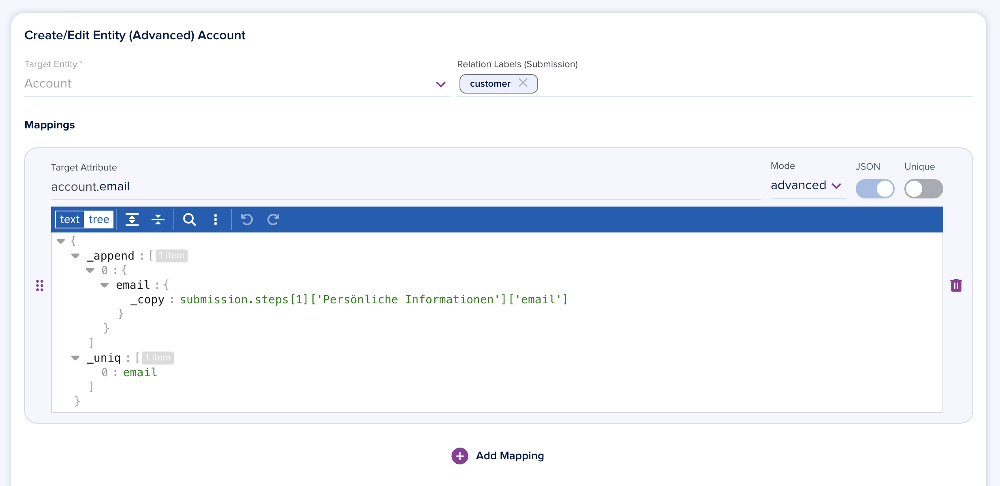

# Entity Mapping

[[API Docs](/api/automation#tag/flows)]
[[SDK](https://www.npmjs.com/package/@epilot/automation-client)]

:::info
These docs describe the advanced, low-code Entity Mapping feature. For the no-code solution, see the [epilot Help Center](https://help.epilot.cloud/automatisierungen-und-mapping/6304301252242-Mapping-Zuordnung-von-Journey-Daten-zu-Entit%25C3%25A4ten?from_search=202771407).
:::

The **Create/Edit Entity (Advanced)** action allows mapping data from one entity to create or update other entities.



## Create/Edit Entity

The Create/Edit Entity Action (`map-entity`) consists of a Target Entity and a list of Attribute Mappings and Relations.

You can choose any Entity Schema configured in your organization as the target. An entity with this schema will be created or edited as the output of this automation action.


The created entity will be automatically added as a relation to your Automation trigger entity (usually Submission). By default, the relation will be stored in the `mapped_entities` attribute.

You can also define Relation Labels that will be added to the Relation on the trigger entity. 


These labels may be used later to identify previously mapped entities when adding relations between mapped entities.

## Mappings

To add mappings, choose a target field from the list of attributes of the target entity. This field will be populated with the value you specify below.


## Attribute Mappings

Attribute Mappings define how to map attribute values for the target entity.

A special JSON mapping syntax is used to define an operation to determine the output value.

As an example, the following mapping operation will:

1. Append an object with `email` property to the output array value
1. Copy the value for the `email` property from a Journey submission field in Step 1, Block "Persönliche Informationen", field "email".
1. Make sure each object in the output array is unique using the value of `email` as the key.

```json
{
  "_append": [
    {
      "email": {
        "_copy": "submission.steps[1]['Persönliche Informationen']['email']"
      }
    }
  ],
  "_uniq": [
    "email"
  ]
}
```



## Mapping Operations

The mapping JSON syntax supports a list of operations, which can be combined and nested together in various ways.

### `_copy`

The `_copy` operation copies a value from the trigger entity context. Both the trigger entity and its relations are available as source data.

The operation uses the same path format as [Template Variables](/docs/templates/template-variables) used in email and document templates.

```json
// copy contact first_name
{
  "_copy": "contact.first_name"
}
```

You can also set a list of fallbacks. The first path that contains a value will be used.

```json
// copy account title, fall back to contact title if account doesn't exist
{
  "_copy": ["account._title", "contact._title"]
}
```

### `_append`

The `_append` operation adds new values to an array.

```json
// append strings "tag1", "tag2" to an array
{
  "_append": ["tag1", "tag2"]
}
```

```json
// append an object with a mapped phone number from submission
{
  "_append": [
    {
      "phone": {
        "_copy": "submission.phone_number"
      }
    }
  ]
}
```

### `_prepend`

The `_prepend` operation adds new values to *the start* of an array.

```json
// prepend strings "tag1", "tag2" to the beginning of an array
{
  "_prepend": ["tag1", "tag2"]
}
```

### `_uniq`

The `_uniq` operation makes sure all items in an array are unique.

```json
// append tags, make sure each item is unique
{
  "_append": ["tag1", "tag2", "tag2"],
  "_uniq": true
}
```

For arrays with objects, you can define a unique key to be used.

Duplicate objects are deeply merged retaining the old values. If a matching object was found, and the values should overwrite the found element, we can additionally set `_retain_old_values` to `false`

```json
// append addresses, make sure each item is unique
{
  "_append": [
    {
      "street": { "_copy": "submission.street" },
      "street_number": { "_copy": "submission.street_number" },
      "postal_code": { "_copy": "submission.postal_code" },
      "city": { "_copy": "submission.city" }
    }
  ],
  "_uniq": ["street", "street_number", "postal_code", "city"],
  "_retain_old_values": false
}
```

### `_set`

The `_set` operation can be used to override an existing value with a new one.

Use this when you want to replace a value entirely instead of merging (the default behavior).

```json
// set source link to an object with href and title
{
  "_set": {
    "title": "My Journey",
    "href": "https://portal.epilot.cloud/app/journey/123"
  }
}
```

### `_random`

The `_random` operation can be used to generate a random number or id.

Options for **type**:
- `nanoid` or `uuid` -- generates a random identifier
- `number` -- generates a random number, with optional `min` (default 0) and `max` (default 1)

```json
{
  "_random": {
    "type": "nanoid",
  }
}

{
  "_random": {
    "type": "number",
    "min": 2,
    "max": 6
  }
}
```

### `_template`

The `_template` operation can be used to output a single string based on [handlebars](https://handlebarsjs.com/guide/expressions.html) expressions.

Use this to concatenate fields, apply mathematical expressions, or merge multiple values into a single string.
```json
{
  "_template": "{{contact.first_name}} {{contact.last_name}}",
}
```

### Nesting

Operations can be nested to create complex mapping behaviour:

```json
// add contact as a $relation value, set the relation label to primary
{
  "$relation": {
    "_append": [
      {
        "_tags": {
          "_set": ["primary"]
        },
        "entity_id": {
          "_copy": ["account._id", "contact._id"]
        }
      }
    ],
    "_uniq": ["entity_id"]
  }
}
```

## Uniqueness

To edit an existing entity instead of creating a new one, you must provide uniqueness criteria for your mapping.

This is achieved by switching on the Unique toggle for the attributes that form a unique key.

Example: To update existing Contacts based on the email address value, switch on Unique on for the Email attribute mapping.

## Relation Mappings

When choosing a relation attribute for mapping, you define which entities from the trigger entity (usually a submission) to add as relations.

Define a filter to select the related entities. For example, to relate a Contact created earlier in the automation with a "primary" label, filter by `Schema: contact` and `Relation Label: primary`.


