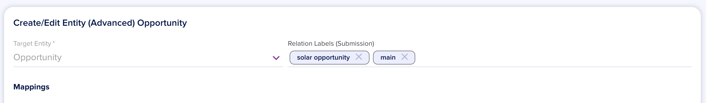
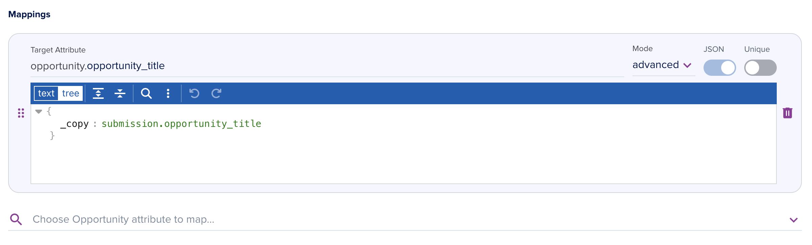
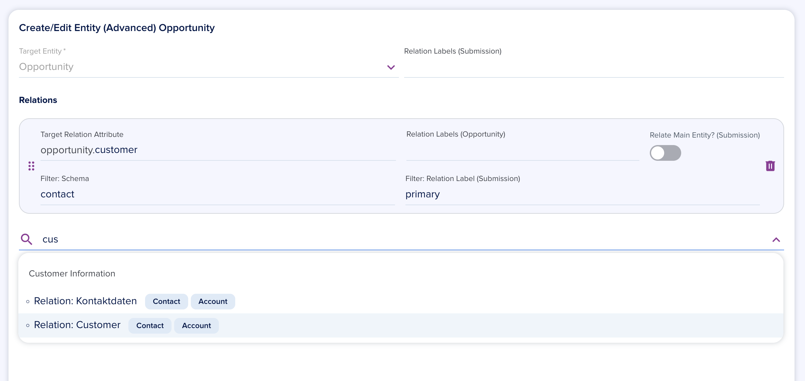

# Entity Mapping

[[API Docs](/api/automation#tag/flows)]
[[SDK](https://www.npmjs.com/package/@epilot/automation-client)]

> Entity Mapping is an advanced feature available only for certain pricing tiers.
> 
> Please contact epilot support to enable advanced automation features

The **Create/Edit Entity** action allows mapping data from one entity to create or update other entities.

## Create/Edit Entity

The Create/Edit Entity Action (`MapEntityAction`) consists of a Target Entity and a list of Attribute Mappings and Relations.

You can choose any Entity Schema configured in your organization as the target. An entity with this schema will be created or edited as the output of this automation action.

The created entity will be automatically added as a relation to your Automation trigger entity (usually Submission). By default, the relation will be stored in the `mapped_entities` attribute.

You can also define Relation Labels that will be added to the Relation on the trigger entity. 

These labels may be used later to identify previously mapped entities when adding relations between mapped entities.

## Mappings

To add mappings, choose a target field from the list of attributes of the target entity. This field will be populated with the value you specify below.

## Attribute Mappings

Attribute Mappings configure a value for your target entity. Three different modes are supported:

- `copy_if_exists` - replaces the target attribute with a value from the source entity
- `append_if_exists` - replaces target attribute with array-like values. Useful when you have multiple values to be added into one attribute.
- `set_value` - sets a value to a static predefined value.

The first two modes `copy_if_exists` and `append_if_exists` require a source field on the trigger entity defined with [JSONPath](https://support.smartbear.com/alertsite/docs/monitors/api/endpoint/jsonpath.html) syntax.

To pick a field, the automation editor will suggest existing fields based on real fields appearing on the trigger entity.

You can also define JSON values by toggling JSON mode for the target attribute. JSONPaths are supported as property values.

## Uniqueness

To edit an existing entity instead of creating a new one, you must provide uniqueness criteria for your mapping.

This is achieved by switching on the Unique toggle for the attributes that form a unique key.

Example: To update existing Contacts based on the email address value, switch on Unique on for the Email attribute mapping.

## Relation Mappings

When choosing a relation attribute for mapping, you define which entities from the trigger entity (usually submission) should be added as relations.

This is done by defining a filter. 

To relate a Contact defined earlier in the automation with "primary" relation label, Filter by `Schema: contact` and `Relation Label: primary`.

