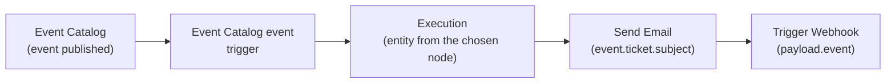
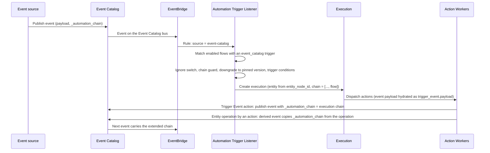

# Event Catalog Trigger

[[API Docs](/api/automation#tag/flows)]
[[SDK](https://www.npmjs.com/package/@epilot/automation-client)]

The **Event Catalog event** trigger (`event_catalog`) starts an Automation Flow whenever a [Core Event](/docs/integrations/core-events) is published in your organization -- for example `CustomerRequestSubmitted` or `MeterReadingAdded`.

Compared to the **Entity Operation** trigger, which reacts to low-level create, update, and delete operations on a single entity, an Event Catalog event describes a complete business occurrence: it carries all entities involved (the event's *entity graph*) plus event-specific fields, in a versioned, stable schema. The whole payload is available to your trigger conditions, action conditions, templates, and webhooks as the `event` variable.



## Requirements

- The **Core Events** setting must be enabled for your organization. The trigger option is only offered in the automation editor when the setting is on -- the same condition that shows the **Trigger Event** action.
- The event you want to react to must be **enabled** in the [Event Catalog](/docs/integrations/core-events) of your organization. Disabled events are never published, so flows subscribed to them never start.

## Configuration

Create a new Automation Flow under [Configuration > Advanced Configuration > Automation](https://portal.epilot.cloud/app/automation-hub) and choose **Event Catalog event** as the trigger. The trigger has four settings:

### Event

The Core Event that starts the flow. Only events enabled for your organization are listed. One trigger subscribes to exactly one event; add further triggers to the same flow to react to several events.

### Version

Every Core Event is versioned (`MAJOR.MINOR`). The trigger is **pinned** to the version you select -- by default the latest published version. Pinning guarantees that the field paths you use in conditions and templates keep working even after the event schema evolves. See [Version pinning](#version-pinning) for the runtime behaviour.

### Entity

Every Automation Execution runs in the context of one entity: it is the entity the execution is shown on, the entity actions such as **Start Workflow**, **Send Email**, or **Create/Edit Entity** operate on, and the entity whose attributes and relations are available as `{{entity...}}` template variables.

An Event Catalog event can carry several entities (for example a `CustomerRequestSubmitted` event carries the `ticket` and the `contact`). The **Entity** setting selects which node of the event's entity graph becomes that context entity. Only nodes that hold exactly one entity (cardinality one) are offered; when the event has just one such node it is pre-selected and read-only.

:::tip
Pick the node your actions should act on. To start a workflow on the ticket, select the `ticket` node; to send the customer an email, `contact` is usually the better anchor. All other nodes remain available through the `event` variable, for example `{{event.contact.email}}`.
:::

### Ignore events emitted by automations

Enabled by default. When on, the flow does not start for events that were published by the **Trigger Event** action of an automation (events with `_trigger_source_type: automation`). Events the platform derives from entity operations are not affected by this switch, even when the operation was performed by an automation -- those carry `_trigger_source_type: operation` and are covered by the chain guard instead. See [Loop prevention](#loop-prevention) before switching it off.

### Example flow definition

```json title="Flow with an Event Catalog trigger"
{
  "flow_name": "Notify service team about new customer requests",
  "enabled": true,
  "triggers": [
    {
      "id": "12d4f45a-1883-4841-a94c-5928cb338a94",
      "type": "event_catalog",
      "configuration": {
        "event_name": "CustomerRequestSubmitted",
        "event_version": "1.1",
        "entity_node_id": "ticket",
        "entity_schema": "ticket",
        "ignore_automation_triggered": true
      }
    }
  ],
  "trigger_conditions": [
    {
      "source": "event.ticket.priority",
      "comparison": "equals",
      "value": "high"
    }
  ],
  "actions": []
}
```

| Field | Description |
|---|---|
| `event_name` | Name of the Core Event that starts the flow |
| `event_version` | Version (`MAJOR.MINOR`) the trigger is pinned to |
| `entity_node_id` | Node of the event's entity graph whose entity becomes the execution's entity |
| `entity_schema` | Schema of that node. The automation editor fills this in from the event definition; set it explicitly when creating flows through the API |
| `ignore_automation_triggered` | Skip events that originate from automations. Defaults to `true` when omitted |

Flows with an Event Catalog trigger for a given event can be listed through the API with `GET /v1/automation/flows?trigger_event_name=CustomerRequestSubmitted`.

## Using event data

The published event payload is available as the `event` variable throughout the flow. Its shape is the event's schema at the pinned version: the [common metadata fields](/docs/integrations/core-events#common-event-fields), one object per entity-graph node (keyed by node id, for example `event.ticket` and `event.contact`), and the event's own fields. Use the schema viewer on the [Core Events](/docs/integrations/core-events) page to look up the exact field paths of an event.

### Trigger conditions

Flow-level trigger conditions decide whether an execution is created at all. Next to attributes of the context entity, they accept paths into the event payload prefixed with `event.`:

```json
{
  "source": "event.ticket.priority",
  "comparison": "equals",
  "value": "high"
}
```

### Action conditions

Conditions on individual actions can read from the event payload by setting the condition source's `originType` to `event`. The `attribute` is then a dot path into the payload:

```json
{
  "source": {
    "id": "12d4f45a-1883-4841-a94c-5928cb338a94",
    "origin": "trigger",
    "originType": "event",
    "attribute": "ticket.subject",
    "attributeType": "text"
  },
  "operation": "contains",
  "values": ["meter"]
}
```

`originType: event` is only valid with `origin: trigger` on flows that have an Event Catalog trigger.

In the automation editor, the condition builder lists the event's fields -- derived from the event's JSON schema at the pinned version -- alongside the entity attributes.

### Template variables

The actions **Send Email**, **Reply Email**, **Forward Email**, and **Create Document** receive the event payload as `event.<path>` variables in addition to the usual entity variables:

```
Hello {{event.contact.first_name}},

we received your request "{{event.ticket.subject}}" ({{event._event_name}}, reference {{event._event_id}}).
```

The same paths work in email templates and in document templates. In a `.docx` document template the tag is looked up literally, so write the full path as the tag: `{{event.ticket.subject}}`.

The payload is flattened into variables as follows:

- Nested objects are flattened to their leaf paths and addressed with dots (`{{event.contact.address.city}}`), up to six levels deep. Values deeper than six levels are provided as a JSON string at the sixth level.
- Arrays of primitive values are provided as a JSON string at their path (`{{event.tags}}`).
- Arrays containing objects are addressed per item index only (`{{event.items.0.name}}`); they are not additionally available as a JSON string.
- `null` values become an empty string.
- Of the top-level metadata fields, only `event._event_name`, `event._event_id`, `event._event_version`, and `event._event_time` are exposed; the other underscore-prefixed metadata fields are hidden. System fields inside entity nodes, such as `{{event.ticket._id}}`, remain available.

### Webhook and custom action payloads

The **Trigger Webhook** action and custom actions -- external integrations as well as app workflow functions -- receive the event as an `event` object in their payload, next to `entity`, `trigger_event`, and the related entities. The object is the downgraded payload at the pinned version, with the `_downgrades` and `_automation_chain` bookkeeping fields removed. It is only present on executions started by an Event Catalog trigger.

### Entity mapping

Entity mapping does not currently receive event fields: the **Create/Edit Entity** action maps from the context entity, its relations, and the loop entity only. Anchor the trigger on the entity you want to map from.

## Version pinning

At runtime the event may arrive in a newer version than the one pinned on the trigger:

- **Same version** -- the payload is used as-is.
- **Newer published version** -- the payload is **downgraded** to the pinned version using the compatibility transformations the event definition provides for each version step. Your conditions and templates see the fields exactly as they were defined in the pinned version. The execution records both versions: `trigger_event.event_version` (pinned and delivered) and `trigger_event.published_version`.
- **Pinned version cannot be reached** -- if the pinned version is newer than the published one, or no downgrade path leads to it, the flow **does not start**. The event is skipped for this trigger and a warning is logged.

To move a flow to a newer event version, change the pinned version on the trigger and review the conditions and templates that reference fields changed by the new version.

## Loop prevention

Automations can both *react to* events (this trigger) and *cause* events, in two different ways:

- **Explicitly**, through the **Trigger Event** action. These events carry `_trigger_source_type: automation`.
- **Indirectly**, through entity changes made by actions such as **Create/Edit Entity** or **Start Workflow**. The platform derives built-in events from entity operations and stamps them `_trigger_source_type: operation` -- regardless of whether a user or an automation performed the operation.

A flow can therefore end up starting itself, or two flows can keep starting each other. Four guards stop this, and each one targets a specific class of loop:

| Guard | Stops | How |
|---|---|---|
| **Ignore events emitted by automations** (per trigger, on by default) | Loops through explicitly emitted events | Events with `_trigger_source_type: automation` -- published by a **Trigger Event** action of any flow -- do not start the flow |
| **Save-time rejection** | Direct self-loops through explicitly emitted events | A flow cannot be saved when an Event Catalog trigger subscribes to the same event that one of the flow's own **Trigger Event** actions emits. The editor shows a validation error; the API rejects the request |
| **Automation chain guard** | Loops through entity-derived events, and loops spanning several flows | Every execution records the chain of flows that led to it. The chain travels with every event an automation causes -- explicitly emitted or derived from an entity operation -- and is handed to the executions it starts. A flow that is already in the chain is not started again from that chain |
| **Hot flow detection** | Anything the guards above do not cover | A flow that fires far more often than expected is automatically disabled. See [Hot Flow Detection](/docs/automation/architecture#hot-flow-detection) |

### Worked example

Flow **A** starts on `CustomerRequestSubmitted` (`ticket` node) and, as part of its actions, updates that ticket with **Create/Edit Entity** -- for example to assign it to the technician team. The update is an entity operation, so the platform derives a new `CustomerRequestSubmitted` event from it. That event would start flow **A** again, which would update the ticket again -- forever.

What happens instead:

1. The derived event is stamped `_trigger_source_type: operation`, so **Ignore events emitted by automations** does not apply -- this switch only filters events published by a **Trigger Event** action.
2. The derived event does carry the automation chain of the execution that performed the update: `["A"]`. When the trigger listener evaluates flow A for this event, it finds A already in the chain and skips it. The loop ends after the first run. Any *other* flow subscribed to the event starts normally and continues the chain as `["A", "<other flow>"]`.
3. Had flow A instead published `CustomerRequestSubmitted` explicitly through a **Trigger Event** action, saving the flow would have been rejected in the first place, and the ignore switch would have stopped the event at runtime anyway.
4. Should an unusual configuration get past all of the above -- for example a long cycle of flows in which every step is legitimate on its own -- hot flow detection disables the flow once it exceeds the execution rate thresholds.

:::caution
Switch off **Ignore events emitted by automations** only for flows that are meant to continue a chain another automation started with a **Trigger Event** action. It does not protect against loops through entity changes; those rely on the chain guard.
:::

## How it works



The event payload is not stored inline on the execution. `trigger_event.payload_ref` points to a stored copy of the downgraded payload, which the action workers load before each action runs. Payloads too large to travel on the event bus are fetched from storage the same way.

## Limitations

- **Entity-anchored events only.** The trigger needs a node with exactly one entity to run the execution against. Events whose entity graph has no such node cannot start automations.
- **Entity mapping does not currently receive event fields.** The **Create/Edit Entity** action maps from the context entity and its relations, not from the `event` variable.
- **One event per trigger.** Subscribe to several events by adding several triggers to the flow.
- **Pinned version must be reachable.** Events published in an older version than the pinned one, or without a downgrade path to it, do not start the flow.
