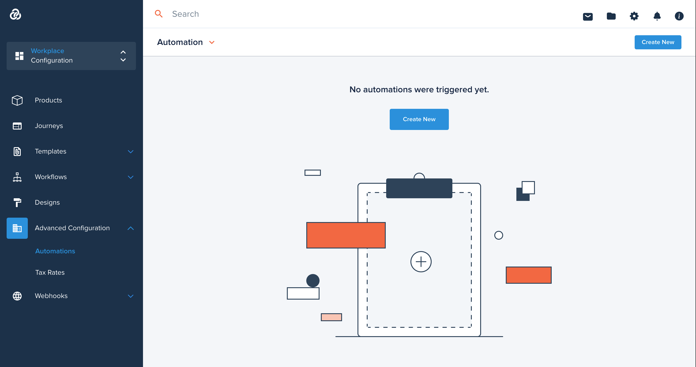

# Automation

[[API Docs](/api/automation#tag/flows)]
[[SDK](https://www.npmjs.com/package/@epilot/automation-client)]

The epilot app comes with a general-purpose automation framework to automate some actions with [Entities](/docs/entities/entity-api).

Some examples of Automation usage in epilot:

- Sending Automated Emails on Journey Submissions
- Mapping data from Submissions to Business Entities such as Contacts, Orders or Opportunities
- Configuring Webhook integrations triggered on Entity Updates

The configuration of Automation is found under:
[Configuration > Advanced Configuration > Automation](https://portal.epilot.cloud/app/automation-hub)
 
