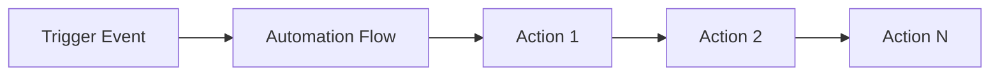

# Automation

[[API Docs](/api/automation#tag/flows)]
[[SDK](https://www.npmjs.com/package/@epilot/automation-client)]

epilot provides a general-purpose automation framework for executing actions on [Entities](/docs/entities/entity-api) in response to events.

Common use cases:

- Sending automated emails on journey submissions
- Mapping submission data to business entities such as Contacts, Orders, or Opportunities
- Triggering webhooks on entity updates
- Generating documents from templates
- Starting workflows as part of a business process

Configure automations under [Configuration > Advanced Configuration > Automation](https://portal.epilot.cloud/app/automation-hub).