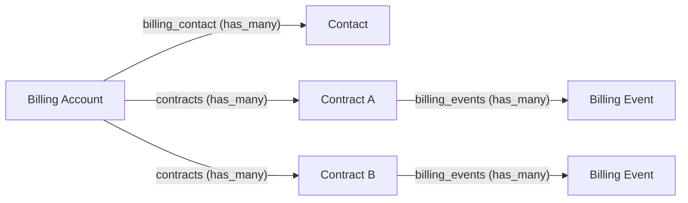

# Billing Accounts

[[API Docs](/api/billing#tag/billing_account_schema)]
[[SDK](https://www.npmjs.com/package/@epilot/billing-client)]

A **Billing Account** groups multiple contracts under a single billing entity for a customer. It acts as the central place for payment methods, billing addresses, and outstanding balances — aligning with standard ERP concepts like SAP's Contract Account or Schleupen's Rechnungseinheitskonto.

:::info
Billing accounts are an optional entity enabled via the `billing_account_entity` feature setting.
:::

## Relationships

A billing account is typically linked to one or more **contacts** (the payer) and one or more **contracts** (the services being billed). Billing events such as invoices and payments roll up through the linked contracts.

## Key Attributes

| Attribute | Type | Description |
|-----------|------|-------------|
| `billing_account_number` | string | Unique identifier for the billing account |
| `billing_contact` | relation | The customer or account being billed |
| `billing_address` | relation_address | Billing address, overrides individual contract addresses |
| `payment_method` | payment (repeatable) | Payment methods, overrides individual contract payment methods |
| `balance` | currency (read-only) | Aggregated outstanding balance across all linked contracts |
| `contracts` | relation | Contracts grouped under this billing account |

## Override Behavior

When a billing account is linked to contracts, its **payment method** and **billing address** take precedence over those set on individual contracts. This means updating a payment method on the billing account propagates the change to all contracts underneath it — useful when a customer switches bank accounts or moves to a new address.

## ERP Integration

Billing accounts map naturally to ERP billing constructs:

| ERP System | Equivalent Concept |
|------------|-------------------|
| SAP IS-U | Contract Account |
| Schleupen | Rechnungseinheitskonto |
| Wilken | Contract Account (Debitor) |
| LIMA | Debitor |

Common ERP sync use cases include keeping billing accounts in sync, propagating payment method changes, and synchronizing billing events. See the [ERP Toolkit](/docs/integrations/erp-toolkit/use-cases) for detailed examples.

## Portal Integration

When billing accounts are enabled, the **Customer Portal** uses them to:

- Display an aggregated **balance** across all contracts
- Group contracts under billing accounts in the **contract switcher**
- Apply payment method changes at the billing account level instead of per-contract
