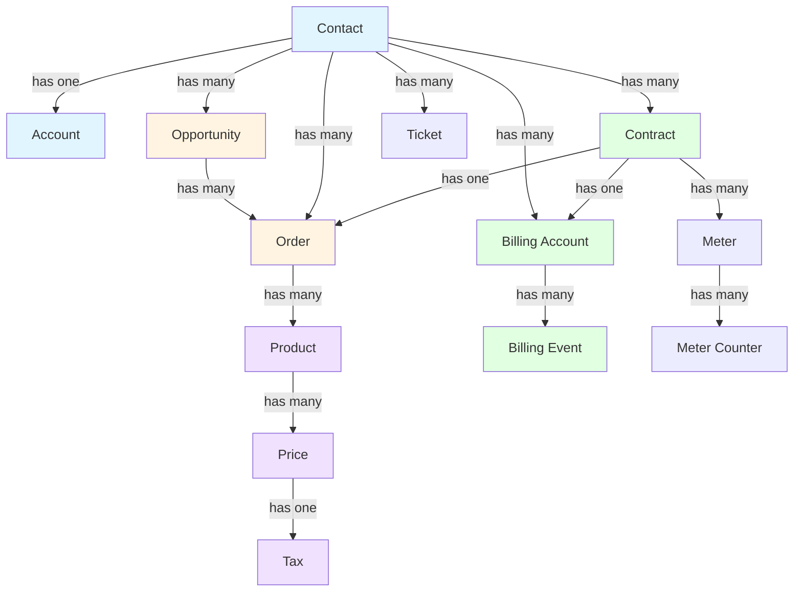

import EntitySchemaViewer from '@site/src/components/EntitySchemaViewer';

# Core Entities

epilot ships with a set of built-in entity schemas that model common business objects. This page lists all core schemas with their descriptions, relationship diagram, and links to API docs.

## Relationship Diagram

## Built-in Entity Schemas

### Customer Relations

<EntitySchemaViewer
  schema="contact"
  displayName="Contact"
  description="Contacts store details about customers or individuals managed by the epilot organization."
  apiLink="/api/customer#tag/contact_schema"
/>

<EntitySchemaViewer
  schema="account"
  displayName="Account"
  description="Accounts store details about companies. Contacts can be linked to an account to represent a business customer."
  apiLink="/api/customer#tag/account_schema"
/>

<EntitySchemaViewer
  schema="partner"
  displayName="Partner"
  description="Partners store details about collaborating third parties, such as installation partners, OEMs and other business partners."
  apiLink="/api/partner#tag/partner_schema"
/>

<EntitySchemaViewer
  schema="ticket"
  displayName="Ticket"
  description="Tickets store customer support requests and help desk inquiries."
/>

### Sales

<EntitySchemaViewer
  schema="opportunity"
  displayName="Opportunity"
  description="Opportunities store details about sales leads or product inquiries usually made through journeys."
  apiLink="/api/opportunity#tag/opportunity_schema"
/>

<EntitySchemaViewer
  schema="order"
  displayName="Order"
  description="Orders store details about requested products, pricing and past orders placed by customers."
  apiLink="/api/order#tag/order_schema"
/>

### Product Hub

<EntitySchemaViewer
  schema="product"
  displayName="Product"
  description="Products represent services or products sold by the epilot organization."
  apiLink="/api/product#tag/product_schema"
/>

<EntitySchemaViewer
  schema="price"
  displayName="Price"
  description="Prices configure the pricing models for products."
  apiLink="/api/product#tag/price_schema"
/>

<EntitySchemaViewer
  schema="tax"
  displayName="Tax"
  description="Taxes represent the tax rates applied to prices."
  apiLink="/api/product#tag/tax_schema"
/>

<EntitySchemaViewer
  schema="coupon"
  displayName="Coupon"
  description="Coupons represent discounts or promotions that can be applied to products."
  apiLink="/api/pricing#tag/coupon_schema"
/>

### Contracts & Billing

<EntitySchemaViewer
  schema="contract"
  displayName="Contract"
  description="Contracts store details about service agreements, tariffs and other agreements between customers and the epilot organization."
  apiLink="/api/billing#tag/contract_schema"
/>

<EntitySchemaViewer
  schema="billing_account"
  displayName="Billing Account"
  description="Billing accounts store billing information and payment details for customers."
  apiLink="/api/billing#tag/billing_account_schema"
/>

<EntitySchemaViewer
  schema="billing_event"
  displayName="Billing Event"
  description="Billing events store records of financial transactions, including payments, invoices, and credit notes."
  apiLink="/api/billing#tag/billing_event_schema"
/>

### Metering

<EntitySchemaViewer
  schema="meter"
  displayName="Meter"
  description="Meters store details about power, gas, water, or other devices used to meter consumption."
  apiLink="/api/metering#tag/meter_schema"
/>

<EntitySchemaViewer
  schema="meter_counter"
  displayName="Meter Counter"
  description="Meter counters represent the counters used in meter devices, allowing separate tracking for different consumption types or purposes, such as peak and off-peak energy usage."
  apiLink="/api/metering#tag/meter_counter_schema"
/>

### Journeys

<EntitySchemaViewer
  schema="journey"
  displayName="Journey"
  description="Journeys contain the configuration of a customer journey, which is used to collect data from customers."
  apiLink="/api/journey#tag/journey_schema"
/>

<EntitySchemaViewer
  schema="submission"
  displayName="Submission"
  description="Submissions store raw data collected from Journeys or other outside data sources into epilot."
  apiLink="/api/submission#tag/submission_schema"
/>

### Messaging

<EntitySchemaViewer
  schema="message"
  displayName="Message"
  description="Messages are email communications sent and received through the epilot platform."
  apiLink="/api/message#tag/message_schema"
/>

<EntitySchemaViewer
  schema="email_template"
  displayName="Email Template"
  description="Email templates are used as templates containing variables for emails sent from epilot."
  apiLink="/api/email-template#tag/email_template_schema"
/>

### Marketing & Analytics

<EntitySchemaViewer
  schema="campaign"
  displayName="Campaign"
  description="Campaigns store marketing campaign information and configurations."
/>

<EntitySchemaViewer
  schema="target"
  displayName="Target"
  description="Targets represent goals or milestones for sales and marketing activities."
/>

<EntitySchemaViewer
  schema="product_recommendation"
  displayName="Product Recommendation"
  description="Product recommendations suggest products to customers based on their preferences and behavior."
/>

### System

<EntitySchemaViewer
  schema="file"
  displayName="File"
  description="Files store details about documents, images, templates and other files uploaded to the epilot platform."
  apiLink="/api/file#tag/file_schema"
/>

<EntitySchemaViewer
  schema="comment"
  displayName="Comment"
  description="Comments allow users to add notes and have discussions across the platform."
  apiLink="/api/notes"
/>

<EntitySchemaViewer
  schema="portal_user"
  displayName="Portal User"
  description="Portal users are users registered to use end customer portals or installer portals."
  apiLink="/api/customer-portal#tag/portal_user_schema"
/>
