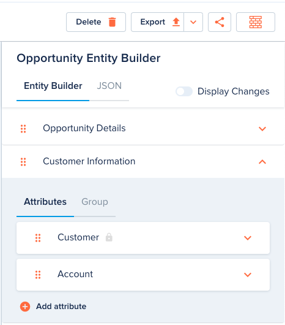

# Entity Builder

[[API Docs](/api/entity/#tag/Schemas)]
[[SDK](https://www.npmjs.com/package/@epilot/entity-client)]

Configuring users in epilot can define the data model of their entities using an Entity Builder interface.

The Entity Builder uses the Entity Schema API to mutate schemas.

