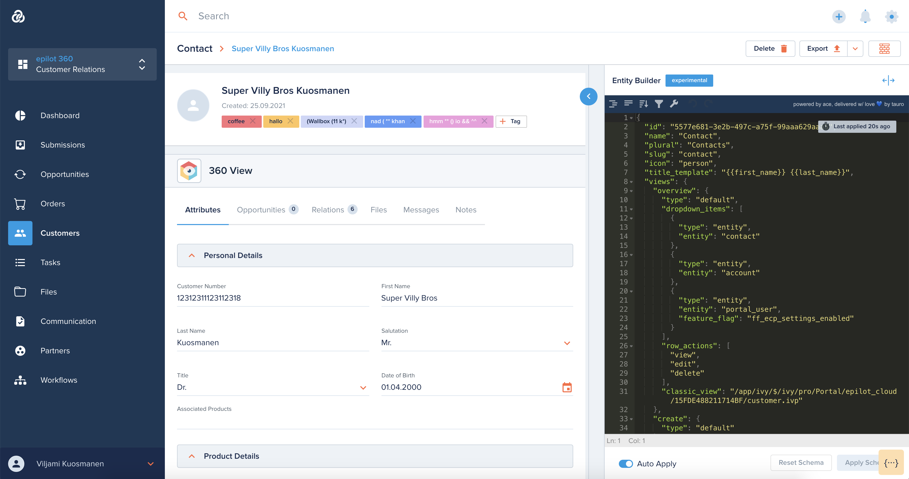

# Flexible Entities

[[API Docs](/api/entity)]
[[SDK](https://www.npmjs.com/package/@epilot/entity-client)]

The epilot application uses a flexible *Entities* data layer to model business data on the platform.

## Entities

Entities are business objects in epilot with flexible user-defineable schemas.

Each entity can contain arbitrary JSON data, which is made accessible via the Entity API.

## Schemas

Schemas represent different types of entities in epilot.

Examples of Entity Schemas:

- Contact
- Account
- Product
- Submission
- Order
- Opportunity
- File
- Message

The primary purpose of schemas is to control how the flexible entities are represented in the epilot 360 portal UI.

## Entity Builder

The epilot 360 potal provides a builder interface to modify the schemas defined in the organization.

## Attributes

Schemas define a list of Attributes, which are fields that the entity can have.

These Attributes are rendered in Tables and Details views for all entities of the Schema.

Examples of Attributes:

- First Name
- Last Name
- VAT ID
- Product Name
- Product SKU
- Order ID

## Capabilities

Entity Schemas may also define capabilities for the entities, which define extra functionality for that entity.

Examples of capabilities:

- File Attachments
- Comments

## Relations

Entities also natively support relations, meaning entities can be linked with each other.

Related entities appear in each-others detail views as previewable links.

## Activity

Any events related to the entity are stored in an append-only Activity feed.

Each activity item contains a description of the activity, the caller and details about any operations touching the data of the entity.
