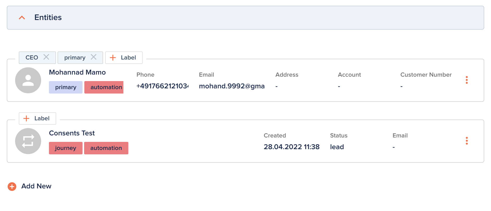

# Relations

[[API Docs](/api/entity/#tag/Relations)]
[[SDK](https://www.npmjs.com/package/@epilot/entity-client)]

Relations link epilot entities to each other. Any entity can relate to any other entity, regardless of schema. The Relations tab on each entity detail view shows all linked entities.



## Data Structure

Relations are stored as a JSON object with a `$relation` array. Each entry references a related entity by ID and can carry `_tags` for classification:

```json title="stored-value"
{
  "contacts": {
    "$relation": [
      {
        "entity_id": "48e9432b-05e9-44fb-a8c2-8d29d9ceade8",
        "_tags": ["CEO", "primary"]
      },
      {
        "entity_id": "c0f7ad05-f03d-4d6a-a36a-c85281da28bb",
        "_tags": ["Head of sales"]
      }
    ]
  }
}
```

## Relation References

Relation references (`$relation_ref`) point to a specific attribute on a related entity, avoiding data duplication. This is useful when a contract should reference the billing address or payment method stored on another entity.

```json title="stored-value"
{
  "billing_address": {
    "$relation_ref": [
      {
        "entity_id": "843f2de0-f71a-43fc-a5f5-908e20c4df25",
        "path": "address",
        "_id": "addr1"
      }
    ]
  }
}
```

| Field | Description |
|-------|-------------|
| `entity_id` | The related entity's ID |
| `path` | Path to the attribute on the related entity |
| `_id` | Optional: ID of a specific item within a repeatable attribute |

## Hydration

Pass `hydrate=true` to Entity API operations (`getEntity`, `searchEntities`, `getRelations`) to resolve `$relation` and `$relation_ref` references in-place. Each relation entry is expanded to include the full entity data while preserving the original reference metadata.

See [Entity API — Relations API](/docs/entities/entity-api#relations-api) for API usage examples.

## Relation Attributes

Relations are defined on schemas as [relation attributes](/docs/entities/attributes#relation). Key schema properties:

- `relation_type` — `"has_many"` or `"has_one"`
- `allowedSchemas` — restricts which entity types can be linked
- `reverse_attributes` — automatically creates a back-reference on the related entity
- `relation_affinity_mode` — `"weak"` (preserved on duplication) or `"strong"` (discarded on duplication)
