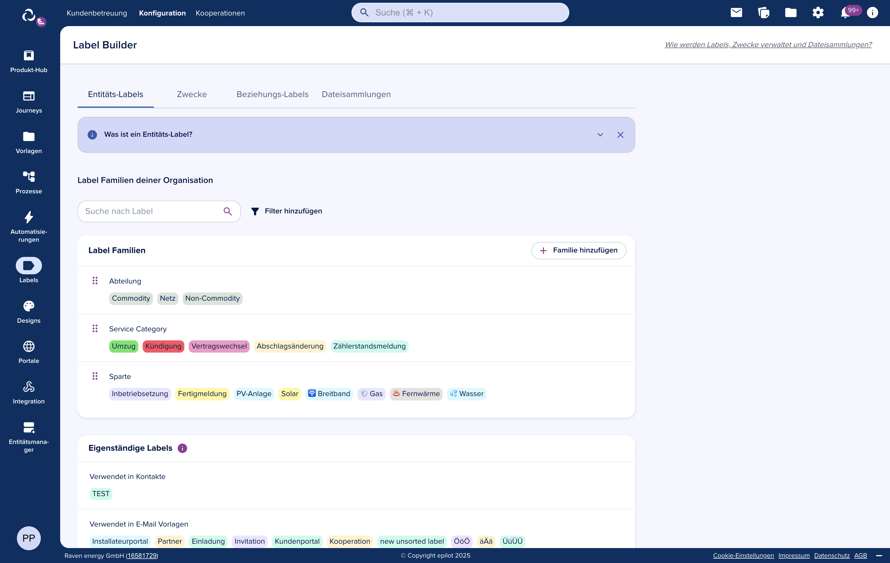

# Taxonomies

Taxonomies in epilot provide a powerful labeling and classification system for organizing entities, relations, and files. They enable consistent categorization and improve searchability across the platform.




## Overview

Taxonomies are hierarchical classification systems that allow you to create and manage labels for different types of data in epilot. The system supports three main taxonomy types, each with specific prefixes:

- **Entity Labels** - Classification for entities (`_schema_` prefix for standalone labels or any slug not starting with `_relation_` or `_system_`)
- **Relation Labels** - Classification for entity relationships (`_relation_` prefix)  
- **System Collections** - Organization for document groups (`_system_` prefix)

## Entity Labels

Entity labels provide a way to categorize and classify entities within your schemas. They help organize entities by their business purpose, status, or any other relevant classification.

### Structure
```typescript
type EntityStandardFamilySlug = `_schema_${string}`
type EntityStandardFamilyLabelSlug = `_schema_${string}:${string}`
```

### Use Cases
- Categorizing customers by type (e.g., residential, commercial)
- Marking entity status (e.g., active, archived, pending)
- Grouping entities by business processes
- Flagging entities for specific workflows

### System Labels
Entity schemas include predefined system labels that are locked and cannot be modified:
- `__hidden` - Marks entities as hidden from standard views
- `copy` - Indicates an entity is a copy
- `merged` - Marks entities that have been merged
- `composite` - Identifies composite entities
- `automation` - Related to automated processes
- `bulk-generated` - Entities created through bulk operations

The reason for this is simple, our system produces some of these labels depending on certain actions, like bulk operations, or system actions, like duplicating entities. Enabling users to modify these labels wouldn't serve much of purpose since those labels would keep coming back. For this reason, the system locks these labels.

## Purposes

Purposes are a special type of taxonomy that define the business purpose or intent of a given entity, but not exclusively. Purposes are also used to control visibility of attributes and groups of fields within an entity. They provide semantic meaning to entity data.

### Key Characteristics
- Purposes exist as a standalone taxonomy family with slug `purpose`
- They can be applied to any entity, attribute or group of fields to clarify its business context
- They can be used to control visibility of attributes and groups of fields within an entity

## Relation Labels

Relation labels classify the connections between entities, providing additional context about the nature of relationships.

### Structure
```typescript
type RelationSystemFamilySlug = `_relation_${string}`
type RelationSystemFamilyLabelSlug = `_relation_${string}:${string}`
```

### Predefined Relation Labels

The system includes predefined relation labels for common entity types:

#### Address Relations
- `_relation_address:billing` - Billing address
- `_relation_address:delivery` - Delivery address

#### Account Relations
- `_relation_account:customer` - Customer account
- `_relation_account:installer` - Installer account
- `_relation_account:planner` - Planner account
- `_relation_account:onsite_contact` - On-site contact
- `_relation_account:architect` - Architect account
- `_relation_account:supplier` - Supplier account

#### Contact Relations
- `_relation_contact:customer` - Customer contact
- `_relation_contact:installer` - Installer contact
- `_relation_contact:planner` - Planner contact
- `_relation_contact:onsite_contact` - On-site contact
- `_relation_contact:architect` - Architect contact
- `_relation_contact:supplier` - Supplier contact

### Benefits
- Enables filtering relationships by type
- Improves data navigation and discovery
- Supports business logic based on relationship types

## File Collections

File collections provide a way to organize and group documents and files within epilot, supporting both global collections and user-specific collections.

### Structure
```typescript
type FileCollectionSystemFamilyLabelSlug = `_system_files_collection_schema_${string}:${string}`
type FileUserCollectionSystemFamilyLabelSlug = `_system_files_collection_schema_${string}_${string}:${string}`
```

### Types of File Collections

#### Global Collections
- System-wide file groupings accessible across all entities
- Used for shared documents, templates, and resources
- Examples: Company policies, standard contracts, marketing materials

#### Per-User-Schema Collections (also called User Collections, since they are personal to each user)
- Collections specific to user and a specific schema
- Organize documents related to specific entity types
- Examples: Customer contracts, project documentation, compliance certificates

### Use Cases
- Document categorization by type or purpose
- Compliance document management
- Project file organization
- Template and resource libraries
- Attachment classification

## Working with Taxonomies


### Label Structure

All taxonomy labels follow a consistent structure:
```typescript
{
  id: string,           // Unique identifier
  slug: string,         // Formatted slug with prefix
  name: string          // Display name
}
```

### System Functions

The platform provides utility functions for working with taxonomies:

- `isEntitySystemFamilyOrSlug()` - Check if a slug is an entity taxonomy
- `isRelationSystemFamilyOrSlug()` - Check if a slug is a relation taxonomy
- `isFileCollectionSystemFamilyOrSlug()` - Check if a slug is a file collection
- `getSchemaFromSystemFamilySlug()` - Extract schema name from taxonomy slug
- `getLabelSlugFromSystemLabel()` - Extract label portion from full slug

### Locked System Labels

Some labels are system-defined and locked, meaning they:
- Cannot be deleted or modified
- Are consistently available across all instances
- Support core platform functionality
- Include special handling in the application logic


### Permissions

Taxonomy operations require specific permissions:
- `label_builder:create` - Create taxonomies and classifications
- `label_builder:edit` - Update existing labels
- `label_builder:delete` - Delete labels

### Error Handling

Common API errors:
- `TaxonomyNotFoundError` - Returns 404
- `TaxonomyAlreadyExistsError` - Returns 409 Conflict
- `TaxonomyValidationError` - Returns 400 Bad Request
- `TaxonomyInUseError` - Returns 400 when trying to delete taxonomy in use
- `RelationTaxonomyClassificationDeletionNotAllowedError` - Returns 403 for protected items

### Bulk Operations

The API supports bulk operations for efficiency:

```typescript
// Bulk classification update
POST /v1/entity/taxonomies/{taxonomySlug}/classifications
{
  "create": [
    { "id": "uuid", "name": "New Label", "slug": "new-label" }
  ],
  "update": [
    { "id": "existing-id", "name": "Updated Name" }
  ],
  "delete": [
    { "id": "id-to-delete" }
  ]
}
```

### Search and Filtering

Advanced search capabilities:
```typescript
// Search with patterns
POST /v1/entity/taxonomies/classifications/search
{
  "classificationIds": [
    { "pattern": "customer*" },  // Wildcard search
    "specific-id"                // Exact match
  ]
}
```

### Integration Example

```typescript
import { getEntityClient } from '@epilot/entity-client';

const client = getEntityClient();

// Create a new taxonomy
const taxonomy = await client.createTaxonomy({}, {
  slug: 'project-status',
  name: 'Project Status',
  type: 'entity',
  enabled: true
});

// Add classifications
await client.updateClassifications({
  taxonomySlug: 'project-status'
}, {
  create: [
    { id: 'uuid-1', name: 'Planning', slug: 'planning' },
    { id: 'uuid-2', name: 'In Progress', slug: 'in-progress' },
    { id: 'uuid-3', name: 'Completed', slug: 'completed' }
  ]
});

// Search classifications
const results = await client.searchClassifications({
  taxonomySlug: 'project-status',
  query: 'progress',
  include_archived: 'false'
});
```

For detailed API documentation, refer to the [Taxonomy API Reference](https://docs.epilot.io/api/entity#tag/Taxonomy).
