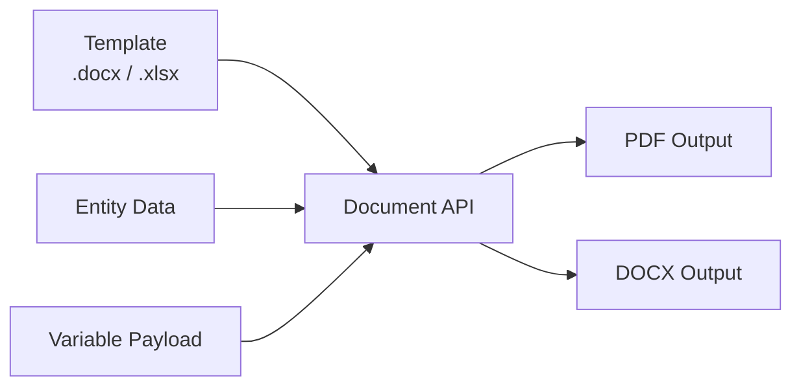

# Document Generation

[[API Docs](/api/document)]
[[SDK](https://www.npmjs.com/package/@epilot/document-client)]

## Overview

The Document Generation API creates documents from templates with dynamic variable substitution. It supports multiple input and output formats, image embedding, Excel generation, and async processing with job tracking.



## API Endpoints

### Extract Template Metadata

Extract metadata and variables from document templates.

**Endpoint:** `POST /v2/documents:meta`

**Supported formats:** `.docx`, `.doc`, `.xlsx`, `.xls`, `.xlsm`

```json title="Request"
{
  "template_document": {
    "s3ref": {
      "bucket": "epilot-files-prod",
      "key": "123/templates/contract-template.docx"
    }
  }
}
```

```json title="Response"
{
  "page_margins": {
    "top": 1440,
    "bottom": 1440,
    "left": 1440,
    "right": 1440,
    "header": 720,
    "footer": 720
  },
  "variables": [
    "customer_name",
    "order.billing_contact.0.salutation",
    "items[0].description",
    "opportunities[Primary].value"
  ]
}
```

### Generate Documents

Generate documents from templates with variable substitution.

**Endpoint:** `POST /v2/documents:generate`

**Input formats:** `.docx`, `.xlsx`, `.xls`, `.xlsm`, `.ics`

**Output formats:** `.pdf`, `.docx`, `.xlsx`, `.ics`

**Query parameters:**

| Parameter | Values | Default | Description |
|-----------|--------|---------|-------------|
| `job_id` | string | -- | Track async generation status |
| `mode` | `partial_generation`, `full_generation` | `full_generation` | Generation flow type |
| `preview_mode` | `open`, `download` | `open` | Preview behavior |

```json title="Request"
{
  "template_document": {
    "s3ref": {
      "bucket": "epilot-files-prod",
      "key": "123/templates/invoice-template.docx"
    },
    "filename": "invoice-template.docx"
  },
  "context_entity_id": "550e8400-e29b-41d4-a716-446655440000",
  "user_id": "user_123",
  "language": "en",
  "variable_payload": {
    "custom_field": "Override value",
    "discount": 15
  },
  "template_settings": {
    "top_margin": 1440,
    "bottom_margin": 1440,
    "show_guidelines": false
  }
}
```

```json title="Response"
{
  "job_id": "job_550e8400",
  "job_status": "SUCCESS",
  "pdf": {
    "s3ref": {
      "bucket": "epilot-generated-documents",
      "key": "123/output/invoice.pdf"
    },
    "preview_url": "https://s3.amazonaws.com/...",
    "filename": "invoice.pdf"
  },
  "docx": {
    "s3ref": {
      "bucket": "epilot-generated-documents",
      "key": "123/output/invoice.docx"
    },
    "preview_url": "https://s3.amazonaws.com/...",
    "filename": "invoice.docx"
  },
  "variable_payload": {
    "customer_name": "John Doe",
    "custom_field": "Override value",
    "discount": 15
  }
}
```

### Convert Documents

Convert documents between formats (currently DOCX to PDF).

**Endpoint:** `POST /v2/documents:convert`

```json title="Request"
{
  "input_document": {
    "s3ref": {
      "bucket": "epilot-files-prod",
      "key": "123/documents/contract.docx"
    }
  },
  "output_format": "pdf",
  "output_filename": "contract-converted.pdf",
  "language": "en"
}
```

```json title="Response"
{
  "output_document": {
    "s3ref": {
      "bucket": "epilot-generated-documents",
      "key": "123/converted/contract-converted.pdf"
    },
    "preview_url": "https://s3.amazonaws.com/...",
    "filename": "contract-converted.pdf"
  }
}
```

## Template Variables

### Basic Variable Syntax

Templates use double curly braces for variable substitution:

```
{{variable_name}}              // Simple variable
{{customer.name}}               // Nested object
{{address.street.number}}       // Deep nesting
{{items.0.price}}              // Alternative array syntax
{{opportunities[Primary].value}} // Label-lookup array access
{{data["special-key"]}}        // Bracket notation for special characters on Label Lookups
```

### Variable Resolution Order

Variables resolve in this precedence order (highest first):

1. `variable_payload` -- explicitly provided values
2. `context_data` -- additional context data
3. Entity attributes from `context_entity_id`
4. User preferences (language) from `user_id`

### Complex Variable Examples

```
// Customer information
{{customer.first_name}} {{customer.last_name}}
{{customer.address.0.street}}
{{customer.contacts[billing].email}}

// Order details with calculations
{{ calc "ROUND((price * qty) * (1 - discount), 2)" }}
{{order.total_amount}}

// Conditional display (in supported templates)
{{#has_discount}}
  Discount: {{discount_percentage}}%
{{/has_discount}}
```

You can find more examples about calculation variables [here](https://docs.epilot.io/docs/templates/template-variables#excel-like-formulas).

## Image Variables

### Basic Image Syntax

Images can be embedded in documents using the special syntax:

#### Direct Image URL
```
{{% image_url }}
```
This renders the image at its original size.

#### Image with Size Control
Use an image placeholder in your template and set the variable in the alt text:
1. Insert an image placeholder in your Word/Excel template
2. Set the alt text to: `{{% image_url }}`
3. The placeholder image dimensions will control the rendered size

### Image Loops and Collections

<div style={{display: 'flex', gap: '20px', marginBottom: '20px', alignItems: 'center'}}>


</div>


#### Mapping Journey Submissions to File Attributes

Since the global `_files` attribute is not yet supported, you need to map Journey submission fields to file attributes. For example, map a journey field to `my_journey_images`.

#### Basic Image Loop
```
{{#my_journey_images[*]}}
    {{% public_url }}
{{/my_journey_images[*]}}
```
This iterates through all images in the collection.

#### Filtered Image Loop by Label
```
{{#my_journey_images[...solar-panel]}}
    {{% public_url }}
{{/my_journey_images[...solar-panel]}}
```
This only includes images with the label "solar-panel".

#### Complete Example with Formatting
```
{{#property_images[*]}}
    Property Image:
    {{% public_url }}

    Description: {{ _title }}
    Uploaded: {{ _created_at }}
{{/property_images[*]}}
```

### Automatic Public URL Generation

The service automatically handles private images by converting them to signed URLs with temporary access credentials. These URLs expire shortly after document processing completes.

:::warning
**Order tables with margin corrections are incompatible with loops.** Templates using `{{~order_table mt=2 mb=2}}` cannot include image loops or any `FOR_LOOP` constructs. Remove margin correction variables and adjust margins directly in Word's built-in settings instead.
:::

## Excel Generation

<div style={{display: 'flex', gap: '20px', marginBottom: '20px', alignItems: 'center'}}>


</div>

### Excel Template Support

The Document Generation API supports Excel templates with:
- Variable substitution in cells
- Formula preservation (recalculation is not supported due to Excel's security model)
- Image embedding in spreadsheets

:::note
Order Table variables are not supported in Excel templates due to Excel's limitations with direct HTML rendering.
:::

### Excel Variable Syntax

#### Cell Variables
```
A1: {{customer_name}}
B1: {{order_date}}
```

#### Images in Excel
```
Cell A1: {{% product_image }}
Cell B2: {{% chart_url }}
```

### Excel Generation Example

**Request:**
```json
{
  "template_document": {
    "s3ref": {
      "bucket": "epilot-files-prod",
      "key": "templates/report-template.xlsx"
    }
  },
  "context_entity_id": "550e8400-e29b-41d4",
  "variable_payload": {
    "report_title": "Q4 Sales Report",
    "sales_data": [
      {"month": "October", "revenue": 125000},
      {"month": "November", "revenue": 145000},
      {"month": "December", "revenue": 168000}
    ],
    "chart_image": "https://charts.example.com/q4-sales.png"
  }
}
```

## Troubleshooting

<details>
<summary>Variables not replaced</summary>

- Verify `{{}}` bracket syntax
- Check that the variable exists in the payload or entity
- Remember that `variable_payload` overrides entity data

</details>

<details>
<summary>Image not rendering</summary>

- Use `{{% url }}` with the correct syntax
- Confirm the image URL is accessible
- When using label filters, verify images have the correct labels

</details>

<details>
<summary>Loop syntax errors</summary>

- Use `[*]` for all items, `[...label]` for filtered
- Ensure matching opening and closing loop tags
- Remove `{{~order_table mt=2 mb=2}}` when using loops

</details>

## Code Examples

### cURL

```bash title="Extract template metadata"
curl -X POST https://api.epilot.cloud/v2/documents:meta \
  -H "Authorization: Bearer $TOKEN" \
  -H "Content-Type: application/json" \
  -d '{
    "template_document": {
      "s3ref": {
        "bucket": "epilot-files-prod",
        "key": "templates/contract.docx"
      }
    }
  }'
```

```bash title="Generate a document"
curl -X POST https://api.epilot.cloud/v2/documents:generate \
  -H "Authorization: Bearer $TOKEN" \
  -H "Content-Type: application/json" \
  -d '{
    "template_document": {
      "s3ref": {
        "bucket": "epilot-files-prod",
        "key": "templates/invoice.docx"
      }
    },
    "context_entity_id": "550e8400-e29b-41d4-a716-446655440000",
    "variable_payload": {
      "custom_message": "Thank you for your business!"
    }
  }'
```

### Template Settings

Customize document margins and appearance:

```json title="template_settings"
{
  "template_settings": {
    "top_margin": 1440,
    "bottom_margin": 1440,
    "left_margin": 1080,
    "right_margin": 1080,
    "show_guidelines": false,
    "enable_headers": true,
    "enable_footers": true
  }
}
```

### Async Job Tracking

For large documents, poll the generation endpoint with the returned `job_id`:

```typescript
const { job_id } = await client.generateDocument({ ... });

const poll = async (jobId: string) => {
  const res = await client.generateDocument({ job_id: jobId });

  if (res.job_status === 'SUCCESS') {
    return res.pdf.preview_url;
  } else if (res.job_status === 'FAILED') {
    throw new Error('Generation failed');
  }

  // Still processing -- retry after delay
  await new Promise((r) => setTimeout(r, 2000));
  return poll(jobId);
};
```