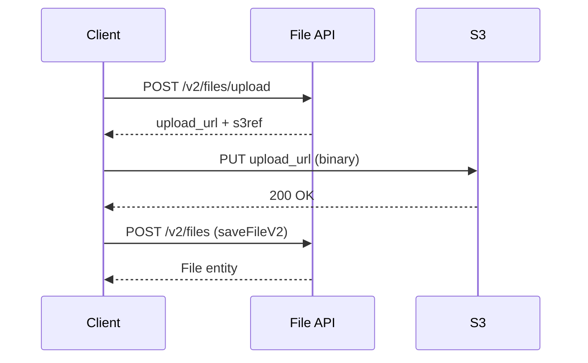
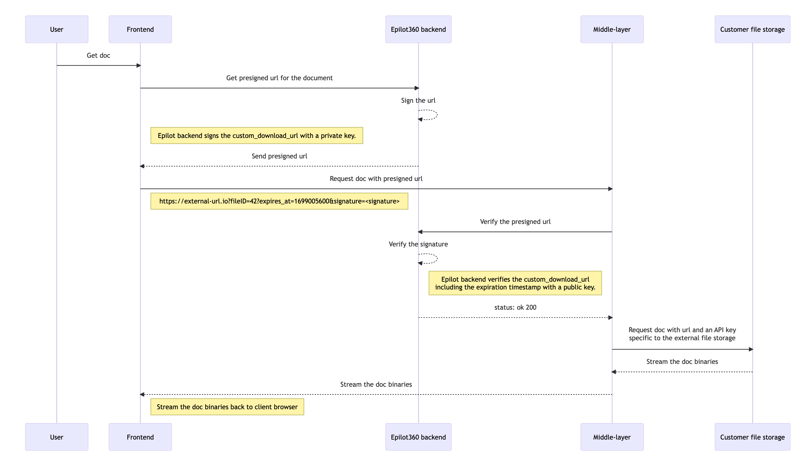

# File API

[[API Docs](/api/file)]
[[SDK](https://www.npmjs.com/package/@epilot/file-client)]

Files in epilot are uploaded and managed through the [File API](/api/file).

## Downloading Files

The [`downloadFile` operation](/api/file#tag/files/operation/downloadFile) returns a temporary presigned S3 URL for downloading a file.

```
GET /v1/files/{id}/download
```

```json title="Response"
{
  "download_url": "https://epilot-prod-user-content.s3.eu-central-1.amazonaws.com/...?X-Amz-..."
}
```

The `download_url` is valid for 15 minutes.

:::info
The `downloadFile` operation requires a valid access token.
:::

:::note
Public files can also be downloaded directly via their `public_url` property. However, `downloadFile` works for both public and private files and is the recommended approach.
:::

## Uploading Files

The [`uploadFileV2` operation](/api/file#tag/files/operation/uploadFileV2) returns a temporary presigned S3 URL for uploading a file via `PUT`.

After uploading, call [`saveFileV2`](/api/file#tag/files/operation/saveFileV2) to persist the file and create a File entity. Files that are uploaded but not saved expire and are deleted within 24 hours.

:::info
`uploadFileV2` requires a valid access token. Use `uploadFilePublic` for public journey submissions.
:::

## Example Upload Flow



### Step 1: Call uploadFileV2 to get an s3ref

```
POST /v2/files/upload
```

```json title="Request body"
{
  "filename": "example.pdf",
  "mime_type": "application/pdf"
}
```

```json title="Response (201)"
{
  "s3ref": {
    "bucket": "epilot-prod-user-content",
    "key": "123/temp/f5e1c2be-7392-4a0d-8c45-236743423733/example.pdf"
  },
  "upload_url": "https://epilot-prod-user-content.s3.eu-central-1.amazonaws.com/...?X-Amz-...",
  "public_url": "https://epilot-prod-user-content.s3.eu-central-1.amazonaws.com/..."
}
```

### Step 2: Upload the file to S3

Use the returned `upload_url` to upload your file via `PUT`.

:::tip
Set the `Content-Type` header to match the file's MIME type.
:::

```
PUT {upload_url}
Content-Type: application/pdf

(binary data)
```

### Step 3: Call saveFileV2 to persist the file

```
POST /v2/files
```

```json title="Request body"
{
  "s3ref": {
    "bucket": "epilot-prod-user-content",
    "key": "123/temp/f5e1c2be-7392-4a0d-8c45-236743423733/example.pdf"
  },
  "filename": "example.pdf",
  "access_control": "private"
}
```

```json title="Response (201)"
{
  "_id": "ef7d985c-2385-44f4-9c71-ae06a52264f8",
  "filename": "example.pdf",
  "access_control": "private",
  "public_url": "...",
  "type": "document",
  "mime_type": "application/pdf",
  "size_bytes": 0,
  "versions": [...]
}
```

:::note
The `public_url` property is always present in the response. When `access_control` is `private`, the URL returns a 403 response.
:::

Attach the returned file entity ID to a business entity as a relation on any `file` attribute, or the default `_files` attribute:

```json
{
  "_schema": "opportunity",
  // ...other entity fields
  "_files": {
    "$relation": [
      { "entity_id": "ef7d985c-2385-44f4-9c71-ae06a52264f8" }
    ]
  }
}
```

## External Files

When migrating a large document archive is impractical, skip the upload steps and use the `custom_download_url` property to reference files stored externally.

```
POST /v2/files
```

```json title="Request body"
{
  "custom_download_url": "https://external-url.io?fileID=42",
  "filename": "example.pdf",
  "access_control": "private"
}
```

```json title="Response (201)"
{
  "_id": "ef7d985c-2385-44f4-9c71-ae06a52264f8",
  "filename": "example.pdf",
  "access_control": "private",
  "custom_download_url": "https://external-url.io?fileID=42",
  "type": "unknown",
  "size_bytes": 0,
  "versions": [...]
}
```

epilot retrieves external files on the fly with a short-lived signature and streams them directly to the end user. Use the [`verifyCustomDownloadUrl` operation](/api/file#tag/files/operation/verifyCustomDownloadUrl) to verify that a download request originates from epilot.



:::warning
Download requests for external files come from the user's browser. Do not include sensitive data (internal tokens, credentials) in the response -- the end user can inspect all response headers and content.
:::


## Updating Files

Update or save new versions of File entities via the [`saveFileV2` operation](/api/file#tag/files/operation/saveFileV2).

## Deleting Files

Delete files using the [`deleteFile` operation](/api/file#tag/files/operation/deleteFile). This permanently deletes both the File entity and the underlying S3 object.
