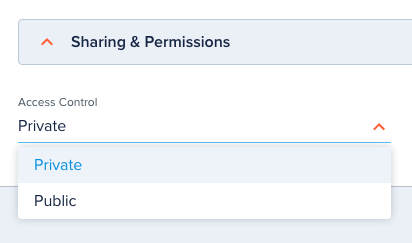
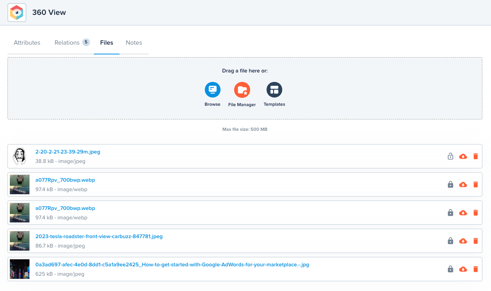
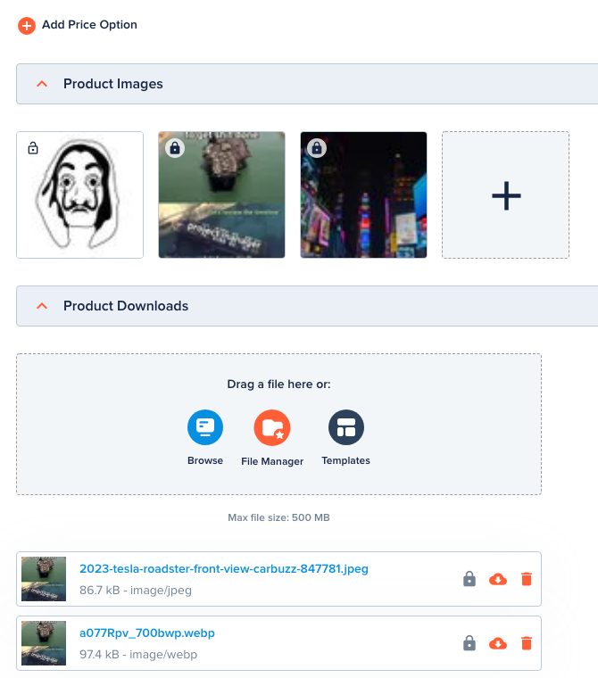
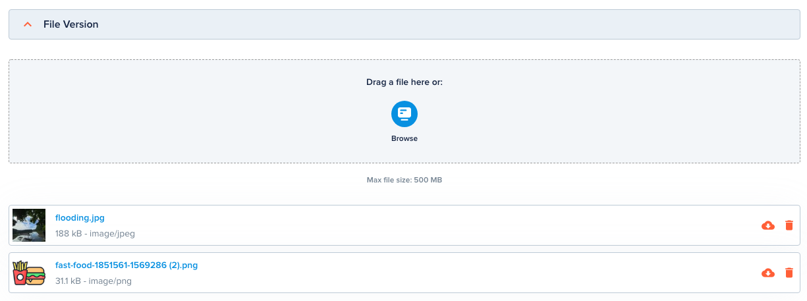

# File Entity

[[API Docs](/api/file)]
[[SDK](https://www.npmjs.com/package/@epilot/file-client)]

All files uploaded to epilot are represented as File Entities and available via the [Entity API](/docs/entities/entity-api).

## Access Control

The access control of the file is defined via the File entity.

The `access_control` attribute of a file can be set as either `private` (default) or `public-read`.

Whenever a File entity is created, updated or deleted, the underlying file's access control S3 is updated accordingly.

## File Relations

When a file is attached to an entity, a new File Entity is created and stored as a relation on the parent entity.

A file can be attached to an entity via:

- Upload through Files Tab
- File Manager through Files Tab
- Document Generation
- File Attribute
- Image Attribute

## Versions

File entities can be updated with new versions. 

By default, the latest version is used when the File entity is referred.

