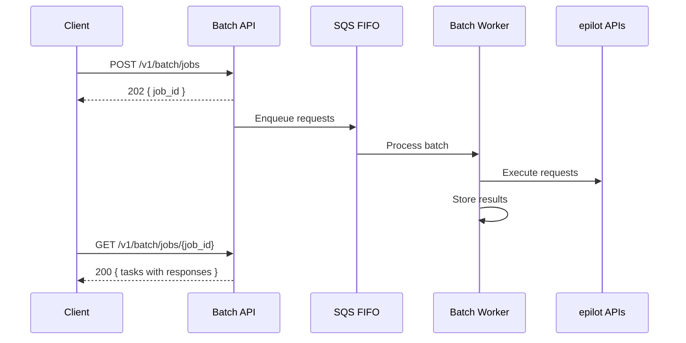

# Batch API

[[API Docs](/api/batch)]

The Batch API allows you to execute multiple epilot API calls in a single HTTP request. Instead of making 50 individual API calls, submit them as one batch and retrieve the results asynchronously.

This is particularly useful for middleware platforms (e.g., SAP CPI) where each HTTP request counts against message quotas.

## How It Works



1. **Submit** a batch of requests to `POST /v1/batch/jobs` -- returns a `job_id`
2. **Poll** `GET /v1/batch/jobs/{job_id}` to retrieve results as tasks complete
3. Each task includes the original request and its HTTP response

## Request Format

A batch job contains requests grouped by HTTP method. All requests target epilot API endpoints.

```json title="POST /v1/batch/jobs"
{
  "defaults": {
    "headers": {
      "authorization": "Bearer <token>"
    }
  },
  "PatchRequests": [
    {
      "request_id": "update-contact-1",
      "url": "https://entity.sls.epilot.io/v1/entity/contact:upsert",
      "body": {
        "unique_key": ["email.0.email"],
        "entity": {
          "_schema": "contact",
          "first_name": "Jane",
          "last_name": "Doe",
          "email": [{ "email": "jane@example.com" }]
        }
      }
    },
    {
      "request_id": "update-contact-2",
      "url": "https://entity.sls.epilot.io/v1/entity/contact:upsert",
      "body": {
        "unique_key": ["email.0.email"],
        "entity": {
          "_schema": "contact",
          "first_name": "John",
          "last_name": "Smith",
          "email": [{ "email": "john@example.com" }]
        }
      }
    }
  ]
}
```

### Supported Methods

| Field | HTTP Method |
|---|---|
| `GetRequests` | GET |
| `PostRequests` | POST |
| `PutRequests` | PUT |
| `PatchRequests` | PATCH |
| `DeleteRequests` | DELETE |

### Request Properties

| Property | Required | Description |
|---|---|---|
| `url` | Yes | Full URL to an epilot API endpoint |
| `body` | No | Request payload (for POST, PUT, PATCH) |
| `headers` | No | Per-request headers (merged with `defaults.headers`) |
| `request_id` | No | Custom identifier for tracking individual requests in the response |
| `group_id` | No | Sequential processing group (see [Ordering](#ordering) below) |

## Response Format

```json title="GET /v1/batch/jobs/{job_id}"
{
  "job_id": "abc-123",
  "job_status": "pending",
  "created_at": "2025-06-15T10:30:00Z",
  "PatchTasks": [
    {
      "task_id": "task-1",
      "task_status": "finished",
      "request": {
        "request_id": "update-contact-1",
        "url": "https://entity.sls.epilot.io/v1/entity/contact:upsert"
      },
      "response": {
        "status": 200,
        "body": { "entity": { "_id": "abc", "_schema": "contact" } }
      }
    },
    {
      "task_id": "task-2",
      "task_status": "in_progress",
      "request": {
        "request_id": "update-contact-2",
        "url": "https://entity.sls.epilot.io/v1/entity/contact:upsert"
      }
    }
  ]
}
```

Task statuses: `pending` | `in_progress` | `finished`

## Ordering

By default, requests within a batch execute **in parallel** (up to 10 concurrently). When order matters, use `group_id` to enforce sequential processing within a group.

```json title="Sequential meter readings with group_id"
{
  "PostRequests": [
    {
      "group_id": "meter-001",
      "url": "https://entity.sls.epilot.io/v1/entity/meter_reading",
      "body": { "entity": { "reading_date": "2025-01-01", "value": 1000 } }
    },
    {
      "group_id": "meter-001",
      "url": "https://entity.sls.epilot.io/v1/entity/meter_reading",
      "body": { "entity": { "reading_date": "2025-02-01", "value": 1250 } }
    }
  ]
}
```

Requests sharing the same `group_id` execute in order. Different groups run in parallel.

## Limits

| Constraint | Value |
|---|---|
| Max requests per batch | 100 |
| Max payload size | 6 MB |
| Per-request timeout | 30 seconds |
| Parallel execution | Up to 10 concurrent requests |
| Job data retention | 30 days |

:::caution
Only epilot API endpoints (`*.sls.epilot.io`) are accepted. Requests to external URLs are rejected.
:::

## Error Handling

Individual request failures do not affect other requests in the batch. Each task's response contains the HTTP status and body from the target API, including error responses.

| Scenario | Behavior |
|---|---|
| Request succeeds | Task status `finished`, response contains result |
| Request fails (4xx/5xx) | Task status `finished`, response contains error |
| Request times out | Task status `finished`, response contains 504 |
| Invalid URL | Batch rejected with 400 before processing |

Failed tasks are retried up to 3 times before being marked as permanently failed.

## When to Use

| Scenario | Recommended approach |
|---|---|
| Bulk entity upserts from middleware | Batch API |
| Real-time ERP sync with mapping | [ERP Toolkit](/docs/integrations/erp-toolkit/overview) |
| Single API call | Direct API |
| Event-driven notifications | [Webhooks](/docs/integrations/webhooks) |
