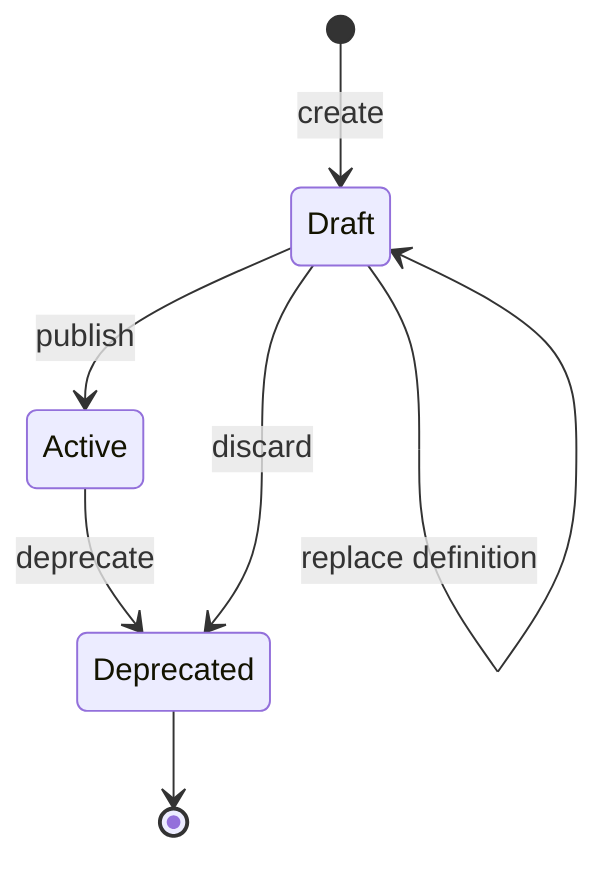

# Custom Events

[Core events](./core-events.md) ship with epilot and are identical in every organization. **Custom events** are authored by your organization: you choose the entity the event is about, the related data it carries, and each payload field — projected from your own entity attributes.

This matters because a built-in event cannot read attributes that only your organization has. If your service team tracks an installment change on a `ticket` attribute called `neuer_abschlagsbetrag_in_eur`, no shared built-in can project it. A custom event can, and once published it behaves exactly like a core event: the same trigger sources, the same payload envelope, the same JSON Schema endpoints, and the same webhook and automation integrations.

## Built-in and custom events compared

| | Core (built-in) events | Custom events |
|---|---|---|
| Defined by | epilot | Your organization |
| Visible to | Every organization | Your organization only |
| Payload fields | Fixed by epilot | Authored by you, projected from entity data |
| Versions | Multiple versions, with downgrade chains | Fixed at `1.0` |
| Definition changes | Released by epilot | Immutable after publishing |
| `event_origin` | `builtin` | `custom` |
| Tagged | `builtin` | `custom` |

Built-in names always win a collision: an event name already used by a built-in cannot be claimed as a custom event.

## Anatomy of a custom event

A custom event definition has four parts. The [Event Catalog API](/api/event-catalog) stores them together as one immutable definition.

### Root entity

Every custom event is built from exactly one **root entity** — a graph node with `cardinality: one`. The root is what an entity-change trigger watches, what an API or Automation trigger seeds the event from, and the starting point for related data. It is chosen once and cannot change afterwards.

### Entity graph

`entity_graph` describes which entities the event carries. Nodes are entity schemas, edges follow the relation attributes those schemas define:

```json
{
  "entity_graph": {
    "nodes": [
      { "id": "ticket", "schema": "ticket", "cardinality": "one" },
      { "id": "contract", "schema": "contract", "cardinality": "one" },
      { "id": "contact", "schema": "contact", "cardinality": "one", "fields": ["email", "first_name", "last_name"] }
    ],
    "edges": [
      { "from": "ticket", "to": "contract" },
      { "from": "ticket", "to": "contact" }
    ]
  }
}
```

When the event fires, epilot hydrates this graph and puts each node into the payload under its node ID. `fields` narrows a node to the listed attributes (plus the internal `_id`, `_schema` and `_org`); omit it to include everything.

### Payload fields and projection

`schema_fields` defines the event's own payload fields. Each field carries a JSON Schema type and a `graph_source` — a [JSONata](https://jsonata.org) expression evaluated against the hydrated graph, where every node is available under its node ID:

```json
{
  "schema_fields": {
    "installment_amount": {
      "json_schema": { "type": "number" },
      "required": true,
      "graph_source": "ticket.neuer_abschlagsbetrag_in_eur"
    },
    "contract_number": {
      "json_schema": { "type": "string" },
      "graph_source": "contract.contract_number"
    },
    "change_reason": {
      "json_schema": { "type": "string" },
      "graph_source": "ticket.sonstiger_grund ? ticket.sonstiger_grund : ticket.aenderungsgrund"
    }
  }
}
```

Because `graph_source` is a full JSONata expression, it also covers type coercion (`$number(ticket.value)`), constants (`'EUR'`), fallbacks and conditionals.

Custom event fields are **always** projected from the entity graph. Unlike some built-ins, a custom event never accepts caller-supplied field values — a `fields` object sent to the trigger endpoint is ignored.

#### Mapping modes

| Mode | How the payload is produced |
|---|---|
| `guided` (default) | Every field in `schema_fields` needs its own `graph_source`. Recommended. |
| `jsonata` | One JSONata expression in `mapping.jsonata` returns the complete payload object. `schema_fields` still defines the schema the result is validated against. |

In `jsonata` mode the expression is evaluated against the hydrated nodes plus an `operation` object holding the entity-operation context. It must return an object, and it cannot write system-owned fields.

### Triggers

A custom event needs at least one trigger source. They combine freely, except where noted:

| Source | Config | What it does |
|---|---|---|
| **Entity changes** | `entity_operation` | Fires when an entity of the root schema is created or updated. Optional `attribute` and `purpose_filters` narrow it. |
| **API** | `api_trigger: true` | Allows an integration to fire the event explicitly via `POST /v1/events/{event_name}:trigger`. |
| **Automation** | `automation_trigger: true` | Offers the event in the automation builder's *Trigger Event* action. |

`entity_operation` supports `createEntity` and `updateEntity`. `deleteEntity` is not available for custom events.

Purposes are filtered by **stable taxonomy classification IDs** (`purpose_filters`), not by classification names, so renaming a classification does not break the trigger. Each filter also carries a `display_name` snapshot for display.

Setting `automation_trigger_only: true` restricts triggering to Automation with durable delivery and strict entity-readiness checks. It requires `automation_trigger: true`, `api_trigger: false`, no `entity_operation`, and an `automation_trigger_seed_node` naming a `cardinality: one` graph node.

### The published payload

A custom event payload is assembled in this order, with later parts overriding earlier ones: common metadata, the entity-operation context (entity triggers only), the hydrated graph nodes, then your projected fields.

```json
{
  "_org_id": "739224",
  "_event_time": "2026-01-15T10:30:00.000Z",
  "_event_id": "01JHQ8EWG7CKF2ATJTX0000000",
  "_event_name": "InstallmentChangeRequested",
  "_event_version": "1.0",
  "_event_source": "entity",
  "_ack_id": "3fa85f64-5717-4562-b3fc-2c963f66afa6",
  "_trigger_source_type": "operation",
  "_trigger_source": "0f2c1b6e-8d4a-4f52-9a1e-5c7d2b3e4f10",

  "operation": "createEntity",
  "trigger_entity": "9b1c7d2e-4a5f-4c83-9e61-7d0a2f3b5c48",
  "activity_id": "6d3e9a1b-2c47-4f8e-b512-8a9c0d1e2f34",
  "activity_type": "EntityCreated",

  "ticket": { "_id": "9b1c7d2e-4a5f-4c83-9e61-7d0a2f3b5c48", "_schema": "ticket", "...": "..." },
  "contract": { "_id": "4e8a0c6b-1d39-4b27-8f54-2a6c9e0d7b13", "_schema": "contract", "...": "..." },
  "contact": { "_id": "7c5b2a1f-9e04-4d6a-83c2-1b4e6f8a0d95", "_schema": "contact", "...": "..." },

  "installment_amount": 42.5,
  "contract_number": "V-2026-00193",
  "change_reason": "Verbrauch gestiegen"
}
```

`_event_source` is `entity` for entity-change triggers, and the caller's `_trigger_source_type` (default `api`) for explicit triggers. The `operation` / `trigger_entity` / `activity_id` / `activity_type` block is present only for entity-change triggers. See [Core Events](./core-events.md#common-event-fields) for the common metadata fields.

## Build a custom event in epilot 360

Open **Event Catalog** in epilot 360 and choose **Create event**. The builder is a five-step wizard; **Save draft** at any point persists your work.

1. **Event details** — start from scratch or [derive from a built-in event](#derive-from-a-built-in-event), then set the API name, title and description. The API name is reserved as soon as the draft is saved, so a late collision cannot cost you the rest of the work.
2. **Triggers** — choose the root entity, then enable API, Automation and/or entity changes. For entity changes, pick create and/or update and optionally narrow by changed attributes and purposes.
3. **Related data** — expand the root entity along the relation attributes its schema defines, and choose whether each node carries all attributes or only selected ones.
4. **Payload** — add payload fields and map each one to entity data, or switch to a single JSONata expression. A live preview renders the resulting event from generated sample data or from a real entity of the root schema.
5. **Preview and publish** — review the assembled event and publish version 1.0.

## Lifecycle



| State | `event_status` | Fires? | What you can do |
|---|---|---|---|
| **Draft** | `draft` | No | Edit the whole definition, preview it, publish it, or discard it. Not offered to webhooks or automations. |
| **Active** | `active` | Yes | Enable/disable it and pause its automatic trigger. The definition itself is immutable. |
| **Deprecated** | `deprecated` | Never again | Read the definition and its event history. The name stays reserved and cannot be reused. |

Three rules follow from this:

- **A draft is not immutable.** It has no consumers yet, so `PUT /v1/events/{event_name}` replaces its whole definition. The event name is its identity and cannot change.
- **Publishing freezes version 1.0.** After publishing, only the activation overlay — `enabled`, `auto_trigger` and `success_criteria` — can change, through `PATCH /v1/events/{event_name}`.
- **Deprecation is one-way.** A deprecated event is disabled, never fires again, and cannot be restored.

## Derive from a built-in event

A custom event can start from a built-in definition and keep a recorded link to it (`lineage`). This is how you adapt a built-in to your organization's own attributes without forking it.

The derived event is a **separate, independently named** event. The built-in is neither modified nor replaced.

What you inherit, you cannot loosen. The base event's version is pinned in `lineage.base_event_version` and validated against the registered built-in, and its trigger restrictions carry over:

- The inherited entity trigger cannot be removed, replaced or narrowed. You may add watched attributes and purposes as OR alternatives, but an inherited trigger that watches all attributes or all purposes cannot be narrowed.
- An inherited Automation-only trigger, including its seed node, cannot be changed.
- Built-in attachment fields cannot be authored, so built-ins that use them cannot be derived.
- Built-ins triggering on `deleteEntity`, on several schemas at once, or without an entity graph cannot be derived.

Because both events now match the same entity changes, publishing a derived event offers to switch off the base event's automatic trigger for your organization (`base_auto_trigger_enabled: false`). The base event stays in the catalog; only its org-level auto-trigger is turned off.

## Consume a custom event

A published custom event is a first-class catalog event, so everything that consumes core events consumes it too.

### Webhooks

Subscribe a webhook to the trigger `event_<EventName>` — for example `event_InstallmentChangeRequested`. The event detail view lists the webhooks already subscribed to the event and links straight to creating another. Payloads arrive in the Event Catalog envelope described above. See [Webhooks](./webhooks/intro.md).

### Automations

Two integrations, in both directions:

- With `automation_trigger: true`, the event appears in the automation builder's **Trigger Event** action, so a flow can fire it.
- Any automation flow can use the event as its own trigger. The event detail view lists the flows already triggered by the event.

### Event history and schema

`GET /v1/events/{event_name}/json_schema` and `GET /v1/events/{event_name}/example` work for custom events exactly as for built-ins, and delivered events are searchable in the event history.

## Build a custom event with the API

Every call below — creating, previewing, publishing, triggering and deprecating — requires the `event_catalog:manage` [grant action](/docs/auth/grant-actions). Reading event definitions requires `event_catalog:view`.

### 1. Create the draft

```bash
curl -X POST https://event-catalog.sls.epilot.io/v1/events \
  -H "Authorization: Bearer $EPILOT_TOKEN" \
  -H "Content-Type: application/json" \
  -d '{
    "event_name": "InstallmentChangeRequested",
    "event_title": "Installment change requested",
    "event_description": "A customer requested a new installment amount.",
    "entity_graph": {
      "nodes": [
        { "id": "ticket", "schema": "ticket", "cardinality": "one" },
        { "id": "contract", "schema": "contract", "cardinality": "one" }
      ],
      "edges": [{ "from": "ticket", "to": "contract" }]
    },
    "entity_operation": {
      "operation": ["createEntity"],
      "schema": ["ticket"],
      "purpose_filters": [
        { "id": "aenderung-abschlag", "display_name": "Änderung Abschlag" }
      ]
    },
    "schema_fields": {
      "installment_amount": {
        "json_schema": { "type": "number" },
        "required": true,
        "graph_source": "ticket.neuer_abschlagsbetrag_in_eur"
      },
      "contract_number": {
        "json_schema": { "type": "string" },
        "graph_source": "contract.contract_number"
      }
    },
    "mapping": { "mode": "guided" },
    "api_trigger": true,
    "automation_trigger": true
  }'
```

The response is the stored definition with `event_status: "draft"`, `event_version: "1.0"` and `event_origin: "custom"`. A name already taken by a built-in or by another event in your organization returns `409`.

To change a draft, send the complete definition again with `PUT /v1/events/InstallmentChangeRequested`. The body's `event_name` must match the path.

### 2. Preview it against a real entity

Preview runs the same hydration and projection the producer runs, so what you see is what will be published. It does not publish anything.

```bash
curl -X POST "https://event-catalog.sls.epilot.io/v1/events/InstallmentChangeRequested:preview" \
  -H "Authorization: Bearer $EPILOT_TOKEN" \
  -H "Content-Type: application/json" \
  -d '{ "seed": { "entity_id": "9b1c7d2e-4a5f-4c83-9e61-7d0a2f3b5c48", "node_id": "ticket" } }'
```

A projection or schema failure returns `400` with the offending field paths.

### 3. Publish version 1.0

```bash
curl -X POST "https://event-catalog.sls.epilot.io/v1/events/InstallmentChangeRequested:publish" \
  -H "Authorization: Bearer $EPILOT_TOKEN" \
  -H "Content-Type: application/json" \
  -d '{ "enabled": true, "auto_trigger": true }'
```

Add `"base_auto_trigger_enabled": false` to switch off the lineage base event's automatic trigger at the same time. Publishing an event that is no longer a draft returns `409`.

### 4. Trigger it explicitly

```bash
curl -X POST "https://event-catalog.sls.epilot.io/v1/events/InstallmentChangeRequested:trigger" \
  -H "Authorization: Bearer $EPILOT_TOKEN" \
  -H "Content-Type: application/json" \
  -d '{ "seed": { "entity_id": "9b1c7d2e-4a5f-4c83-9e61-7d0a2f3b5c48", "node_id": "ticket" } }'
```

The seed is required, because a custom event always projects from a hydrated graph. Any `fields` you send are ignored.

### Deprecate it

```bash
curl -X DELETE "https://event-catalog.sls.epilot.io/v1/events/InstallmentChangeRequested" \
  -H "Authorization: Bearer $EPILOT_TOKEN"
```

This is a soft deprecation: the event is disabled and never fires again, while its definition and history stay readable and its name stays reserved.

## Reference

### Naming and limits

| Field | Rule |
|---|---|
| `event_name` | `^[A-Z][A-Za-z0-9]{2,79}$` — PascalCase, 3–80 characters. Immutable. |
| `event_title` | 1–160 characters |
| `event_description` | Up to 2000 characters |
| Graph node `id` | `^[a-z][A-Za-z0-9_]{0,63}$`, unique within the graph |
| `mapping.jsonata` | Up to 20000 characters |
| Payload field names | Start with a letter, then letters, digits or underscores. Must not start with `_`, collide with a graph node ID, or use a reserved name. |

### Reserved payload field names

These are owned by the platform and cannot be used as payload field names, nor written by a JSONata mapping:

`_org_id`, `_event_time`, `_event_id`, `_event_name`, `_event_version`, `_event_source`, `_ack_id`, `_downgrades`, `operation`, `trigger_entity`, `activity_id`, `activity_type`

Any name starting with `_event_` is reserved as well.

### What the API validates

A definition is rejected unless all of the following hold:

- The entity graph has at least one node and at least one `cardinality: one` node.
- Node IDs are unique and well-formed, and every edge connects defined nodes.
- In `guided` mode, every field has a `graph_source`; in `jsonata` mode, `mapping.jsonata` is present. Every expression compiles, and every `json_schema` is a valid JSON Schema.
- An entity trigger uses only `createEntity` / `updateEntity`, and its schema has exactly one matching `cardinality: one` node to seed from.
- Purposes use `purpose_filters` with non-empty stable IDs and display names — plain `purpose` names are accepted only when inherited unchanged from a pinned built-in version.
- At least one trigger source is enabled, and Automation-only rules hold where they apply.
- No field is reserved, collides with a node ID, or uses built-in attachment semantics.
- The canonical example generated from the definition validates against the event's own JSON Schema.

Validation failures return `400` with one entry per problem, each naming the path that failed.

## Current limitations

- Custom events are fixed at version `1.0`, and a published definition cannot be edited. To change one, publish a new event and deprecate the old one.
- Entity triggers cover `createEntity` and `updateEntity` only.
- Attachment fields (`event_attachments`) are built-in only.
- Payload fields are flat: a nested object or array is passed through whole from an entity attribute rather than authored item by item.
- A custom event is visible only inside the organization that authored it. Event definitions are not among the [resources blueprints carry](/docs/blueprints/supported-resources), so a custom event is recreated per organization rather than distributed with a blueprint.
