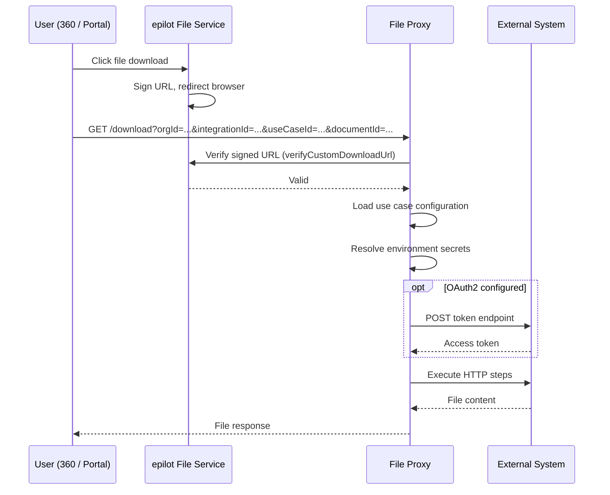

# File Proxy

The File Proxy enables epilot to serve files from external document systems (e.g., ERP document archives, document management systems) **on demand**, without migrating files into epilot's storage. During [inbound sync](./inbound/getting-started), file entities are created with a `custom_download_url` pointing to the file proxy. When a user views the file, epilot's file service verifies the request and the proxy fetches the document from the external system in real time.

Each file proxy configuration is stored as a **use case** with `type: 'file_proxy'` within an integration. The configuration describes how to authenticate, which HTTP calls to make, and how to extract the file from the response — all declaratively, without code changes for new integrations.

:::tip
Use the File Proxy when migrating a large document archive into epilot is impractical. Instead of transferring file content during inbound sync, only metadata is synced — the actual file is fetched on demand when a user views it.
:::

## How It Works



## Basic Structure

A file proxy use case configuration has four top-level sections:

```json
{
  "auth": {
    "type": "oauth2_client_credentials",
    "token_url": "\\{{env.erp.token_url}}",
    "client_id": "\\{{env.erp.client_id}}",
    "client_secret": "\\{{env.erp.client_secret}}"
  },
  "params": [
    { "name": "documentId", "required": true, "description": "External document ID" }
  ],
  "steps": [
    {
      "url": "\\{{env.erp.base_url}}/documents/{{params.documentId}}",
      "method": "GET",
      "response_type": "json"
    }
  ],
  "response": {
    "body": "steps[0].body.data",
    "encoding": "base64",
    "filename": "steps[0].body.fileName",
    "content_type": "steps[0].body.contentType"
  }
}
```

| Field | Required | Description |
|-------|----------|-------------|
| `auth` | No | OAuth2 authentication configuration. If omitted, no auth token is added to requests. |
| `params` | No | Declares which query parameters are expected in the download URL. |
| `steps` | **Yes** | Ordered list of HTTP requests to execute. At least one step is required. |
| `response` | **Yes** | How to extract the file content from the step results. |
| `requires_vpc` | No | Whether requests should be routed through the VPC proxy for IP allowlisting. Defaults to `false`. |

## Authentication

Currently, only **OAuth2 Client Credentials** is supported.

```json
{
  "auth": {
    "type": "oauth2_client_credentials",
    "token_url": "\\{{env.erp.token_url}}",
    "client_id": "\\{{env.erp.client_id}}",
    "client_secret": "\\{{env.erp.client_secret}}",
    "scope": "openid"
  }
}
```

| Field | Required | Description |
|-------|----------|-------------|
| `type` | **Yes** | Must be `"oauth2_client_credentials"` |
| `token_url` | **Yes** | Handlebars template for the token endpoint URL |
| `client_id` | **Yes** | Handlebars template for the OAuth2 client ID |
| `client_secret` | **Yes** | Handlebars template for the OAuth2 client secret |
| `scope` | No | OAuth2 scope string (e.g., `"openid"`) |

All `auth` fields support Handlebars templates, allowing credentials to be resolved from environment secrets at runtime. See [Credentials and Secrets](#credentials-and-secrets).

The acquired token is automatically added as a `Bearer` token in the `Authorization` header for all steps, unless a step explicitly sets its own `Authorization` header. Tokens are cached for the duration of their validity (`expires_in`).

## Parameters

The `params` array declares which query parameters the proxy URL must contain. The proxy returns a `400 Bad Request` if a required parameter is missing.

```json
{
  "params": [
    { "name": "tenantId", "required": true, "description": "External system tenant ID" },
    { "name": "documentId", "required": true, "description": "External document ID" },
    { "name": "version", "required": false, "description": "Optional document version" }
  ]
}
```

| Field | Required | Description |
|-------|----------|-------------|
| `name` | **Yes** | Parameter name as it appears in the query string |
| `required` | **Yes** | Whether the parameter must be present |
| `description` | No | Human-readable description |

All query parameters (including `integrationId`, `useCaseId`, and any custom ones) are available in the Handlebars context under `params`.

## Steps

Steps define the ordered HTTP requests to make against the external system. Each step can reference the results of previous steps, enabling multi-step download flows.

```json
{
  "steps": [
    {
      "url": "\\{{env.erp.base_url}}/documents",
      "method": "POST",
      "headers": { "Content-Type": "application/json" },
      "body": "{\"customerId\": \"{{params.customerId}}\"}",
      "response_type": "json"
    },
    {
      "url": "\\{{env.erp.download_url}}?fileId={{steps.0.body.fileId}}",
      "method": "GET",
      "response_type": "binary"
    }
  ]
}
```

| Field | Required | Description |
|-------|----------|-------------|
| `url` | **Yes** | Handlebars template for the request URL |
| `method` | **Yes** | `"GET"` or `"POST"` |
| `headers` | No | Object where each value is a Handlebars template |
| `body` | No | Handlebars template for the request body (typically used with POST) |
| `response_type` | **Yes** | `"json"` (parse as JSON) or `"binary"` (raw bytes, returned as base64) |

### Handlebars Templates

All string values in `steps` (`url`, `body`, header values) and `auth` fields are Handlebars templates compiled against the [template context](#template-context) at runtime.

```
\{{env.erp.base_url}}/documents/tenant/{{params.tenantId}}/doc/{{params.documentId}}/download
```

Environment variable references use a leading backslash (`\{{ env.* }}`) to escape them from Handlebars — they are resolved in a separate pass after Handlebars compilation. See [Environment Variable Resolution](#environment-variable-resolution).

### Environment Variable Resolution

Environment variables (including secrets) are resolved **after** Handlebars compilation. This is a deliberate security measure: secret values are never processed by the Handlebars template engine.

In Handlebars templates, env references must be **escaped** with a backslash so that Handlebars passes them through as literals:

```
\{{env.erp.base_url}}/documents/{{params.documentId}}
```

:::info
In JSON configuration strings, the backslash must itself be escaped: `"\\{{env.erp.base_url}}/documents/{{params.documentId}}"`
:::

**Processing order:**
1. **Handlebars compilation** — `{{params.documentId}}` is resolved. `\{{env.erp.base_url}}` is output as the literal text `{{env.erp.base_url}}`.
2. **Env resolution** — `{{env.erp.base_url}}` is replaced with the actual value (e.g., `https://erp.example.com/api`).

### Template Context

The Handlebars context is an object that grows as steps execute:

```json
{
  "params": {
    "orgId": "123",
    "integrationId": "abc-123",
    "useCaseId": "def-456",
    "tenantId": "ACME",
    "documentId": "DOC-00034157"
  },
  "steps": [
    {
      "body": { "fileId": "ABC123", "fileName": "invoice.pdf" },
      "headers": { "content-type": "application/json" },
      "statusCode": 200
    }
  ]
}
```

| Namespace | Available From | Contents |
|-----------|---------------|----------|
| `params` | All steps | All query parameters from the incoming request |
| `steps` | Step 2 onwards | Array of previous step results (body, headers, statusCode) |

:::note
Environment variables (`\{{ env.* }}`) are resolved after Handlebars compilation in a separate pass. They are not part of this context. See [Environment Variable Resolution](#environment-variable-resolution).
:::

## Response Extraction

After all steps complete, the `response` section defines how to extract the file content using [JSONata](https://jsonata.org/) expressions evaluated against the full context.

```json
{
  "response": {
    "body": "steps[0].body.data",
    "encoding": "base64",
    "filename": "steps[0].body.docInfo.originalFileName",
    "content_type": "'application/' & steps[0].body.docInfo.extension"
  }
}
```

| Field | Required | Description |
|-------|----------|-------------|
| `body` | **Yes** | JSONata expression that resolves to the file content |
| `encoding` | **Yes** | `"base64"` (decode the body from base64) or `"binary"` (body is already raw bytes) |
| `filename` | No | JSONata expression that resolves to the filename string. Defaults to `"download"` |
| `content_type` | No | JSONata expression that resolves to the MIME type string. Defaults to `"application/octet-stream"` |

### JSONata Expressions

Response fields use [JSONata](https://jsonata.org/) — a lightweight query and transformation language for JSON. The expression is evaluated against a context containing `params` and `steps`.

Common patterns:

```
steps[0].body.data                                    Simple path traversal
steps[0].body.docInfo.originalFileName                Nested property access
'application/' & steps[0].body.docInfo.extension      String concatenation
steps[1].body                                         Reference a later step
steps[0].headers."content-type"                       Access response headers
```

If a JSONata expression produces a string result (e.g., for `filename` or `content_type`), any `{{ env.* }}` references within the result are resolved afterwards.

### Response Encoding

| Encoding | When to use |
|----------|-------------|
| `base64` | The API returns file data as a base64-encoded string inside a JSON response. The proxy decodes it before returning. |
| `binary` | The API returns the file directly as raw binary data. No decoding is needed. |

## VPC Routing

Some external systems require requests to come from known static IPs (IP allowlisting). Set `requires_vpc: true` to route all HTTP requests through a VPC-deployed proxy Lambda with static outbound IPs via NAT gateway.

```json
{
  "requires_vpc": true,
  "steps": [
    {
      "url": "\\{{env.erp.base_url}}/documents/{{params.documentId}}",
      "method": "GET",
      "response_type": "json"
    }
  ]
}
```

When VPC routing is enabled:
- All step HTTP requests are forwarded to the VPC proxy Lambda
- The VPC proxy makes the actual outbound call from a static IP
- Large responses (>4.5 MB) are automatically transferred via S3

## Credentials and Secrets

Auth credentials and base URLs should be stored as organization-level **environment variables** using epilot's Environments & Secrets feature. Reference them with the `{{ env.* }}` syntax:

```json
{
  "token_url": "\\{{env.erp.token_url}}",
  "client_id": "\\{{env.erp.client_id}}",
  "client_secret": "\\{{env.erp.client_secret}}"
}
```

### Recommended Environment Variable Naming

Use a prefix that identifies the external system, with dot notation for grouping:

| Variable | Type | Example Value |
|----------|------|---------------|
| `erp_<system>.base_url` | String | `https://erp.example.com/api` |
| `erp_<system>.token_url` | String | `https://auth.example.com/token` |
| `erp_<system>.client_id` | SecretString | `my-client-id` |
| `erp_<system>.client_secret` | SecretString | `s3cr3t...` |

## Proxy URL Generation

During inbound sync, file entities are created with a `custom_download_url` that points to the file proxy. The URL includes the organization context, integration context, and any document-specific parameters:

```
https://erp-file-proxy.sls.epilot.io/download?orgId=123&integrationId=abc&useCaseId=def&tenantId=ACME&documentId=DOC-00034157
```

The standard parameters `orgId`, `integrationId`, and `useCaseId` are always required. Any additional parameters (like `tenantId`, `documentId`) must match the `params` declared in the configuration.

| Parameter | Required | Description |
|-----------|----------|-------------|
| `orgId` | **Yes** | epilot organization ID. Included in the signed URL to establish org context without requiring authentication. |
| `integrationId` | **Yes** | Integration ID that owns the file proxy use case |
| `useCaseId` | **Yes** | Use case ID within the integration |

When a user views the file, epilot's file service adds a short-lived signature to the URL and redirects the browser. The proxy verifies this signature via the file service's `verifyCustomDownloadUrl` operation.

## Large File Handling

Files larger than 5 MB exceed the Lambda response payload limit. In these cases, the proxy automatically:

1. Uploads the file to a temporary S3 bucket
2. Returns a `302 Redirect` to a presigned S3 download URL (valid for 5 minutes)
3. The browser follows the redirect and downloads the file directly from S3

This is transparent to the user and requires no configuration. Temporary files are automatically cleaned up after 24 hours.

## Examples

### Single-Step Base64-in-JSON

An external document archive returns file content as a base64-encoded string inside a JSON response.

**Environment secrets:**

| Variable | Value |
|----------|-------|
| `erp_archive.base_url` | `https://erp.example.com/document-service` |
| `erp_archive.token_url` | `https://auth.example.com/realms/documents/protocol/openid-connect/token` |
| `erp_archive.client_id` | `epilot-app` (SecretString) |
| `erp_archive.client_secret` | `s3cr3t...` (SecretString) |

**Configuration:**

```json
{
  "requires_vpc": true,
  "auth": {
    "type": "oauth2_client_credentials",
    "token_url": "\\{{env.erp_archive.token_url}}",
    "scope": "openid",
    "client_id": "\\{{env.erp_archive.client_id}}",
    "client_secret": "\\{{env.erp_archive.client_secret}}"
  },
  "params": [
    { "name": "tenantId", "required": true, "description": "External system tenant ID" },
    { "name": "documentId", "required": true, "description": "External document ID" }
  ],
  "steps": [
    {
      "url": "\\{{env.erp_archive.base_url}}/document/tenant/{{params.tenantId}}/doc/{{params.documentId}}/download",
      "method": "GET",
      "response_type": "json"
    }
  ],
  "response": {
    "body": "steps[0].body.data",
    "encoding": "base64",
    "filename": "steps[0].body.docInfo.originalFileName",
    "content_type": "'application/' & steps[0].body.docInfo.extension"
  }
}
```

### Multi-Step Search + Binary Download

Some document management systems require two API calls: first search for the document to get a `fileId`, then download the binary file.

**Environment secrets:**

| Variable | Value |
|----------|-------|
| `erp_dms.base_url` | `https://dms.example.com/services` |
| `erp_dms.download_url` | `https://dms.example.com/services/document-download` |
| `erp_dms.token_url` | `https://dms.example.com/auth/token` |
| `erp_dms.client_id` | `epilot-dms-client` (SecretString) |
| `erp_dms.client_secret` | `s3cr3t...` (SecretString) |

**Configuration:**

```json
{
  "requires_vpc": true,
  "auth": {
    "type": "oauth2_client_credentials",
    "token_url": "\\{{env.erp_dms.token_url}}",
    "client_id": "\\{{env.erp_dms.client_id}}",
    "client_secret": "\\{{env.erp_dms.client_secret}}"
  },
  "params": [
    { "name": "customerId", "required": true },
    { "name": "documentType", "required": true },
    { "name": "externalId", "required": true }
  ],
  "steps": [
    {
      "url": "\\{{env.erp_dms.base_url}}/document-management/documents",
      "method": "POST",
      "headers": { "Content-Type": "application/json" },
      "body": "{\"customerId\": \"{{params.customerId}}\", \"filter\": \"documentType=={{params.documentType}};externalId=={{params.externalId}}\"}",
      "response_type": "json"
    },
    {
      "url": "\\{{env.erp_dms.download_url}}?fileId={{steps.0.body.fileId}}",
      "method": "GET",
      "response_type": "binary"
    }
  ],
  "response": {
    "body": "steps[1].body",
    "encoding": "binary",
    "filename": "steps[0].body.fileName",
    "content_type": "steps[0].body.contentType"
  }
}
```

### Simple Binary Download

A minimal configuration for an API that returns the file directly as binary with no authentication.

```json
{
  "params": [
    { "name": "fileId", "required": true }
  ],
  "steps": [
    {
      "url": "https://public-cdn.example.com/files/{{params.fileId}}",
      "method": "GET",
      "response_type": "binary"
    }
  ],
  "response": {
    "body": "steps[0].body",
    "encoding": "binary"
  }
}
```

This is the simplest possible configuration: one step, no auth, no filename or content type extraction (defaults to `download` and `application/octet-stream`).

## Validation Rules

The following rules are enforced when creating or updating a file proxy use case:

### Auth
- `auth.type` must be `"oauth2_client_credentials"` if auth is provided
- `auth.token_url`, `auth.client_id`, and `auth.client_secret` are required strings
- Handlebars templates must have balanced braces (`{{` and `}}`)

### Params
- `params` must be an array if provided
- Each param must have a `name` (non-empty string) and a `required` (boolean) field

### Steps
- At least one step is required
- Each step must have a `url` (non-empty string), `method` (`"GET"` or `"POST"`), and `response_type` (`"json"` or `"binary"`)
- `body` and `headers` values must be strings if provided
- Handlebars templates must have balanced braces

### Response
- `response.body` is required and must be a valid JSONata expression
- `response.encoding` must be `"base64"` or `"binary"`
- `response.filename` and `response.content_type` must be valid JSONata expressions if provided

## Best Practices

1. **Use descriptive parameter names.** Parameters become part of the proxy URL. Use clear, specific names like `tenantId` and `documentId`.

2. **Extract filename and content type when available.** This gives users a better download experience instead of a generic `download` filename.

3. **Minimize the number of steps.** Each step adds latency. If the external API supports a direct download endpoint, prefer a single-step configuration.

4. **Store credentials as environment secrets.** Never hard-code credentials in the configuration. Use the `\{{ env.* }}` syntax to reference secrets stored via epilot's Environments & Secrets feature.
