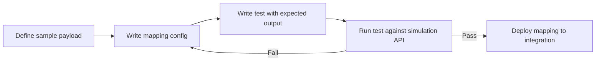

--c-
sidebar_position: 5
title: Mapping Examples
description: Open source mapping examples with test-driven development patterns
---

# Mapping Examples

The [erp-toolkit-mapping-examples](https://github.com/epilot-dev/erp-toolkit-mapping-examples) repository is an open source reference project that demonstrates how to build and test ERP Toolkit mapping configurations using a **test-driven development (TDD)** approach.

:::tip
Clone this repo and use it as a starting point for your own mapping configurations. The TDD workflow lets you iterate on mappings locally before deploying to production.
:::

## Overview

The repo contains sample mapping configurations, sample ERP payloads, and integration tests that validate mappings against the [mapping simulation API](./inbound/getting-started#step-3-send-events) without persisting any data.

| Component | Description |
|-----------|-------------|
| `samples/mapping.*.json` | Mapping configurations for different event types |
| `samples/payload.*.json` | Sample ERP payloads that simulate real inbound events |
| `tests/sample-mappings.test.ts` | Integration tests that validate mapping output |

## Getting Started

### Prerequisites

- Node.js (v18+)
- An epilot API token with access to the ERP Integration API

### Setup

```bash
# Clone the repo
git clone https://github.com/epilot-dev/erp-toolkit-mapping-examples.git
cd erp-toolkit-mapping-examples

# Install dependencies
npm install

# Configure your API token
cp .env.example .env
# Edit .env and add your EPILOT_API_TOKEN
```

### Run Tests

```bash
# Run all tests once
npm test

# Run tests in watch mode (re-runs on file changes)
npm run test:watch
```

## TDD Workflow

The repo demonstrates a test-driven approach to mapping development:



1. **Define your sample payload** -- Create a JSON file in `samples/` that represents the ERP data you expect to receive
2. **Write the mapping configuration** -- Create a mapping JSON file that transforms the payload into epilot entities
3. **Write a test** -- Define the expected entity output and assert against the simulation API response
4. **Iterate** -- Run tests in watch mode, adjust mappings until all tests pass
5. **Deploy** -- Copy the validated mapping configuration into your integration's use case

Each test calls the `simulateMappingV2` endpoint from the [`@epilot/erp-integration-client`](https://www.npmjs.com/package/@epilot/erp-integration-client) SDK, which applies the mapping to the payload and returns the transformed entities without persisting anything.

### Using AI Coding Agents

AI coding agents like [Claude Code](https://docs.anthropic.com/en/docs/claude-code) can significantly speed up the mapping development process. When given access to both the epilot entity schema documentation and your ERP's data model documentation, an AI agent can:

- **Draft mapping configurations** from sample payloads and target entity schemas
- **Write JSONata expressions** for complex transformations, enum lookups, and conditional logic
- **Generate test cases** with expected output based on the sample payloads
- **Debug failing tests** by analyzing the simulation API response and adjusting mappings

For best results, provide the agent with your ERP's API documentation or sample payloads alongside the [epilot entity schemas](/docs/entities/core-entities) and the examples in this repo.

## Example Mappings

### CustomerChanged

Transforms a customer event into **3 entities**: [`contact`](/docs/entities/core-entities#contact), [`account`](/docs/entities/core-entities#account), and [`billing_account`](/docs/entities/core-entities#billing_account).

**Key patterns demonstrated:**
- Multi-value attributes with `_tags` (e.g., Primary email, Mobile phone, Billing Address)
- Conditional entity creation (`account` only created when `customerType = 'business'`)
- SEPA payment data mapping
- Bidirectional entity relations (contact ↔ account)
- Defensive `$exists()` checks in JSONata expressions

<details>
<summary>Sample payload</summary>

```json
{
  "customerId": "CUST-2024-001",
  "customerType": "business",
  "firstName": "Max",
  "lastName": "Mustermann",
  "companyName": "Acme Corporation",
  "email": "max.mustermann@acme.de",
  "phone": "+49 89 12345678",
  "address": {
    "street": "Hauptstraße",
    "houseNumber": "42",
    "zip": "80331",
    "city": "München",
    "country": "DE"
  },
  "defaultPayment": {
    "iban": "DE89370400440532013000",
    "bic": "COBADEFFXXX",
    "accountHolder": "Acme Corporation"
  }
}
```

</details>

<details>
<summary>Mapping configuration (excerpt)</summary>

```json
{
  "entities": [
    {
      "entity_schema": "contact",
      "unique_ids": ["external_id"],
      "fields": [
        { "attribute": "external_id", "field": "customerId" },
        { "attribute": "first_name", "field": "firstName" },
        { "attribute": "last_name", "field": "lastName" },
        {
          "attribute": "email",
          "_type": "email",
          "_tags": ["Primary"],
          "field": "email"
        },
        {
          "attribute": "phone",
          "_type": "phone",
          "_tags": ["Primary"],
          "field": "phone"
        }
      ]
    },
    {
      "entity_schema": "account",
      "unique_ids": ["customer_number"],
      "condition": "customerType = 'business'",
      "fields": [
        { "attribute": "customer_number", "field": "customerId" },
        { "attribute": "name", "field": "companyName" }
      ]
    }
  ]
}
```

</details>

### OrderChanged

Transforms an order event into **2 entities**: [`contact`](/docs/entities/core-entities#contact) and [`order`](/docs/entities/core-entities#order).

**Key patterns demonstrated:**
- Accessing nested source fields (e.g., `customer.customerId`, `customer.email`)
- Array transformation for order line items with `_tags` per item
- Currency amount formatting with `$formatNumber` (multiplying by 100 for cents)
- Computed fields (e.g., `item_count` via `$count(items)`)

### ContractChanged

The most complex example. Transforms a power contract event into **4+ entities** plus **meter readings**: [`contract`](/docs/entities/core-entities#contract), [`meter`](/docs/entities/core-entities#meter), [`meter_counter`](/docs/entities/core-entities#meter_counter), and meter readings.

**Key patterns demonstrated:**
- **Array iteration** -- Entity-level `jsonataExpression` to iterate over a `meter.counters` array, creating one `meter_counter` entity per counter register (e.g., HT peak, NT off-peak)
- **Enum/value mapping** -- JSONata lookup table to map ERP meter types (`SMART`, `IMS`, `TP`) to epilot values (`smart-meter`, `intelligent-measuring-system`, `two-phase-meter`) with a fallback default
- **Meter readings** -- Dedicated `meter_readings` mapping section (separate from `entities`), referencing meter and meter counter by unique IDs
- **Multi-entity relations** -- Contract relates to both customer and meter; meter relates back to customer and contract

<details>
<summary>Array iteration example</summary>

Creating one `meter_counter` entity per item in the `meter.counters` array:

```json
{
  "entity_schema": "meter_counter",
  "jsonataExpression": "meter.counters",
  "unique_ids": ["external_id"],
  "fields": [
    { "attribute": "external_id", "field": "counterId" },
    { "attribute": "obis_number", "field": "obisCode" },
    { "attribute": "direction", "field": "direction" }
  ]
}
```

</details>

<details>
<summary>Enum mapping example</summary>

Translating ERP meter type codes to epilot values using a JSONata lookup:

```json
{
  "attribute": "type",
  "jsonataExpression": "$lookup({'SMART':'smart-meter','IMS':'intelligent-measuring-system','TP':'two-phase-meter','MME':'modern-measuring-equipment'}, meter.meterType) ~> $default('analog')"
}
```

</details>

<details>
<summary>Meter readings mapping example</summary>

Meter readings use a separate top-level `meter_readings` section:

```json
{
  "meter_readings": [
    {
      "jsonataExpression": "meter.readings",
      "meter": {
        "unique_ids": ["external_id"]
      },
      "fields": [
        { "attribute": "external_id", "field": "$$.meter.meterId" },
        { "attribute": "reading_date", "field": "readingDate" },
        { "attribute": "value", "field": "value" },
        { "attribute": "reason", "field": "reason" }
      ]
    }
  ]
}
```

</details>

## Test Structure

Tests use [Vitest](https://vitest.dev/) and follow a consistent pattern:

```typescript
import { simulateMappingV2 } from './helpers';

describe('CustomerChanged', () => {
  it('should map to contact entity', async () => {
    const mapping = require('../samples/mapping.CustomerChanged.json');
    const payload = require('../samples/payload.customer.json');

    const response = await simulateMappingV2(mapping, payload);
    const contact = response.entity_updates.find(
      (e) => e.entity_schema === 'contact'
    );

    expect(contact).toMatchObject({
      entity_schema: 'contact',
      fields: expect.objectContaining({
        first_name: 'Max',
        last_name: 'Mustermann',
      }),
    });
  });
});
```

Each test:
1. Loads a mapping configuration and sample payload from `samples/`
2. Calls `simulateMappingV2()` to dry-run the mapping against the simulation API
3. Finds the relevant entity in the response
4. Asserts the expected output with `toMatchObject()`

### CI Pipeline

The repo includes a GitHub Actions workflow (`.github/workflows/test.yml`) that runs all tests on every push and pull request. The `EPILOT_API_TOKEN` is stored as a GitHub Actions secret.

## Key Mapping Concepts

| Concept | Description | Example |
|---------|-------------|---------|
| **Field mapping** | Map a source field to an entity attribute | `{ "attribute": "first_name", "field": "firstName" }` |
| **JSONata expression** | Compute a value using JSONata | `{ "attribute": "full_name", "jsonataExpression": "firstName & ' ' & lastName" }` |
| **Unique identifiers** | Match existing entities for upsert | `"unique_ids": ["customer_number"]` |
| **Conditional creation** | Only create entity when condition is met | `"condition": "customerType = 'business'"` |
| **Multi-value attributes** | Arrays with tags for email, phone, address | `"_type": "email", "_tags": ["Primary"]` |
| **Array iteration** | Create multiple entities from an array | `"jsonataExpression": "meter.counters"` on entity level |
| **Enum mapping** | Translate ERP codes to epilot values | `$lookup({...}, sourceField)` in JSONata |
| **Entity relations** | Link entities using `$relation` | `"$relation": [{ "entity_schema": "contact", ... }]` |
| **Meter readings** | Dedicated mapping section for readings | Top-level `"meter_readings"` array in config |

## Next Steps

- [Fork the repo](https://github.com/epilot-dev/erp-toolkit-mapping-examples) and add your own mappings
- Read the [Mapping Configuration](./inbound/mapping) guide for the full mapping syntax reference
- Use the [mapping simulation endpoint](./inbound/getting-started) to test mappings interactively
- See the [Inbound Examples](./inbound/examples) for additional mapping patterns
