# Use Cases

This page describes the standard ERP integration use cases that the ERP Toolkit supports. Each use case is classified as **inbound** (ERP to epilot) or **outbound** (epilot to ERP) and documents what happens on each side, which [Core Entities](/docs/entities/core-entities) are involved, and which [Core Events](/docs/webhooks/core-events) are emitted or consumed.

:::tip
Most integrations start with inbound use cases (syncing master data into epilot) and then add outbound use cases (self-service actions from portals and journeys).
:::

## Quick Reference

### Inbound (ERP to epilot)

| Use Case | Core Entities | Typical Trigger |
|----------|---------------|-----------------|
| [Keep Customer In Sync](#keep-customer-in-sync) | [`contact`](/docs/entities/core-entities#contact), [`account`](/docs/entities/core-entities#account), [`billing_account`](/docs/entities/core-entities#billing_account) | Customer record changed in ERP |
| [Keep Contract In Sync](#keep-contract-in-sync) | [`contract`](/docs/entities/core-entities#contract), [`contact`](/docs/entities/core-entities#contact), [`billing_account`](/docs/entities/core-entities#billing_account), [`meter`](/docs/entities/core-entities#meter) | Contract created/modified in ERP |
| [Keep Billing Account In Sync](#keep-billing-account-in-sync) | [`billing_account`](/docs/entities/core-entities#billing_account), [`contact`](/docs/entities/core-entities#contact) | Payment details changed in ERP |
| [Keep Meter In Sync](#keep-meter-in-sync) | [`meter`](/docs/entities/core-entities#meter), [`meter_counter`](/docs/entities/core-entities#meter_counter), [`contract`](/docs/entities/core-entities#contract) | Meter installed/replaced in ERP |
| [Sync Meter Readings](#sync-meter-readings) | [`meter`](/docs/entities/core-entities#meter), [`meter_counter`](/docs/entities/core-entities#meter_counter) | Readings recorded in ERP |
| [Sync Documents](#sync-documents) | [`file`](/docs/entities/core-entities#file), [`contact`](/docs/entities/core-entities#contact), [`contract`](/docs/entities/core-entities#contract) | Documents generated in ERP/archive |
| [Sync Billing Events](#sync-billing-events) | [`billing_event`](/docs/entities/core-entities#billing_event), [`billing_account`](/docs/entities/core-entities#billing_account) | Invoices/payments created in ERP |

### Outbound (epilot to ERP)

| Use Case | Core Event | Core Entities | Typical Trigger |
|----------|------------|---------------|-----------------|
| [Submit Meter Reading](#submit-meter-reading) | [`MeterReadingAdded`](/docs/webhooks/core-events#MeterReadingAdded) | [`meter`](/docs/entities/core-entities#meter), [`meter_counter`](/docs/entities/core-entities#meter_counter) | Portal / Journey / 360 |
| [Change Installment](#change-installment-amount) | [`InstallmentUpdated`](/docs/webhooks/core-events#InstallmentUpdated) | [`contract`](/docs/entities/core-entities#contract), [`billing_account`](/docs/entities/core-entities#billing_account) | Portal / 360 |
| [Change Payment Method](#change-payment-method-sepaiban) | [`PaymentMethodUpdated`](/docs/webhooks/core-events#PaymentMethodUpdated) | [`billing_account`](/docs/entities/core-entities#billing_account), [`contact`](/docs/entities/core-entities#contact) | Portal / Journey / 360 |
| [Change Billing Address](#change-billing-address) | [`BillingAddressUpdated`](/docs/webhooks/core-events#BillingAddressUpdated) | [`billing_account`](/docs/entities/core-entities#billing_account), [`contact`](/docs/entities/core-entities#contact) | Portal / 360 |
| [Update Customer Details](#update-customer-details) | [`CustomerDetailsUpdated`](/docs/webhooks/core-events#CustomerDetailsUpdated) | [`contact`](/docs/entities/core-entities#contact) | Portal / 360 |
| [Request Data Sync](#request-data-sync) | custom webhook | varies | Portal login / 360 |
| [Contract Move](#contract-move-move-in--move-out) | [`LocationMoveRequested`](/docs/webhooks/core-events#LocationMoveRequested) | [`contact`](/docs/entities/core-entities#contact), [`contract`](/docs/entities/core-entities#contract), [`meter`](/docs/entities/core-entities#meter) | Journey |
| [Terminate Contract](#terminate-contract) | [`TerminateContractRequested`](/docs/webhooks/core-events#TerminateContractRequested) | [`contract`](/docs/entities/core-entities#contract), [`contact`](/docs/entities/core-entities#contact) | Portal / Journey |

---

## Inbound Use Cases (ERP to epilot)

Inbound use cases push data from your ERP system into epilot via the [Inbound API](./inbound/getting-started). Your middle layer or ERP sends events to the `/v3/erp/updates/events` endpoint, the ERP Toolkit applies [JSONata mappings](./inbound/mapping), and epilot entities are created or updated.

### Keep Customer In Sync

Synchronize customer master data (business partners) from your ERP into epilot contacts.

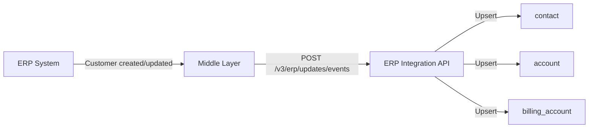

**What happens in the ERP:**
- Customer record is created or updated (name, address, email, phone, tax ID)
- ERP or middle layer detects the change (via delta sync, change events, or polling)
- Middle layer sends the customer payload to the ERP Toolkit inbound API

**What happens in epilot:**
- ERP Toolkit matches the incoming data to an existing [contact](/docs/entities/core-entities#contact) entity using a unique identifier (e.g., `customer_number`)
- Contact entity is created or updated with mapped fields (name, address, email, phone)
- Related entities (billing accounts, contracts) are linked if identifiers are present

**Core Entities:** [`contact`](/docs/entities/core-entities#contact), [`account`](/docs/entities/core-entities#account), [`billing_account`](/docs/entities/core-entities#billing_account)

**Typical unique identifier:** `customer_number` (ERP business partner ID)

**Typical fields mapped:** salutation, first name, last name, date of birth, email, phone, postal address, tax ID, company name, VAT ID

---

### Keep Contract In Sync

Synchronize contract data including tariff, start date, and billing details.

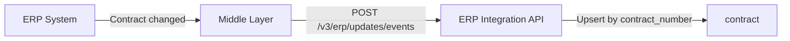

**What happens in the ERP:**
- Contract is created, renewed, or modified
- Middle layer sends contract payload with related customer and meter identifiers

**What happens in epilot:**
- ERP Toolkit matches to an existing [contract](/docs/entities/core-entities#contract) entity using the contract number
- Contract entity is created or updated
- Relations to contact, billing account, and meter entities are established based on identifiers in the payload

**Core Entities:** [`contract`](/docs/entities/core-entities#contract), [`contact`](/docs/entities/core-entities#contact), [`billing_account`](/docs/entities/core-entities#billing_account), [`meter`](/docs/entities/core-entities#meter)

**Typical unique identifier:** `contract_number`

**Typical fields mapped:** contract number, contract type (power, gas, district heating), start date, end date, tariff name, installment amount, market location ID

---

### Keep Billing Account In Sync

Synchronize billing account data including payment methods and SEPA mandates. In many ERPs this entity is known as the **Business Partner** (Geschäftspartner) or billing unit (Rechnungseinheit).

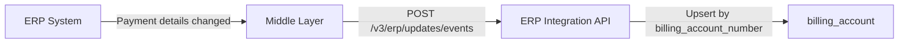

**What happens in the ERP:**
- Business partner / billing account is created or payment details are updated
- Middle layer sends the billing account (business partner) payload including bank account information

**What happens in epilot:**
- ERP Toolkit matches to an existing [billing account](/docs/entities/core-entities#billing_account) entity using the billing account number
- Billing account entity is created or updated
- Bank account details (IBAN, BIC, account holder, SEPA mandate reference) are stored
- Relations to contact and contract entities are established

**Core Entities:** [`billing_account`](/docs/entities/core-entities#billing_account), [`contact`](/docs/entities/core-entities#contact)

**Typical unique identifier:** `billing_account_number` (ERP Rechnungseinheit ID)

**Typical fields mapped:** billing account number, billing address, IBAN, BIC, account holder, SEPA mandate reference, mandate valid from/to, payment method type

:::info
Some ERPs support multiple bank accounts per billing account (e.g., one for receivables, one for credits). The mapping should handle arrays of bank accounts.
:::

---

### Keep Meter In Sync

Synchronize meter and meter counter (register) data.

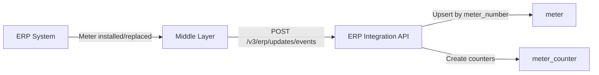

**What happens in the ERP:**
- Meter is installed, replaced, or its configuration changes
- Middle layer sends meter data with device numbers and counter registers

**What happens in epilot:**
- ERP Toolkit matches to an existing [meter](/docs/entities/core-entities#meter) entity using the meter number (device number)
- Meter entity is created or updated
- Meter counter entities are created for each register (e.g., HT/NT for dual-tariff meters)
- Relations to contract and contact entities are established

**Core Entities:** [`meter`](/docs/entities/core-entities#meter), [`meter_counter`](/docs/entities/core-entities#meter_counter), [`contract`](/docs/entities/core-entities#contract)

**Typical unique identifiers:** `meter_number` (device number), `obis_number` (counter register ID)

**Typical fields mapped:** meter number, metering point ID (market location), meter type, tariff type, unit (kWh, m3), installation date

---

### Sync Meter Readings

Synchronize meter reading history from ERP to epilot. See the dedicated [Meter Readings](./inbound/meter-readings) guide for configuration details.

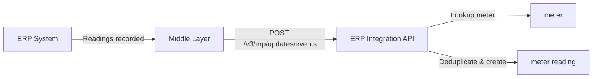

**What happens in the ERP:**
- Meter readings are recorded (regular, irregular, or system-estimated)
- Middle layer sends reading data as an array referencing meters by ID

**What happens in epilot:**
- ERP Toolkit looks up the meter entity by meter number
- Meter readings are created on the matched meter counter
- Deduplication prevents duplicate readings within a 24-hour window

**Core Entities:** [`meter`](/docs/entities/core-entities#meter), [`meter_counter`](/docs/entities/core-entities#meter_counter) (meter readings are stored on meter counters)

**Typical fields mapped:** reading date, reading value, reading type (regular/irregular), reading reason, unit

---

### Sync Documents

Synchronize documents from an ERP or external archive system (e.g., d.3, Doxis).

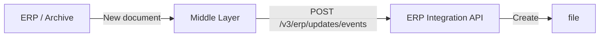

**What happens in the ERP:**
- New documents are generated (invoices, contract confirmations, letters)
- Documents are stored in the ERP or a connected archive system
- Middle layer sends document metadata and file content to epilot

**What happens in epilot:**
- File entities are created with the document content
- Files are linked to the relevant contact and contract entities using identifiers (e.g., contract number, customer number)

**Core Entities:** [`file`](/docs/entities/core-entities#file), [`contact`](/docs/entities/core-entities#contact), [`contract`](/docs/entities/core-entities#contract)

**Typical fields mapped:** file name, document type, MIME type, document date, file content (binary or URL)

:::info
For portals, documents should be synced periodically (e.g., hourly) so that portal users receive notifications for new documents. Lazy loading on login is not sufficient because notifications require the documents to exist in epilot.
:::

---

### Sync Billing Events

Synchronize invoices, payments, and credit notes from the ERP billing system.

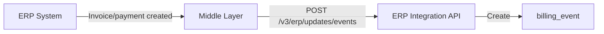

**What happens in the ERP:**
- Invoices are generated, payments are received, or credits are issued
- Middle layer sends billing event data referencing the billing account

**What happens in epilot:**
- Billing event entities are created on the relevant billing account
- Events include amount, date, type (invoice, payment, credit), and status

**Core Entities:** [`billing_event`](/docs/entities/core-entities#billing_event), [`billing_account`](/docs/entities/core-entities#billing_account)

**Typical fields mapped:** event type, amount, currency, date, due date, invoice number, payment reference

---

## Outbound Use Cases (epilot to ERP)

Outbound use cases push epilot events to your ERP via [Webhooks](/docs/webhooks). When a user performs a self-service action in a portal, journey, or epilot 360, an automation triggers a [Core Event](/docs/webhooks/core-events) which is delivered to your middle layer webhook endpoint. Your middle layer then processes the event and calls the appropriate ERP API.

### Submit Meter Reading

A portal user or service agent submits a new meter reading.

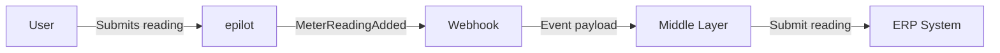

**What happens in epilot:**
- User submits a meter reading via the portal, a journey, or epilot 360
- Automation creates a `MeterReadingAdded` core event
- Webhook delivers the event payload to the middle layer, containing the meter identifier, reading value, and reading date

**What happens in the ERP:**
- Middle layer receives the webhook and extracts meter reading data
- Middle layer calls the ERP API to submit the reading (e.g., meter reading endpoint)
- Middle layer sends an [ACK](/docs/integrations/erp-toolkit/overview#monitoring-and-acks) back to epilot to confirm processing

**Core Event:** [`MeterReadingAdded`](/docs/webhooks/core-events#MeterReadingAdded)

**Core Entities:** [`meter`](/docs/entities/core-entities#meter), [`meter_counter`](/docs/entities/core-entities#meter_counter)

**Typical payload fields:** metering point ID, device number, counter ID, reading value, reading date

---

### Change Installment Amount

A portal user or service agent requests a change to the monthly installment (budget billing / Abschlag).

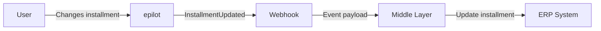

**What happens in epilot:**
- User requests an installment change via the portal or epilot 360
- Automation creates an `InstallmentUpdated` core event
- Webhook delivers the event payload containing the contract identifier and new installment amount

**What happens in the ERP:**
- Middle layer receives the webhook and extracts the installment change details
- Middle layer calls the ERP API to update the installment amount on the contract
- Middle layer sends an ACK back to epilot

**Core Event:** [`InstallmentUpdated`](/docs/webhooks/core-events#InstallmentUpdated)

**Core Entities:** [`contract`](/docs/entities/core-entities#contract), [`billing_account`](/docs/entities/core-entities#billing_account)

**Typical payload fields:** contract number, new installment amount, effective date

---

### Change Payment Method (SEPA/IBAN)

A portal user or service agent updates the bank account or SEPA mandate.

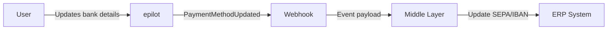

**What happens in epilot:**
- User submits new bank details via the portal, a journey, or epilot 360
- Automation creates a `PaymentMethodUpdated` core event
- Webhook delivers the event payload containing the billing account identifier and new bank details

**What happens in the ERP:**
- Middle layer receives the webhook and extracts bank account data
- Middle layer calls the ERP API to update the payment method
- Middle layer sends an ACK back to epilot

**Core Event:** [`PaymentMethodUpdated`](/docs/webhooks/core-events#PaymentMethodUpdated)

**Core Entities:** [`billing_account`](/docs/entities/core-entities#billing_account), [`contact`](/docs/entities/core-entities#contact)

**Typical payload fields:** billing account number, customer number, IBAN, BIC, account holder, account type (receivables/credits), SEPA mandate valid from, account valid from

:::info
Some ERPs distinguish between multiple bank account types: receivables (Forderung), credits (Guthaben), and combined. The `account_type` field identifies which bank account to update.
:::

---

### Change Billing Address

A portal user or service agent changes the billing address on a billing account.

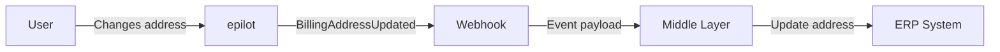

**What happens in epilot:**
- User submits a new billing address via the portal or epilot 360
- Automation creates a `BillingAddressUpdated` core event
- Webhook delivers the event payload containing the billing account identifier and new address

**What happens in the ERP:**
- Middle layer receives the webhook and extracts address data
- Middle layer calls the ERP API to update the billing address
- Middle layer sends an ACK back to epilot

**Core Event:** [`BillingAddressUpdated`](/docs/webhooks/core-events#BillingAddressUpdated)

**Core Entities:** [`billing_account`](/docs/entities/core-entities#billing_account), [`contact`](/docs/entities/core-entities#contact)

**Typical payload fields:** billing account number, customer number, postal code, city, city district, street, house number, effective date

---

### Update Customer Details

A portal user or service agent updates contact information (name, email, phone).

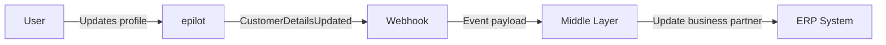

**What happens in epilot:**
- User updates their profile via the portal or a service agent edits the contact in epilot 360
- Automation creates a `CustomerDetailsUpdated` core event
- Webhook delivers the event payload containing the customer identifier and changed fields

**What happens in the ERP:**
- Middle layer receives the webhook and extracts the updated customer fields
- Middle layer calls the ERP API to update the business partner record
- Middle layer sends an ACK back to epilot

**Core Event:** [`CustomerDetailsUpdated`](/docs/webhooks/core-events#CustomerDetailsUpdated)

**Core Entities:** [`contact`](/docs/entities/core-entities#contact)

**Typical payload fields:** customer number, salutation, first name, last name, email, phone

---

### Request Data Sync

An epilot user or portal login triggers a request for the ERP to send fresh data to epilot.

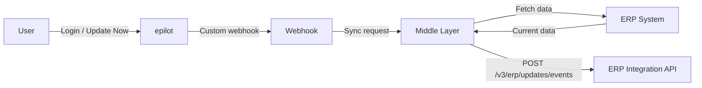

**What happens in epilot:**
- A service agent clicks "Update Now" in epilot 360, or a portal user logs in
- A custom webhook is triggered
- Webhook delivers the event payload containing the customer/contract identifiers

**What happens in the ERP:**
- Middle layer receives the webhook and identifies which data to sync
- Middle layer fetches current data from the ERP (contact details, contracts, meters, bank accounts)
- Middle layer sends the data as inbound events to the ERP Toolkit `/v3/erp/updates/events` endpoint

**Core Event:** custom webhook

**Core Entities:** depends on the data requested (typically [`contact`](/docs/entities/core-entities#contact), [`contract`](/docs/entities/core-entities#contract), [`billing_account`](/docs/entities/core-entities#billing_account), [`meter`](/docs/entities/core-entities#meter))

**Typical payload fields:** customer number, billing account number, contract number (used by the middle layer to query the ERP)

:::tip
This pattern is commonly used with ERPs that do not support event-driven sync. The outbound webhook triggers the middle layer to pull data from the ERP and push it as inbound events.
:::

---

### Contract Move (Move-in / Move-out)

A customer submits a move request via a journey or portal.

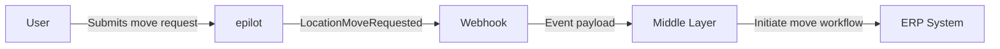

**What happens in epilot:**
- User completes a move-in/move-out journey
- Automation creates a `LocationMoveRequested` core event
- Webhook delivers the event payload containing customer details, old and new addresses, and meter information

**What happens in the ERP:**
- Middle layer receives the webhook and processes the move request
- Middle layer calls the ERP API to initiate the move workflow (terminate old contract, create new contract)
- Middle layer sends an ACK back to epilot

**Core Event:** [`LocationMoveRequested`](/docs/webhooks/core-events#LocationMoveRequested)

**Core Entities:** [`contact`](/docs/entities/core-entities#contact), [`contract`](/docs/entities/core-entities#contract), [`meter`](/docs/entities/core-entities#meter)

**Typical payload fields:** customer number, current contract number, new address, move date, meter number

---

### Terminate Contract

A customer requests contract termination via a portal or journey.

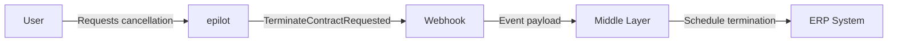

**What happens in epilot:**
- User submits a cancellation request
- Automation creates a `TerminateContractRequested` core event
- Webhook delivers the event payload containing the contract identifier and termination details

**What happens in the ERP:**
- Middle layer receives the webhook and processes the termination
- Middle layer calls the ERP API to schedule the contract termination
- Middle layer sends an ACK back to epilot

**Core Event:** [`TerminateContractRequested`](/docs/webhooks/core-events#TerminateContractRequested)

**Core Entities:** [`contract`](/docs/entities/core-entities#contract), [`contact`](/docs/entities/core-entities#contact)

**Typical payload fields:** contract number, customer number, termination date, termination reason

## ACK Tracking

All outbound use cases support [ACK tracking](/docs/integrations/erp-toolkit/overview#monitoring-and-acks). After processing a webhook, your middle layer should send an acknowledgment back to epilot:

```bash title="Send ACK"
curl -X POST 'https://erp-integration.sls.epilot.io/v1/erp/tracking/acknowledgement' \
  -H 'Content-Type: application/json' \
  -d '{
    "ack_id": "<ack-id-from-webhook-header>",
    "status": "processed"
  }'
```

This enables end-to-end monitoring in the Integration Hub: per-use-case status indicators show whether the ERP successfully processed each event.

## Next Steps

- [Inbound Getting Started](./inbound/getting-started) -- Set up your first inbound sync
- [Mapping Configuration](./inbound/mapping) -- Configure field mappings and JSONata transforms
- [Meter Readings](./inbound/meter-readings) -- Detailed guide for meter reading sync
- [Examples](./inbound/examples) -- Complete working examples
- [Mapping Examples](./mapping-examples) -- Open source example repo with TDD patterns
- [Core Entities](/docs/entities/core-entities) -- Entity schema reference
- [Core Events](/docs/webhooks/core-events) -- Event schema reference
- [Webhooks](/docs/webhooks) -- Configure outbound event delivery
