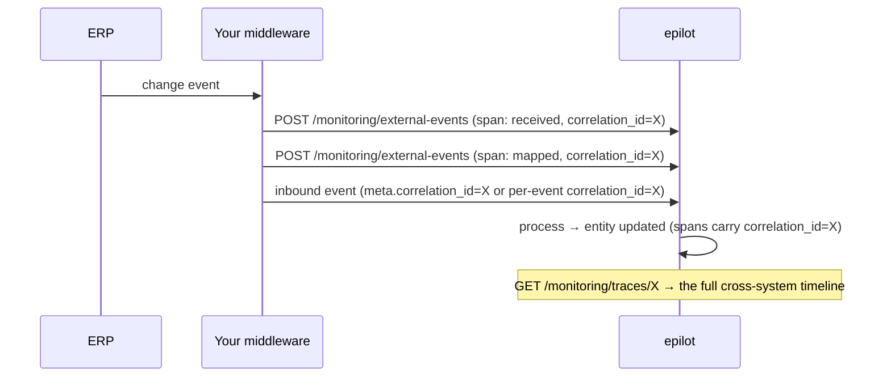

# External Monitoring Events

When part of your integration pipeline runs **outside epilot** — typically an integration middleware that receives events from an ERP, transforms them, and forwards them to epilot — you can push that external system's own **monitoring events** into epilot. This makes the Integration Hub the **central monitoring point** for the whole pipeline, and lets the **Event Trace** span both systems: a single business operation is visible as one timeline, from the moment it leaves the ERP, through the middleware, until epilot updates the entity.

:::info Topology
This is for the case where epilot still does the bulk of the work (mapping, entity/metering updates). The middleware does two independent things:

1. **forwards the inbound data event** to the standard [inbound endpoint](./inbound/getting-started.md), and
2. **separately pushes its own monitoring events** (its processing steps) to the endpoint below.

The two halves are linked into one trace by a shared `correlation_id`.
:::

## How the trace is linked

Each monitoring event is a **span**. Spans are grouped into a **trace** by `correlation_id` — the id of one business operation. To get an end-to-end trace, your middleware mints one unique `correlation_id` per operation and uses the **same value** in both places:

- as `correlation_id` on every span it pushes to `POST …/monitoring/external-events`, and
- as the per-event `correlation_id` on the event it forwards to the inbound endpoint (see [Correlating the forwarded event](#correlating-the-forwarded-event)).

epilot propagates that `correlation_id` across all of its own processing spans automatically, so both systems' spans end up under the same trace.



## Pushing spans

```
POST /v2/integrations/{integrationId}/monitoring/external-events
```

Requires the `integration:manage` permission. The organization is derived from your token; the integration is validated to belong to it. Send a batch of spans (max 100):

```jsonc
{
  "events": [
    {
      "correlation_id": "bp-8f3a2c",              // REQUIRED — the trace id (unique per business operation)
      "level": "success",                          // REQUIRED — success | error | warning | info
      "use_case_slug": "business_partner",         // REQUIRED — a use case configured on the integration
      "occurred_at": "2026-07-20T09:00:00.120Z",   // REQUIRED — ISO 8601; the step's time
      "message": "Received BusinessPartnerUpdate from SAP IDoc 4711",  // REQUIRED — human-readable
      "detail": { "step": "ingest", "erp_doc_id": "4711" }             // optional — free-form context
    }
  ]
}
```

### The span contract

| Field | Required | Notes |
|---|---|---|
| `correlation_id` | yes | The trace id. Use one unique value per business operation, shared with the forwarded event. |
| `level` | yes | `success` \| `error` \| `warning` \| `info`. Drives coloring, stats, and alerting. |
| `use_case_slug` | yes | A use case configured on the integration. Resolved to the internal use case; unknown slugs are still accepted and grouped under the raw slug. |
| `occurred_at` | yes | ISO 8601 timestamp of when the step happened (external clock). |
| `message` | yes | Shown in the trace and event tables. |
| `detail` | no | Free-form JSON for step-specific context (`step`, `http_status`, `reason`, …). |

You do **not** send a `code`: epilot assigns a deterministic, level-derived code (`EXTERNAL_ERROR` / `EXTERNAL_WARNING` / `EXTERNAL_INFO` / `EXTERNAL_SUCCESS`). This marks the span as external in every breakdown and cannot be confused with epilot's own codes. Span identity and de-duplication are the external system's responsibility — epilot ingests each span as sent.

Spans are validated individually; invalid spans are reported per item and do **not** fail the rest of the batch:

```jsonc
// 202
{ "accepted": 2, "rejected": 1, "results": [ { "index": 2, "status": "rejected", "reason": "missing correlation_id" } ] }
```

Accepted spans flow onto the same monitoring stream as epilot's own events, so they show up in the monitoring stats, the event tables, the trace, digests, and — for `error` spans — the same real-time and threshold **alerts** as epilot-produced errors (subject to the integration's notification configuration).

### Correlating the forwarded event

So the middleware's spans and epilot's own processing spans land in one trace, put the same id on the event you forward to the inbound endpoint. `correlation_id` may be supplied per event:

```jsonc
{
  "meta": { "correlation_id": "batch-123" },   // batch/transport correlation (default for all events)
  "events": [
    { "event_type": "UPDATE", "object_type": "business_partner", "correlation_id": "bp-8f3a2c",
      "timestamp": "2026-07-20T09:00:00Z", "format": "json", "payload": "{…}" }
  ]
}
```

The per-event `correlation_id` takes precedence over `meta.correlation_id`, so a single POST can carry several distinct operations and keep their traces separate. If neither is supplied, epilot mints its own id and the trace is epilot-only (nothing breaks — you just lose the cross-system linkage).

## Reading the cross-system trace

```
GET /v2/integrations/{integrationId}/monitoring/traces/{correlationId}
```

Requires `integration:view`. Returns every span sharing the `correlation_id` — external and epilot alike — in chronological order, with a rolled-up status and (when present) the original epilot inbound event as the trace "head":

```jsonc
// 200
{
  "correlation_id": "bp-8f3a2c",
  "status": "error",                 // rolled up: error > warning > success > info
  "started_at": "2026-07-20T09:00:00.120Z",
  "ended_at": "2026-07-20T09:00:03.900Z",
  "span_count": 9,
  "truncated": false,                // true when the trace exceeds the returned window
  "spans": [ /* MonitoringEventV2[] — external spans carry an EXTERNAL_* code */ ],
  "inbound_event": { /* the epilot inbound payload, when present */ }
}
```

External spans are distinguished from epilot spans by their `EXTERNAL_*` code prefix. This endpoint is the correlation-grouped counterpart to the single-event trace at `GET …/monitoring/events/{eventId}/associated`.

:::tip
Keep the `correlation_id` stable and unique per operation. Reusing one id across unrelated operations merges them into one trace; omitting it on the forwarded event leaves epilot's processing in a separate, epilot-only trace.
:::
