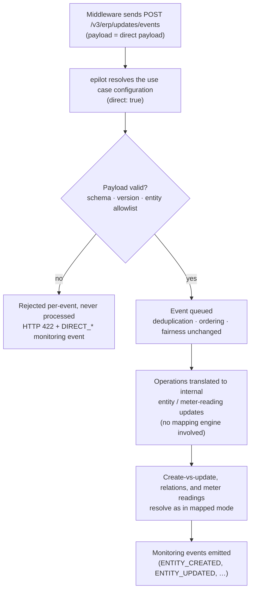

# Direct Mode

Direct mode lets your integration send payloads that are **already in entity-operation format**, skipping the mapping engine entirely. It is built for middleware that already produces entity-shaped data — for example an integration layer on your side that knows your epilot schemas and does its own transformation.

Direct mode removes only the transformation step. Everything else in the inbound pipeline behaves exactly as in mapped mode:

- Ingest deduplication (`deduplication_id`)
- Buffering, per-entity ordering, and fair processing
- Create-vs-update resolution against existing entities
- Relation and relation-reference resolution, including automatic stub creation
- Meter-reading matching
- Echo prevention — inbound writes do not trigger automations by default and never flow back out
- Monitoring events

What you give up is the mapping engine itself: field mappings, JSONata and JSONPath expressions, constants, and the mapping-only field types (see [Unsupported in Direct Mode](#unsupported-in-direct-mode)). If your source system emits raw ERP payloads that need transformation, use [Mapping](./mapping.md) instead. A single integration can freely mix direct and mapped use cases.

## How It Works



## Enabling Direct Mode

Direct mode is enabled per **inbound use case**. All events routed to that use case are then interpreted as direct payloads — a use case is either fully direct or fully mapped, never both.

**In the epilot 360 UI** — the usual way to enable it: open your integration's inbound use case and
flip the **Direct mode** toggle. The JSON configuration editor disappears (direct use cases are
configured visually), and a **Write access** choice appears: **Open** (any entity may be written) or
**Restricted** (an entity allowlist built with schema and unique-id attribute pickers). Flipping the
toggle on an existing mapped use case pre-fills the allowlist from the mapped entities' schemas and
unique ids, and direct use cases are marked with a "Direct" badge in the use case overview.

**Via the API**, the same switch is `direct: true` on the use case's `configuration` — the JSON
below is exactly what the toggle produces.

The minimal configuration:

```json title="Open mode — any entity may be written"
{
  "direct": true
}
```

With an optional entity allowlist:

```json title="Allowlist mode"
{
  "direct": true,
  "entities": [
    { "entity_schema": "contract", "unique_ids": ["contract_number"] },
    { "entity_schema": "contact", "unique_ids": ["customer_number"] }
  ]
}
```

Notes:

- Allowlist entries need no `fields` array — there is nothing to map.
- Every allowlist entry must declare **at least one** unique id — saving a configuration with an
  empty `unique_ids` array is rejected (the UI enforces the same rule inline).
- Declared `unique_ids` are checked against your real entity schemas when the use case is saved, so typos surface at design time.
- Direct mode requires the **v3 events endpoint** (`POST /v3/erp/updates/events` with `integration_id`). The deprecated v1/v2 endpoints do not support it.

### Open Mode vs Entity Allowlist

If `entities` is **absent or empty**, the use case runs in **open mode**: any `entity_slug` is accepted.

If `entities` is **non-empty**, it acts as an allowlist for entity operations:

1. The operation's `entity_slug` must equal the `entity_schema` of some allowlist entry, otherwise the operation is rejected with `DIRECT_ENTITY_NOT_ALLOWED`.
2. The operation's `unique_ids` keys must be **exactly the declared set** (order-insensitive), **or** exactly `["_id"]` — referencing an entity directly by its epilot ID is always allowed. Any other key set is rejected with `DIRECT_ENTITY_NOT_ALLOWED`, and the error message names the expected keys.

Meter-reading operations are **not** allowlist-gated — the allowlist applies to entity operations only.

## Payload Contract (Version "1")

The direct payload travels inside the existing `ErpEventV3.payload` — either as a JSON object or as a serialized JSON string (with `format: "json"`). XML is rejected for direct use cases.

The schema is snake_case throughout. All object schemas are **strict**: unknown keys are rejected with a clear error naming the offending path. The single exception is `attributes`, which is a free-form record — attribute values pass through verbatim, except relation envelopes, which are validated and translated (see [Relations](#relations)).

### Versioning Policy

The `version` field pins the payload schema:

- Changes within a version are **additive-only** — existing payloads never break within version `"1"`.
- If a breaking revision is ever needed, it arrives as version `"2"` with both versions accepted in parallel — none is currently planned.
- An unknown version is rejected with `DIRECT_VERSION_UNSUPPORTED`.

### Envelope

```json
{
  "version": "1",
  "operations": [
    {
      "entity_slug": "contact",
      "unique_ids": { "customer_number": "42" },
      "attributes": {
        "first_name": "Erika",
        "last_name": "Mustermann"
      }
    }
  ]
}
```

| Field | Required | Description |
|-------|----------|-------------|
| `version` | **Yes** | Payload schema version. Currently only `"1"` (string). Unknown values are rejected with `DIRECT_VERSION_UNSUPPORTED`. |
| `operations` | **Yes** | 1 to 100 operations, applied in order. Each is an [entity operation](#entity-operations) or a [meter reading operation](#meter-reading-operations). |

### Entity Operations

An operation with `type` omitted or set to `"entity"`:

```json
{
  "type": "entity",
  "entity_slug": "contract",
  "unique_ids": { "contract_number": "C-123" },
  "mode": "upsert",
  "attributes": {
    "status": "active",
    "contract_start_date": "2026-09-01"
  }
}
```

| Field | Required | Description |
|-------|----------|-------------|
| `type` | No | `"entity"` (default when omitted). |
| `entity_slug` | **Yes** | Target epilot entity schema (e.g. `"contact"`, `"contract"`). Non-empty string. |
| `unique_ids` | **Yes** | Object with at least one key. Keys are attribute names used to find the existing entity; values are strings or numbers (numbers are coerced to strings). Values that are empty after trimming are rejected. Use the single key `"_id"` to reference an entity directly by its epilot ID. See [Unique Identifiers](./unique-identifiers.md) for lookup behavior. |
| `unique_id_types` | No | Per-field type hint, `"email"` or `"phone"` — overrides the server-side schema derivation. See [Email and Phone Unique Identifiers](#email-and-phone-unique-identifiers). |
| `mode` | No | `"upsert"` (default), `"delete"`, or `"purge"`. |
| `attributes` | **Yes** for `upsert` | The attributes to write, verbatim. Optional for `delete` / `purge`. Relation envelopes inside `attributes` are validated and translated (see [Relations](#relations)); everything else passes through untouched. |

Unknown keys on the **operation object** are rejected (strict schema), while unknown keys **inside `attributes`** are free-form and pass through.

Delete example — `attributes` may be omitted:

```json
{
  "entity_slug": "contract",
  "unique_ids": { "contract_number": "C-123" },
  "mode": "delete"
}
```

Behavior notes:

- **Restore on upsert.** An upsert whose unique ids match a **soft-deleted** entity restores it
  before applying the attributes (reported as `ENTITY_UPDATED`, alongside a
  `SOFT_DELETED_ENTITY_MATCHED` warning).
- **Purge.** `purge` deletes irrecoverably and is reported as `ENTITY_DELETED` with mode `purge` in
  the monitoring detail — there is no separate purge code.
- **Unique id not in the schema.** A unique-id attribute that does not exist in the entity schema
  never matches anything — every event then **creates a new entity**, and each write also emits an
  error-level `UNIQUE_ID_NOT_IN_SCHEMA` monitoring event. Catch this before go-live with
  [simulateDirect](#dry-run-simulatedirect)'s schema warnings.
- **`_id` references never create.** `unique_ids: {"_id": …}` pointing at a nonexistent (or purged)
  entity fails the event after retries — the `_id` form is strictly a reference to an entity that
  exists.

### Meter Reading Operations

An operation with `type: "meter_reading"`:

```json
{
  "type": "meter_reading",
  "meter": { "unique_ids": { "meter_number": "M-42" } },
  "counter": { "unique_ids": { "obis_number": "1-0:1.8.0" } },
  "mode": "upsert",
  "reading_matching": "strict-date",
  "attributes": {
    "external_id": "R-9",
    "timestamp": "2026-08-24T06:00:00Z",
    "source": "ERP",
    "value": 12345.6,
    "direction": "feed-in"
  }
}
```

| Field | Required | Description |
|-------|----------|-------------|
| `type` | **Yes** | Must be `"meter_reading"` for this variant. |
| `meter` | **Yes** | `{ "unique_ids": { ... } }` with at least one key — identifies the meter. |
| `counter` | No | `{ "unique_ids": { ... } }` with at least one key when present — identifies the meter counter. |
| `mode` | No | `"upsert"` (default) or `"delete"`. |
| `reading_matching` | No | `"external_id"` or `"strict-date"`. See [Reading Matching Strategies](./meter-readings.md#reading-matching-strategies) for semantics. |
| `attributes` | **Yes** | The reading itself; see the table below. |

Reading attributes:

| Attribute | Required | Description |
|-----------|----------|-------------|
| `external_id` | **Yes** | String or number (numbers are coerced to strings). |
| `timestamp` | **Yes** | ISO-8601 date or datetime. |
| `source` | **Yes** | One of `ECP`, `ERP`, `360`, `journey-submission`. |
| `value` | **Yes** | Number, or a numeric string (coerced to a number). Non-numeric values are rejected. |
| `direction` | No | For example `"feed-in"`. |
| other keys | No | Extras such as `reason`, `read_by`, `status`, `metadata` pass through verbatim. |

:::caution
`reading_matching: "strict-date"` **requires** `counter`. Date-based matching searches for existing readings on the counter — without a counter it can never find a match, so the combination is rejected at validation time.
:::

## Relations

Relations use the same envelope concepts as mapped mode, written directly as attribute values. Resolution, tags, and automatic stub creation behave exactly as described in [Relations](./relations.md).

### Relation Operations

On any attribute inside `attributes`, a relation value is either a bare array (shorthand for `_set`) or an object with **exactly one** operation key — `_set`, `_append`, or `_append_all`, with the same semantics as in mapped mode (see [Relation Operations](./relations.md#relation-operations)):

```json
"contacts": { "$relation": [ { "schema": "contact", "unique_ids": { "customer_number": "42" } } ] }
```

```json
"contacts": { "$relation": { "_append": [ { "schema": "contact", "unique_ids": { "customer_number": "43" } } ] } }
```

**Only** those three operation keys are accepted — any other key is rejected at validation time, so a typo like `_apend` fails fast with an actionable error instead of producing an unresolved relation downstream.

### Relation Items

Each item in the operation array is one of two forms.

**Already-resolved reference** — you know the epilot entity ID:

```json
{ "entity_id": "0195c3d2-7f4a-71b8-9e02-4c1a5d6e8f90", "tags": ["primary"] }
```

**Lookup by unique identifiers** — the pipeline resolves (or stub-creates) the target:

```json
{
  "schema": "contact",
  "unique_ids": { "customer_number": "42" },
  "tags": ["primary"]
}
```

| Field | Required | Description |
|-------|----------|-------------|
| `entity_id` | resolved form | The epilot entity ID of the target. |
| `schema` | lookup form | Entity schema of the target. |
| `unique_ids` | lookup form | At least one key; same value rules as top-level `unique_ids`. |
| `unique_id_types` | No | Per-field `"email"` / `"phone"` override, same as top level. |
| `tags` | No | Relation tags (labels), e.g. `["primary"]`. |

Using `"_id"` as the **sole** key of `unique_ids` — at the top level of an entity operation or inside a relation lookup item — references the entity directly by its epilot ID, skipping the search. The `["_id"]` key set is always accepted by the [entity allowlist](#open-mode-vs-entity-allowlist).

### Email and Phone Unique Identifiers

Email and phone attributes are repeatable field types in epilot and need type-aware matching (see [Special Identifier Types](./unique-identifiers.md#special-identifier-types)). In direct mode this is handled **server-side**: the pipeline inspects the target entity schema and derives the field type for each unique identifier whose schema attribute has type `email` or `phone`. You normally do not need to do anything:

```json
{
  "entity_slug": "contact",
  "unique_ids": { "email": "erika@example.com" },
  "attributes": { "first_name": "Erika" }
}
```

To override or supplement the derivation, set `unique_id_types` explicitly — explicit values always win:

```json
{
  "entity_slug": "contact",
  "unique_ids": { "email": "erika@example.com" },
  "unique_id_types": { "email": "email" },
  "attributes": { "first_name": "Erika" }
}
```

Derivation applies to the top-level `unique_ids` **and** to relation / relation-reference lookup items (per item `schema`). If a schema cannot be resolved, derivation is skipped for that schema with a warning — explicit `unique_id_types` still apply, so set them explicitly for custom schemas you rely on.

### Relation References

A relation reference points at an **item inside a repeatable attribute** of another entity — for example one address out of a contact's `address` list. Same concept as [Relation References in mapped mode](./relations.md#relation-references), expressed directly:

```json
"billing_address": {
  "$relation_ref": {
    "_append": [
      {
        "schema": "contact",
        "unique_ids": { "customer_number": "42" },
        "path": "address",
        "value": { "street": "Main Street", "city": "Berlin" }
      }
    ]
  }
}
```

| Field | Required | Description |
|-------|----------|-------------|
| `schema` | **Yes** | Entity schema of the target entity. |
| `unique_ids` | **Yes** | Identifies the target entity; same rules as relation lookup items. |
| `unique_id_types` | No | Per-field `"email"` / `"phone"` override. |
| `path` | **Yes** | Attribute on the **target** entity holding the repeatable array (e.g. `"address"`). |
| `value` | **Yes** | The item to match (or create) at that path. |

The operation envelope follows the same rules as [`$relation`](#relation-operations).

## Sending Direct Events

Direct events use the **same endpoint** as mapped events: `POST /v3/erp/updates/events`. The only difference is the payload content — the routing (`use_case_slug` or `event_name`), timestamps, deduplication, and ordering fields are unchanged.

```json
{
  "integration_id": "123e4567-e89b-12d3-a456-426614174000",
  "events": [
    {
      "use_case_slug": "customer-sync",
      "timestamp": "2026-08-24T06:00:00Z",
      "format": "json",
      "deduplication_id": "customer-42-2026-08-24T060000-001",
      "payload": {
        "version": "1",
        "operations": [
          {
            "entity_slug": "contact",
            "unique_ids": { "customer_number": "42" },
            "attributes": {
              "first_name": "Erika",
              "last_name": "Mustermann"
            }
          },
          {
            "entity_slug": "contract",
            "unique_ids": { "contract_number": "C-123" },
            "attributes": {
              "status": "active",
              "contacts": {
                "$relation": [
                  { "schema": "contact", "unique_ids": { "customer_number": "42" }, "tags": ["primary"] }
                ]
              }
            }
          }
        ]
      }
    }
  ]
}
```

The `payload` may also be a serialized JSON string (per the `ErpEventV3` contract); it is parsed on arrival. `format: "xml"` is rejected for direct use cases.

### Deduplication

`deduplication_id` works exactly as in mapped mode — see [Deduplication](../configuration.md#deduplication).

One caveat matters more in direct mode: the pipeline additionally applies **content-based deduplication** — two **byte-identical** events within a 5-minute window collapse silently into one. Direct payloads are far more likely to be byte-identical than raw ERP payloads (no incidental timestamps or sequence fields from the source system). If your middleware can legitimately send the same operation twice in quick succession and both must be processed, make each event distinguishable — set a unique `deduplication_id` per logical event (for example, include a source sequence number or timestamp).

### Ordering

Ordering is derived exactly as in mapped mode:

- The request-level and event-level `group_id` control cross-event parallelism (omit for strict per-integration ordering).
- Within the pipeline, per-entity ordering is derived from `entity_slug` + `unique_ids` — two operations targeting the same entity are always processed in order, regardless of which events carried them.

### Validation and Failure Behavior

Direct payloads are validated **fully on arrival** — schema, version, and allowlist — using the same code path the pipeline uses, so there is no drift between what the API accepts and what the pipeline processes.

- A malformed request envelope (invalid `ErpUpdatesEventsV3Request`) is rejected with HTTP `400`.
- An event whose direct payload fails validation gets a per-event `status: "error"` in the response, and the overall request returns HTTP `422`. Rejected events are **never processed** — fix and resend.
- Error messages are actionable: they name the operation index and the field path, e.g. `operations[3].unique_ids: at least one unique identifier is required`.
- Each rejection also emits a monitoring event with the matching `DIRECT_*` code (see [Monitoring](#monitoring)).

An event accepted at ingest can still fail inside the pipeline in one scenario: the use case configuration changed between acceptance and processing (configurations are cached — see [configuration propagation](../configuration.md#use-case-configuration)). Such failures do not retry — the event is dropped and reported via a monitoring event with the matching `DIRECT_*` code.

## Dry Run: simulateDirect

`POST /v1/erp/updates/direct_simulation` (operation ID `simulateDirect`) validates a direct payload against a configuration **without persisting anything** — the direct-mode counterpart of `simulateMappingV2`. Use it while developing your middleware, and in CI against your fixture payloads.

The same dry run is available in the epilot 360 UI: the use case's **Test** tab works for direct
use cases as it does for mapped ones — paste a payload and review the verdict, collected errors,
and translated preview without writing anything.

:::note
Request-level validation intercepts some contract violations **before** the dry run executes — an
unsupported `version`, more than 100 operations, or a structurally malformed envelope return
HTTP `400` with schema errors instead of a `200` verdict. The collected-errors behavior below
applies to the checks the dry run itself performs (allowlist, relation envelopes, meter-reading
rules, unique-id values, …). On the live events endpoint the same defects surface as per-event
errors with `DIRECT_*` codes.
:::

Request:

```json
{
  "event_configuration": {
    "direct": true,
    "entities": [
      { "entity_schema": "contract", "unique_ids": ["contract_number"] }
    ]
  },
  "payload": {
    "version": "1",
    "operations": [
      {
        "entity_slug": "contract",
        "unique_ids": { "contract_number": "C-123" },
        "attributes": { "status": "active" }
      },
      {
        "entity_slug": "order",
        "unique_ids": { "order_number": "O-9" },
        "attributes": { "status": "open" }
      }
    ]
  }
}
```

Response — **all** errors are collected across operations (the simulation does not stop at the first failure, unlike live ingest where the event is all-or-nothing):

```json
{
  "valid": false,
  "errors": [
    {
      "code": "DIRECT_ENTITY_NOT_ALLOWED",
      "message": "operations[1]: entity_slug \"order\" is not allowed by the use case's entity allowlist",
      "operation_index": 1
    }
  ]
}
```

When the payload is valid, the response includes the translated internal update previews — exactly what the pipeline would process — plus schema warnings for unique identifiers that do not exist in the target schema (same design-time check as mapping simulation):

```json
{
  "valid": true,
  "errors": [],
  "warnings": [
    {
      "entity_schema": "contract",
      "field": "erp_contract_key",
      "message": "Unique identifier \"erp_contract_key\" not found in schema \"contract\""
    }
  ],
  "entity_updates": [
    {
      "entity_slug": "contract",
      "unique_identifiers": { "contract_number": "C-123" },
      "mode": "upsert",
      "attributes": { "status": "active" }
    }
  ],
  "meter_reading_updates": []
}
```

Schema warnings do not fail the simulation — an unknown unique identifier is a warning because lookups on it will simply never match, causing every event to create a new entity. That is almost always a configuration mistake worth fixing before go-live.

## Monitoring

Direct mode adds three monitoring codes. All three are **error**-level:

| Code | Level | Category | Meaning |
|------|-------|----------|---------|
| `DIRECT_PAYLOAD_INVALID` | error | validation | Direct payload failed schema validation, JSON parsing, or used the XML format. |
| `DIRECT_VERSION_UNSUPPORTED` | error | validation | Payload `version` is not in the supported set. |
| `DIRECT_ENTITY_NOT_ALLOWED` | error | configuration | `entity_slug` or `unique_ids` keys not permitted by the use case's entity allowlist. |

Success paths reuse the existing codes — direct operations are indistinguishable from mapped ones once translated: `ENTITY_CREATED`, `ENTITY_UPDATED`, `ENTITY_DELETED`, `ENTITY_NO_OP`, `METER_READING_UPSERTED`, `METER_READING_DELETED`.

The existing pipeline warning codes also apply unchanged; the ones you are most likely to meet in
direct mode: `SOFT_DELETED_ENTITY_MATCHED` (upsert matched a soft-deleted entity — it is restored),
`UNIQUE_ID_MULTIPLE_MATCHES`, `RELATION_REF_VALUE_UNDEFINED` / `RELATION_REF_ITEM_NOT_FOUND`, and
the error-level `UNIQUE_ID_NOT_IN_SCHEMA`.

Batch shape: several readings for the **same meter/counter in one event** are written as one batch
and produce **one** `METER_READING_UPSERTED` event whose detail carries the reading count and
external ids — not one event per reading.

## Unsupported in Direct Mode

The following are intentionally **not supported** in direct mode. In each case, mapped mode remains fully available — a single integration can mix direct and mapped use cases freely.

| Not supported | Why | What to use instead |
|---------------|-----|---------------------|
| Prune-scope operations (`upsert-prune-scope-*`) | Destructive bulk semantics need their own design before being exposed on a raw wire format. | Mapped mode [Operation Modes](./mapping.md#operation-modes). |
| File proxy URL construction | The proxy URL embeds server-side context the integrator does not have. | Mapped mode [File Proxy URL Mapping](./mapping.md#file-proxy-url-mapping). |
| `portal_ref` | Resolved from server-side portal configuration. | Mapped mode [Portal Reference Mapping](./mapping.md#portal-ref-mapping). |
| `env_var_ref` | Environment variables and secrets are resolved server-side and must not round-trip through the integrator. | Mapped mode [Environment Variable Reference Mapping](./mapping.md#env-var-ref-mapping). |
| Pricing | Couples to the pricing engine's server-side product and price resolution. | Mapped mode [Pricing](./pricing.md). |
| XML payloads | The direct contract is JSON-only by design. | Send JSON; for XML-emitting sources use mapped mode. |
| CSV imports against direct use cases | CSV imports emit mapping-shaped events; routed to a direct use case they fail with `DIRECT_PAYLOAD_INVALID`. | Route CSV imports to mapped use cases. |
| v1/v2 events endpoints | The legacy configuration paths do not carry the `direct` flag. | `POST /v3/erp/updates/events` with `integration_id`. |
| Meter-reading allowlist gating | The entity allowlist covers entity operations only. | Open by design; gate entity operations if needed. |

## Operational Notes

- **Size budget.** Each event is processed as a single message with a 256 KiB limit (1 MiB for meter-reading batches). A payload holds at most **100 operations**; split larger batches across multiple events. The operation limit is additive to raise in a future revision if needed.
- **No entity-attribute validation — by design.** Attributes are written verbatim; attributes not defined in the schema are stored but not indexed. This is intentional and common integration practice (mapped mode behaves the same way). The design-time guards are [simulateDirect](#dry-run-simulatedirect) and the unique-identifier schema warnings.
- **Content-based deduplication.** Byte-identical events within 5 minutes collapse silently — set `deduplication_id` deliberately (see [Deduplication](#deduplication)).
- **Automations and echo.** Inbound sync writes do **not** trigger entity automations by default — an automation can opt in via its trigger's "Ignore system activities?" setting — and they never echo back out through outbound delivery. Same behavior as mapped mode.
